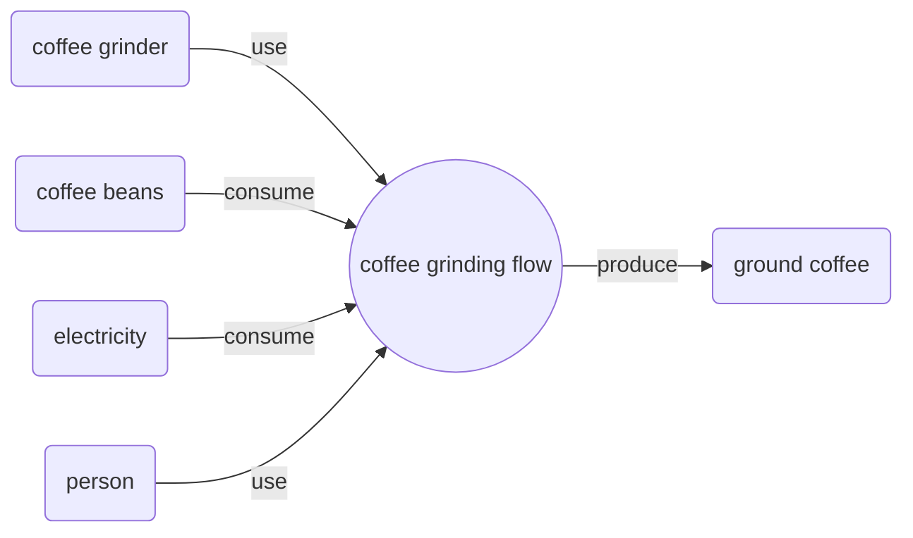

# introduction to Value Flows

## example flow

```mermaid
%% coffee grinding flow
graph LR
  i1(coffee grinder)-- use -->f
  i2(coffee beans)-- consume -->f
  i3(electricity)-- consume -->f
  i4(person)-- use -->f
  f((coffee grinding flow))-- produce -->o1
  o1(ground coffee)
```
