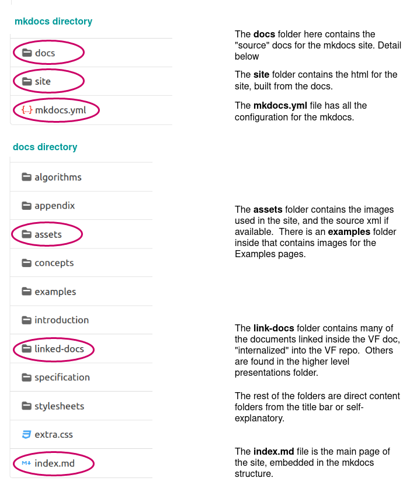

# Website publishing procedure

We have moved both the Valueflows hosted doc and the repo to [codeberg](https://codeberg.org/). This is the procedure to get any changes made to the Valueflows doc at valueflows/valueflows to appear at https://valueflo.ws, served from valueflows/pages.

## Directory structure in the valueflows repo, starting with the mkdocs directory

## Codeberg

The generated html is pushed to the codeberg valueflows publishing repo at https://codeberg.org/valueflows/pages.

Codeberg has open registration.  Please ask if you want to be added to the valueflows organization there.

## Procedure

This assumes that [Material for Mkdocs](https://squidfunk.github.io/mkdocs-material/) is installed locally, and codeberg valueflows and pages are both cloned locally.

1. In the valueflows git pull, branch and make the needed changes.
1. In a terminal navigate to the mkdocs directory.
1. Run `mkdocs serve` and view on localhost:8000.
1. Fix and view as needed.  Ctrl-C to shut down the localhost.
1. Run `mkdocs build`.  This populates the site directory.
1. Commit locally, and push all changes to valueflows, create PR.
1. Re-generate pyLODE if needed: ask @hoijui to create, fix the css (#pylode top: 15em;
#pylode left: -13em;
#toc width: 15%;
#content width: 86%;), put in /specification/all_vf.html
1. Review, fix as needed using the above steps, merge. 
2. Create tag and release if needed, rebuild, merge.

When you are ready to put all merged changes to the live site:

1. In a terminal navigate to the local pages directory.
1. Create a branch.
1. Locally, copy everything in the valueflows site directory to the pages directory.
1. Commit the changes.
1. Push to codeberg, create a pull request (https://codeberg.org/valueflows/pages/pulls).
1. In codeberg, review the changes, merge to main.
1. Test on the https://valueflo.ws site.

