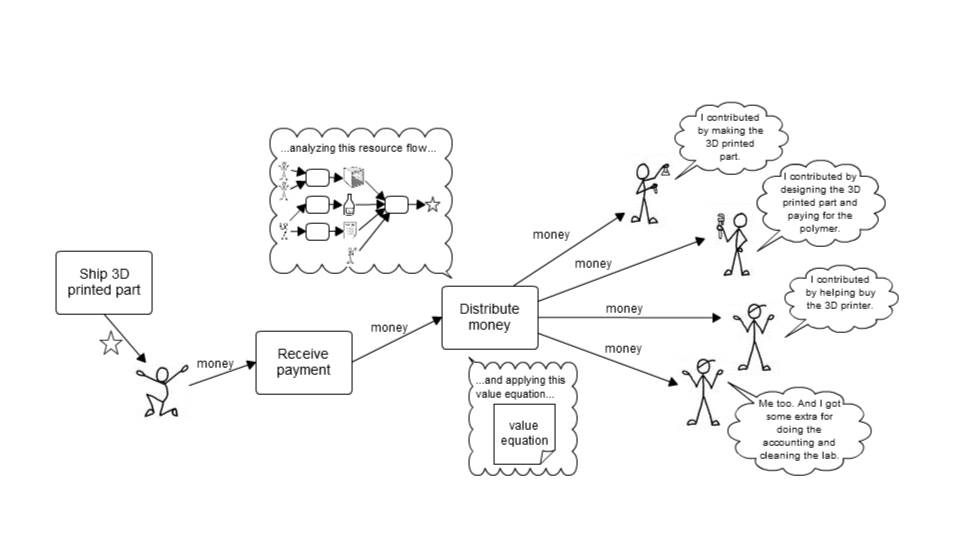

# Value Equations

As far as we know, the idea and name for value equations was invented by [Sensorica](http://www.sensorica.co/), a pioneering Open Value Network.  They are now calling them "Benefit Redistribution Algorithms".

The idea is to have a published formula for distributing income to contributors to creating some deliverable that brings in some money.

This is a (simplified) very specific example taken from Sensorica:

Contributing to creating the output:

Distributing income according to the value equation:

Here's [a lot more detail about value equations](https://speakerdeck.com/mikorizal/10-nrp-value-equation-concepts-and-tutorial){target="_blank"} as implemented in Sensorica's NRP software, one of the precursors to Valueflows.
