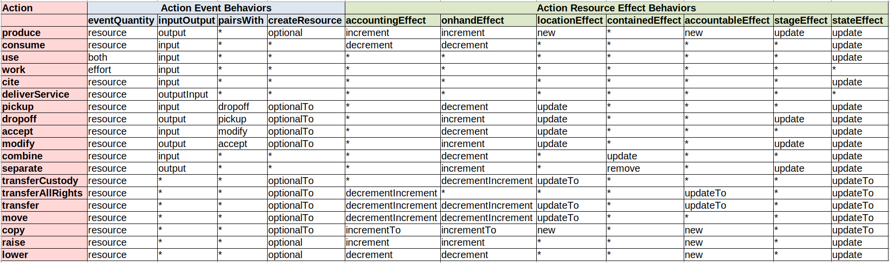

All flows (Economic Event, Commitment, Intent, Claim, Recipe Flow) use an action property to designate what the flow is doing and how it will affect or has affected an economic resource (or not).

See also [Economic Resources](https://www.valueflo.ws/concepts/resources/).

We have defined a core set of actions, but expect that this will be extended with some others. If extended, we recommend that they be defined as part of this or another formal vocabulary so that all can use them and assume the same meaning.

## Action Definitions

**produce** - A new resource is created in the process, or an addition to an existing stock resource of the same type is incremented.  `produce` is used in manufacturing of goods, but also in any kind of creation of a material or digital or energy resource.

**use** - Most often `use` is employed for equipment or tools that are used in a process, but not consumed.  After the process, the piece of equipment of tool still exists, but during the process, it is unavailable. The unavailability can be useful to know if the resource must be scheduled, or if one needs to know how much the resource is used.

**consume** - Most often, an ingredient or component is transformed  into the output(s) of the process. Or the input resource can be used up during the process, like energy. After the process the specified quantity of the consumed input is gone.

**cite** - `cite` is used when a resource is input to a process, but is neither used nor consumed, and remains available during the process.  Examples are a design file or a scientific paper, any digital knowledge, which is cited so that the agent(s) responsible for the resource receive credit.

**work** - `work` refers to labor power applied to a process.  There is generally no identifiable resource involved, only the provider agent. In this case, the type of work or skill involved can be identified by a resource specification. A possible exception would be if the agent's work schedule is kept on a calendar, representing when the specific agent is available to work.

**pickup** -  The transported resource or person enters the process; the same resource will appear later in an output of the process.  It is assumed that the resource is already in custody of the agent providing the transportation.

**dropoff** -  The transported resource or person leaves the process; the same resource or person appeared in an input of this process.

**accept** - This is used as input to a process involving repair, modification, testing, or similar of a resource.  The same resource will appear in the output of the process.  It is sometimes a bit of a gray area when to use `accept`/`modify` vs. `consume`/`produce`.  The choice is based on the need to have the same identified resource before and after the process. Generally if the resource is involved in a series of processes to create it before anything else happens to it, `accept`/`modify` is appropriate.  If the input resource and the output resource need to be identified as different resource specifications for any reason, then `accept`/`modify` is not appropriate.

**modify** - The identified resource that was accepted into a process appears in the output of that process, with modifications made.  Note not all modifications require a physical change, for example quality testing.  In all cases though, it matters that the resource has gone through that process, and the `stage` of the resource (the process specification of the process) is then used as part of the logical identification of the resource when the resource is requested as a process input or for a transfer.

**combine** - A resource is put in a package or a combination resource; the same resource might appear later when it is separated.  Examples are packing one or more resources for transportation or storage, or creation of a kit resource.  The combined resource is still identified in the system, but is `containedIn` the package or combination resource, which would be usually produced in the process.  When a resource is `containedIn` another resource, it is not available on its own.  Note that packing materials or containers which will continue to have their own identity later are also combined in the process; if not, they can be consumed.

**separate** - A resource is removed from a package or a combination resource; the same resource appeared as input earlier in this or another process when it was combined.  When the resource is separated, it loses its `containedIn` reference, and becomes available on its own.

**deliverService** - A new service is produced and delivered as output of a process. A service implies that an agent actively receives the service at the same time as it is delivered.  Services are not tangible, so would not create or increment an inventoried resource. Services are perhaps most often delivered directly to an agent. But unlike other actions, sometimes the service is at the same time being delivered into another documented process, in which case it can be output from a process and input to another, at the same time. 

**transferAllRights** - This action gives full (in the human realm) rights and responsibilities to another agent, without transferring physical custody.  People might call this "ownership"; or it might be considered "stewardship" or similar.  This occurs instantaneously, and does not involve documented physical transfer.  It is often `triggeredBy` a transfer of custody, for example shipping or receipt of goods.

**transferCustody** - This action gives physical custody and control of a resource to another agent, without full rights. The physical custodian often has responsibilities associated with custody, however.  Examples where transfer of custody is useful are loaning a resource to another agent, or when a resource is transferred to have a service performed by another agent, like transportation or repair.

**transfer** - This action gives full (human) rights and responsibilities plus physical custody, combining the last two actions.

**move** - `move` changes the location (and possibly the identifier, if location is part of the logical identifier) of a resource, but does not transfer agent rights or custodianship.

**copy** - A new resource is created for the receiver, an exact copy of the original provider resource.

**raise** - This action adjusts a quantity up, used either when a computer system is brought up and existing resources must be entered with a beginning balance, or when an inventory count in the real world shows that the quantity in the computer system is too low.  When it is known how a resource was obtained, it is preferable to use the real action.

**lower** - This action adjusts a quantity down, used either when a computer system is brought up and existing resources must be entered with a negative beginning balance (very rare!), or when an inventory count in the real world showing that the quantity in the computer system is too high.  When it is known how a resource was lowered, it is preferable to use the real action.

## Action Behaviors

The behaviors that are included on the tables below are also defined as Action properties so that computer systems can be "data driven" in this respect if desired.

### Event Effects

**eventQuantity** - Either only `resourceQuantity` or only `effortQuantity` or both make sense on an economic event with this action.  The action `use` provides for both because there can be a requirement for use of some number of a resource (or resource specification) for some time or other effort unit.

**inputOutput** - An event with this action can be `input` of a process, or `output` of a process, or should not be related to a process.  The event with the special case `outputInput` is basically an output of a process, but can sometimes also be an input to another recorded process, at the same time as it is an output.  This is because services imply delivery as they are created.

**pairsWith** - These pairings indicate that events with these actions usually will be part of the same flow, either input and output of the same process, or different connected processes.

**createResource** - An event with this action generally should support the options to create a new resource or to increment an existing "stock" resource. This will be a choice the user (or possibly specific application rules) must make, there are no rules defined in the vocabulary or data, and it depends on what actually is done operationally, and how agents choose to identify and manage their resources. It is also possible that neither will occur, if the agent does not inventory this particular resource for whatever reason.  If a resource is created by the actions with `optional`, it is the `resourceInventoriedAs`; if with `optionalTo`, it is the `toResourceInventoriedAs`.  

Note: Any action that can create a new resource can alternatively affect (almost always increment) an existing "stock" resource. 

### Resource Effects

**accountingEffect** - If there is an inventoried resource, this defines how the economic resource's `accountingQuantity` is affected by the event's `resourceQuantity`.

**onhandEffect** - If there is an inventoried resource, this defines how the economic resource's `onhandQuantity` is affected by the event's `resourceQuantity`.

For both AccountingEffect and OnhandEffect, the main options are `decrement` (subtract from), `increment` (add to), or no effect. For actions with the option `decrementIncrement`, the `resourceInventoriedAs` should be decremented (if there is one);and the `toResourceInventoriedAs` should be incremented (if there is one).  For actions with the option `incrementTo`, the `toResourceInventoriedAs` should be created/incremented, and the `resourceInventoriedAs` should be left as-is.

Note: The event's `effortQuantity` does not affect economic resources.

Note: The actions `use` and `work` are time-based actions, either with or without an explicit schedule. Although not defined in VF, if a calendar schedule is documented as connected to the economic resource, then those economic events could possibly "decrement" that calendar schedule in some way.

**locationEffect** - For this action, if the economic event's `toLocation` exists, then the affected economic resource's `currentLocation` should be set to the same location.  For `new`, the resource's location should be set only if it is a new resource.  For `updateTo`, the resource is the one in `toResourceInventoriedAs`.  For `update`, the resource is the one in `resourceInventoriedAs`.

**containedEffect** - This applies to the actions that deal with resources contained in other resources, and applies to the `resourceInventoriedAs`.  The `update` option sets the resource's `containedIn` resource, which can be referenced in the event's `toResourceInventoriedAs`; the `remove` option nulls the resource's `containedIn` resource.

**accountableEffect** - If there is an inventoried resource, these actions should set the resource's `primaryAccountable` agent using the event's `receiver` agent.  For `new`, this applies to new resources created by the event (otherwise the `receiver` and the `primaryAccountable` should already match).  For `updateTo`, the resource updated is the `toResourceInventoriedAs`.

**stageEffect** - For actions with `stage`, if the process which the event is output of is based on a process specification, set the `stage` of the `resourceInventoriedAs`, or of the new resource if one is created, to the process specification.

**stateEffect** - If a resource is created or updated by the economic event, if the `state` is included in the event, set the `state` of the resource to the event `state`.  If `update` the resource is the `resourceInventoriedAs`; if `updateTo` the resource is the `toResourceInventoriedAs`.

### Behaviors by Action

*To make the diagram bigger, you can right click and select 'View Image' or 'Open Image in New Tab' or a similar command in your browser.*

*In the above chart, the `notApplicable` values are not included, for easier overall viewing.  For the complete list of behavior values by action as defined in the rdf vocabulary, see the [turtle file starting here](https://lab.allmende.io/valueflows/valueflows/-/blob/master/release-doc-in-process/all_vf.TTL#L1113).

### Saving Breadcrumbs for Track and Trace

If you will be using the track or trace algorithms to find the connected value flows forwards or backwards, an additional field is needed when saving an event.  See [Breadcrumbs in the Track and Trace algorithm](../../algorithms/track#adding-breadcrumbs-on-initial-save) for the procedure.
