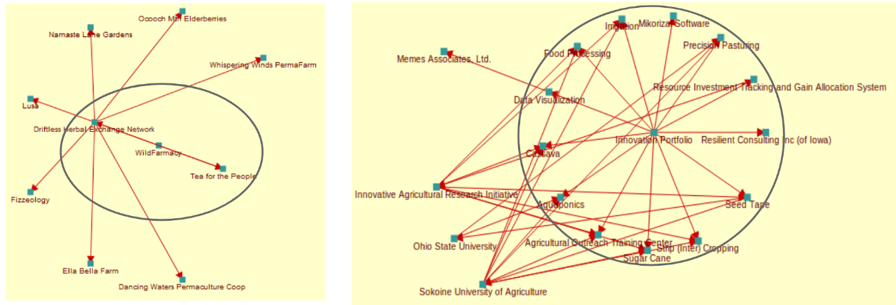

The agent vocabulary describes networks of people, organizations, and ecological agents, constructed using a simple but powerful model of agents and their relationships.

See also [Agents in the Diagram Explanations](../specification/model-text.md#agent) and [Agent examples](../examples/ex-agent.md).

## Types of Agents

Types of agents:

* **Persons** are human beings.
* **Organizations** include formal or informal organizations of all kinds. This also includes groups, as long as they consider themselves to have some agency as a group.
* The **ecological agent** concept is added to expand the scope of REA to do ecological and climate accounting, including impact of various resources on agents in the environment.

(The concept of "Agent" could also in the future include software/AI-based agents(bots, self-driving vehicles, etc.), but this is controversial and somewhat complex.)

In Valueflows, we are talking about economic agents, agents who can create or modify or exchange value, and make agreements with each other - who have economic agency.  Adding the Ecological Agent also expands the concept of "economic", bringing that kind of activity and impact, and even agency, out to the whole ecosystem, not just the human one.

If people want to define types of organizations (like cooperative, corporation, network, community, etc.) we provide a classification property which people can define as they wish.  We do the same for the ecological agent (like ecosystem, forest, etc.).

We have defined the properties of Agents very minimally. There are a number of useful properties in existing vocabularies, such as [foaf](http://xmlns.com/foaf/spec/), [vcard](https://www.w3.org/TR/vcard-rdf/), [schema.org](https://schema.org/), and others that can be used. Or people can create their own as needed.

## Agent Relationships

Agent relationships have many nuances, thus VF provides the ability to define one's own kinds of relationships.  For example people might "participate" with an organization by means of agreeing to terms and conditions.  Or people might have more active "membership" in a group or organization.  Or people might consider themselves members but want a more independently flavored term such as "affiliates".

A relationship can be more like a role, for example "grower" or "harvester" for a food network.

Relationships have direction: For example, in "Michael is a member of Enspiral", Michael is the subject and Enspiral is the object.  In this case the inverse is also valid, "Enspiral has member Michael". In VF, we consider this to be one relationship.  One directional relationships like "follows" are also supported.

Relationships can be in a [scope](scoping.md) (or not): For example, "Kathy is mentor of Sam, in the scope of Enspiral."

EcologicalAgents and Organizations both need human Agents to act on their behalf and represent their agency in the world of people. This can be defined as various roles.

## Network Shapes

Different kinds of relationships can be thought of as creating the "shapes" of a network. Something like this:

The following shows some agents that are "inside" a network, also some agents that are "outside" a network, but have relationships with the network agent or with agents within the network.

## Agent Philosophies

We also want to acknowledge that some people prefer to think of themselves as independent and decentralized agents who interact in different places in the economy as individuals, and some people think of themselves more as members of different groups and networks and communities and interact more in the context of those groups and networks and communities.  Many experiments are going on as people strive towards another economy.  We want to support all these experiments, so want to support both of these ways of thinking and organizing ourselves.  The agent vocabulary is very flexible, and will support these as well as current conventional structures.

So, if people want to form a group that has agency as a group, fine.  If people want to consider that their group does not have agency as a group, also fine.  Not all groups, and especially not all networks, will be economic Agents in Valueflows. That depends on the agreement of the people in the group, and what the group needs to do as-a-group. For example, does the group need to make agreements as-a-group with other groups? Or exchange resources with other agents as-a-group?  Note that within the vocabulary, network formations will emerge, as agents have economic interactions with each other in the world.  This does not mean that the network is necessarily a Valueflows Agent, but it could be, if the participants want.
