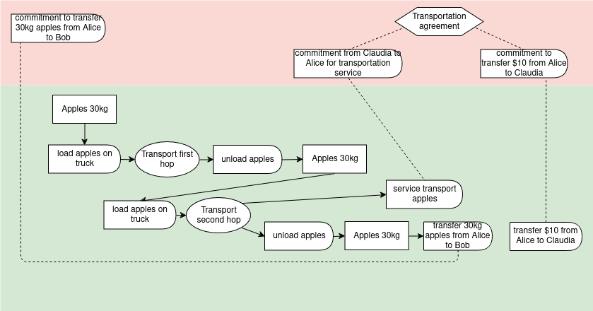

# Plan - Produce - Exchange Examples


#### Plan from recipe with production and exchange

This shows a simple recipe that includes both a process and the exchange of work that is input to the process for currency.


``` yaml
# Example: Simple recipe with both process and exchange

'@context':
  - '@vocab': http://w3id.org/valueflows/ont/vf#
  - alice: https://alice.example/
    doc: https://documenters.example

'@graph':

  # the recipe

  - '@id': urn:uuid:3be5259d-10f0-431c-9fec-9c0c15a461d3
    '@type': ResourceSpecification
    name: Training handout
    substitutable: false

  - '@id': urn:uuid:6b5bc786-b9ed-4189-b34f-5ef7d10f1f86
    '@type': ResourceSpecification
    name: Technical writing # a skill

  - '@id': urn:uuid:33e8933b-ff73-4a01-964a-ca7a98893083
    '@type': RecipeFlow
    recipeOutputOf: urn:uuid:e1721a61-cd47-4556-84b9-8b1b81da15bf
    action: produce
    resourceConformsTo: urn:uuid:3be5259d-10f0-431c-9fec-9c0c15a461d3 # the handout spec
    resourceQuantity:
      hasUnit: one
      hasNumericalValue: 1

  - '@id': urn:uuid:e1721a61-cd47-4556-84b9-8b1b81da15bf
    '@type': RecipeProcess
    name: Write and format training handout

  - '@id': urn:uuid:60f4204e-b8d2-4026-8577-102c3f82c0af
    '@type': RecipeFlow
    recipeInputOf: urn:uuid:e1721a61-cd47-4556-84b9-8b1b81da15bf # the recipe process
    recipeClauseOf: urn:uuid:9bd19194-a36d-4a1f-896b-8082887962cb # the recipe exchange
    action: work
    resourceConformsTo: urn:uuid:6b5bc786-b9ed-4189-b34f-5ef7d10f1f86 # technical writing
    effortQuantity:
      hasUnit: hour
      hasNumericalValue: 15

  - '@id': urn:uuid:9bd19194-a36d-4a1f-896b-8082887962cb
    '@type': RecipeExchange
    name: Exchange documentation work for FairCoin

  - '@id': urn:uuid:3129ca8b-fcda-45be-bbda-294dc924d3b9
    '@type': RecipeFlow
    recipeReciprocalClauseOf: urn:uuid:9bd19194-a36d-4a1f-896b-8082887962cb # the recipe exchange
    action: transfer
    resourceConformsTo: http://www.wikidata.org/entity/Q21002847 # FairCoin
    resourceQuantity:
      hasUnit: one
      hasNumericalValue: 300

  # the plan

  - '@id': doc:8e5fe80d-a769-4bd5-89e5-2136d33eab9f
    '@type': Plan
    name: X Training Handout and Payment
    note: Write and format the training handout, payment for writing work.
    due: 2019-04-08T17:00:00-5:00
    created: 2019-04-01T10:35:00-5:00

  - '@id': doc:a8236bbb-81e0-422d-9861-56d2417db0fb
    '@type': Commitment
    independentDemandOf: doc:8e5fe80d-a769-4bd5-89e5-2136d33eab9f # the plan
    outputOf: doc:02b39a30-3e04-4305-9656-7f261aa63c84
    action: produce
    provider: https://documenters.example/
    receiver: https://documenters.example/
    resourceConformsTo: urn:uuid:3be5259d-10f0-431c-9fec-9c0c15a461d3 # training handout
    resourceQuantity:
      hasUnit: one
      hasNumericalValue: 1

  - '@id': doc:02b39a30-3e04-4305-9656-7f261aa63c84
    '@type': Process
    name: Write and format X training handout
    plannedWithin: doc:8e5fe80d-a769-4bd5-89e5-2136d33eab9f # the plan

  - '@id': doc:52f0e212-3c4f-4d27-b345-5e964c135824
    '@type': Commitment
    inputOf: doc:02b39a30-3e04-4305-9656-7f261aa63c84
    clauseOf: urn:uuid:583e83d9-a46d-44ff-bd71-88513a1d83c0
    action: work
    provider: https://alice.example/
    receiver: https://documenters.example/
    resourceConformsTo: urn:uuid:6b5bc786-b9ed-4189-b34f-5ef7d10f1f86
    effortQuantity:
      hasUnit: hour
      hasNumericalValue: 20 # the estimate for this particular work is higher than the generic recipe

  - '@id': urn:uuid:583e83d9-a46d-44ff-bd71-88513a1d83c0
    '@type': Agreement
    name: Exchange technical documentation work for FairCoin

  - '@id': doc:b52a5815-fae9-43bf-be95-833b95dc0adb
    '@type': Commitment
    plannedWithin: doc:8e5fe80d-a769-4bd5-89e5-2136d33eab9f # the plan
    reciprocalClauseOf: doc:02b39a30-3e04-4305-9656-7f261aa63c84
    action: transfer
    provider: https://documenters.example/
    receiver: https://alice.example/
    resourceConformsTo: http://www.wikidata.org/entity/Q21002847 # FairCoin
    resourceQuantity:
      hasUnit: one
      hasNumericalValue: 400 # the plan payment is adjusted from the generic recipe
```

#### Transportation with transfer

Bob purchases 30kg of apples from Alice and Claudia transports them (FOB destination).  This illustrates an implied transfer of custody, to keep the overall flow simpler.  (The example without the implied transfer is shown after this one.)



``` yaml
# Transportation with transfer

'@context':
  - '@vocab': http://w3id.org/valueflows/ont/vf#
  - alice: https://alice.example/
    bob: https://bob.example/
    claudia: https://claudia.example/
    geo: https://location.example/

'@graph':

# Bob purchases 30kg of apples from Alice and Claudia transports them (FOB destination)

  # Alice's resource before

  - '@id': alice:21f361a6-2375-46bb-b192-c21b5ba833bf
    '@type': EconomicResource
    conformsTo: http://www.wikidata.org/entity/Q41777871 # haralson apples
    trackingIdentifier: lot-alice-apples-2018-10-11
    locatedAt: geo:70ee3034-0d15-4471-8ee3-91c60bb1a9c9
    primaryAccountable: https://alice.example
    accountingQuantity:
      hasUnit: kilogram
      hasNumericalValue: 230
    onhandQuantity:
      hasUnit: kilogram
      hasNumericalValue: 230

  # alice commits to transfer some apples to bob

  - '@id': urn:uuid:6b5bc786-b9ed-4189-b34f-5ef7d10f1f86
    '@type': Commitment
    action: transfer
    resourceConformsTo: http://www.wikidata.org/entity/Q41777871Q41777871 # haralson apples
    provider: https://alice.example/
    receiver: https://bob.example/
    resourceQuantity:
      hasUnit: kilogram
      hasNumericalValue: 30

  # alice and claudia agree on transportation of the apples

  - '@id': urn:uuid:f325a950-5737-488d-b122-8f21114d0eb0
    '@type': Agreement
    note: exchange transportation service for currency
    stipulates:

    - '@id': urn:uuid:c7897c39-7f05-4a5d-a487-80e130a2414a
      '@type': Commitment
      note: Transportation of alice's apples from alice's location to bob's location
      action: deliverService
      resourceClassifiedAs: http://www.wikidata.org/entity/Q7590 # transportation service
      provider: https://claudia.example/
      receiver: https://alice.example/
      resourceQuantity:
        hasUnit: one
        hasNumericalValue: 1

    stipulatesReciprocal:

    - '@id': urn:uuid:33e8933b-ff73-4a01-964a-ca7a98893083
      '@type': Commitment
      action: transfer
      resourceConformsTo: http://www.wikidata.org/entity/Q4917 # US Dollar
      provider: https://alice.example/
      receiver: https://claudia.example/
      resourceQuantity:
        hasUnit: one
        hasNumericalValue: 10

  # claudia transports the apples in two hops

  - '@id': claudia:633f6e56-6c7d-4a5b-b9c9-1a8adafd8960
    '@type': Process
    note: Claudia transports the apples to the distribution center
    hasInput:

    - '@id': claudia:fd399b37-0740-4a68-a184-1e655021ca21
      '@type': EconomicEvent
      action: pickup # with implied transfer custody, since different provider/receiver
      resourceInventoriedAs: alice:21f361a6-2375-46bb-b192-c21b5ba833bf
      toResourceInventoriedAs: claudia:27be5cab-d740-4194-9298-1661a69d9d95
      provider: https://alice.example/
      receiver: https://claudia.example/
      resourceQuantity:
        hasUnit: kilogram
        hasNumericalValue: 30

    hasOutput:

    - '@id': claudia:57f1c1d0-432e-4bfa-9d32-002b8955a708
      '@type': EconomicEvent
      action: dropoff # no implied transfer, one agent and one resource
      resourceInventoriedAs: claudia:27be5cab-d740-4194-9298-1661a69d9d95
      provider: https://claudia.example/
      receiver: https://claudia.example/
      resourceQuantity:
        hasUnit: kilogram
        hasNumericalValue: 30

  - '@id': claudia:c404cff5-19c7-453d-b0d8-d8e96055bd0c
    '@type': Process
    note: Claudia transports the apples from the distribution center to the receiver
    hasInput:

    - '@id': claudia:856c43b1-0a63-445f-a56f-707b257f086e
      '@type': EconomicEvent
      action: pickup
      resourceInventoriedAs: claudia:27be5cab-d740-4194-9298-1661a69d9d95
      provider: https://claudia.example/
      receiver: https://claudia.example/
      resourceQuantity:
        hasUnit: kilogram
        hasNumericalValue: 30

    hasOutput:

    - '@id': claudia:9cb4944b-d26d-4774-a530-d18f2747c0d8
      '@type': EconomicEvent
      action: dropoff # implied transfer of custody
      resourceInventoriedAs: claudia:27be5cab-d740-4194-9298-1661a69d9d95
      toResourceInventoriedAs: bob:9bd19194-a36d-4a1f-896b-8082887962cb
      provider: https://claudia.example/
      receiver: https://bob.example/
      resourceQuantity:
        hasUnit: kilogram
        hasNumericalValue: 30

    - '@id': urn:uuid:68cabaf3-deb8-4bd5-a439-798263abe35a
      '@type': EconomicEvent
      note: Transportation of alice's apples to bob's location
      action: deliverService
      resourceConformsTo: http://www.wikidata.org/entity/Q7590 # transportation service
      provider: https://claudia.example/
      receiver: https://alice.example/
      resourceQuantity:
        hasUnit: one
        hasNumericalValue: 1
      fulfills: urn:uuid:c7897c39-7f05-4a5d-a487-80e130a2414a # the commitment

  # receipt of the apples triggers finalizing the transfer of ownership

  - '@id': urn:uuid:ad56a7ed-be3c-4937-a3fb-0f156bcd2c47
    '@type': EconomicEvent
    action: transferAllRights
    resourceClassifiedAs: http://www.wikidata.org/entity/Q41777871 # haralson apples
    trackingIdentifier: lot-alice-apples-2018-10-11
    provider: https://alice.example/
    receiver: https://bob.example/
    resourceQuantity:
      hasUnit: kilogram
      hasNumericalValue: 30
    fulfills: urn:uuid:6b5bc786-b9ed-4189-b34f-5ef7d10f1f86 # the commitment

  # resources snapshot

  - '@id': alice:21f361a6-2375-46bb-b192-c21b5ba833bf
    '@type': EconomicResource
    conformsTo: http://www.wikidata.org/entity/Q41777871 # haralson apples
    trackingIdentifier: lot-alice-apples-2018-10-11
    locatedAt: geo:70ee3034-0d15-4471-8ee3-91c60bb1a9c9
    primaryAccountable: https://alice.example
    accountingQuantity:
      hasUnit: kilogram
      hasNumericalValue: 200
    onhandQuantity:
      hasUnit: kilogram
      hasNumericalValue: 200

  - '@id': bob:9bd19194-a36d-4a1f-896b-8082887962cb
    '@type': EconomicResource
    conformsTo: http://www.wikidata.org/entity/Q41777871 # haralson apples
    trackingIdentifier: lot-alice-apples-2018-10-11
    locatedAt: geo:b52a5815-fae9-43bf-be95-833b95dc0ada
    primaryAccountable: https://bob.example
    accountingQuantity:
      hasUnit: kilogram
      hasNumericalValue: 30
    onhandQuantity:
      hasUnit: kilogram
      hasNumericalValue: 30

  - '@id': claudia:27be5cab-d740-4194-9298-1661a69d9d95 # record of claudia's bill of lading on the truck
    '@type': EconomicResource
    conformsTo: http://www.wikidata.org/entity/Q41777871 # haralson apples
    onhandQuantity:
      hasUnit: kilogram
      hasNumericalValue: 0

  # alice pays claudia for the transportation service

  - '@id': urn:uuid:8baa8ff7-9c1e-4586-ae7b-79d620a3cac9
    '@type': EconomicEvent
    action: transfer
    resourceConformsTo: http://www.wikidata.org/entity/Q4917 # US Dollar
    resourceInventoriedAs: alice:daa2ec3b-2c1a-4eb1-839f-8dcec1a1f93a # alice's bank account
    toResourceInventoriedAs: claudia:bd5806d6-4a36-45b9-b3b6-3e7d361a5a14 # claudia's bank account
    provider: https://alice.example/
    receiver: https://claudia.example/
    resourceQuantity:
      hasUnit: one
      hasNumericalValue: 10
    fulfills: urn:uuid:33e8933b-ff73-4a01-964a-ca7a98893083 # the commitment
```
The following shows a snippet alternative for the transport, where claudia uses alice's id for what is in her custody.
``` yaml
  # claudia transports the apples in two hops

  - '@id': claudia:633f6e56-6c7d-4a5b-b9c9-1a8adafd8960
    '@type': Process
    note: Claudia transports the apples to the distribution center
    hasInput:

    - '@id': claudia:fd399b37-0740-4a68-a184-1e655021ca21
      '@type': EconomicEvent
      action: pickup
      resourceInventoriedAs: alice:21f361a6-2375-46bb-b192-c21b5ba833bf
      provider: https://alice.example/
      receiver: https://claudia.example/
      resourceQuantity:
        hasUnit: kilogram
        hasNumericalValue: 30

    hasOutput:

    - '@id': claudia:57f1c1d0-432e-4bfa-9d32-002b8955a708
      '@type': EconomicEvent
      action: dropoff
      resourceInventoriedAs: alice:21f361a6-2375-46bb-b192-c21b5ba833bf
      provider: https://claudia.example/
      receiver: https://claudia.example/
      resourceQuantity:
        hasUnit: kilogram
        hasNumericalValue: 30

  - '@id': claudia:c404cff5-19c7-453d-b0d8-d8e96055bd0c
    '@type': Process
    note: Claudia transports the apples from the distribution center to the receiver
    hasInput:

    - '@id': claudia:856c43b1-0a63-445f-a56f-707b257f086e
      '@type': EconomicEvent
      action: pickup
      resourceInventoriedAs: alice:21f361a6-2375-46bb-b192-c21b5ba833bf
      provider: https://claudia.example/
      receiver: https://claudia.example/
      resourceQuantity:
        hasUnit: kilogram
        hasNumericalValue: 30

    hasOutput:

    - '@id': claudia:9cb4944b-d26d-4774-a530-d18f2747c0d8
      '@type': EconomicEvent
      action: dropoff
      resourceInventoriedAs: alice:21f361a6-2375-46bb-b192-c21b5ba833bf
      toResourceInventoriedAs: bob:9bd19194-a36d-4a1f-896b-8082887962cb
      provider: https://claudia.example/
      receiver: https://bob.example/
      resourceQuantity:
        hasUnit: kilogram
        hasNumericalValue: 30

    - '@id': urn:uuid:68cabaf3-deb8-4bd5-a439-798263abe35a
      '@type': EconomicEvent
      note: Transportation of alice's apples from alice's location to bob's location
      action: deliverService
      resourceConformsTo: http://www.wikidata.org/entity/Q7590 # transportation service
      provider: https://claudia.example/
      receiver: https://alice.example/
      resourceQuantity:
        hasUnit: one
        hasNumericalValue: 1
      fulfills: urn:uuid:c7897c39-7f05-4a5d-a487-80e130a2414a # the commitment
```
It is also valid to do this with an explicit transfer of custody, as below:


``` yaml
# Transportation with transfer

'@context':
  - '@vocab': http://w3id.org/valueflows/ont/vf#
  - alice: https://alice.example/
    bob: https://bob.example/
    claudia: https://claudia.example/

'@graph':

# Bob purchases 30kg of apples from Alice and Claudia transports them (FOB destination)

  # Alice's resource before

  - '@id': alice:21f361a6-2375-46bb-b192-c21b5ba833bf
    '@type': EconomicResource
    conformsTo: http://www.wikidata.org/entity/Q41777871 # haralson apples
    trackingIdentifier: lot-alice-apples-2018-10-11
    locatedAt: geo:70ee3034-0d15-4471-8ee3-91c60bb1a9c9
    primaryAccountable: https://alice.example
    accountingQuantity:
      om2:hasUnit: om2:kilogram
      om2:hasNumericalValue: 230
    onhandQuantity:
      om2:hasUnit: om2:kilogram
      om2:hasNumericalValue: 230

  # alice commits to transfer some apples to bob

  - '@id': urn:uuid:6b5bc786-b9ed-4189-b34f-5ef7d10f1f86
    '@type': Commitment
    action: transfer
    resourceConformsTo: http://www.wikidata.org/entity/Q41777871 # haralson apples
    provider: https://alice.example/
    receiver: https://bob.example/
    resourceQuantity:
      om2:hasUnit: om2:kilogram
      om2:hasNumericalValue: 30

  # alice and claudia agree on transportation of the apples

  - '@id': urn:uuid:f325a950-5737-488d-b122-8f21114d0eb0
    '@type': Agreement
    skos:note: exchange transportation service for currency
    stipulates:

    - '@id': urn:uuid:c7897c39-7f05-4a5d-a487-80e130a2414a
      '@type': Commitment
      skos:note: Transportation of alice's apples from alice's location to bob's location
      action: deliverService
      resourceClassifiedAs: http://www.wikidata.org/entity/Q7590 # transportation service
      provider: https://claudia.example/
      receiver: https://alice.example/
      resourceQuantity:
        om2:hasUnit: om2:one
        om2:hasNumericalValue: 1

    stipulatesReciprocal:
    - '@id': urn:uuid:33e8933b-ff73-4a01-964a-ca7a98893083
      '@type': Commitment
      action: transfer
      resourceConformsTo: http://www.wikidata.org/entity/Q4917 # US Dollar
      provider: https://alice.example/
      receiver: https://claudia.example/
      resourceQuantity:
        om2:hasUnit: om2:one
        om2:hasNumericalValue: 10

  # alice transfers custody of the apples to claudia for transportation

  - '@id': urn:uuid:6b5bc786-b9ed-4189-b34f-5ef7d10f1f87
    '@type': EconomicEvent
    action: transferCustody # this is an event that was implied in the first example
    resourceClassifiedAs: http://www.wikidata.org/entity/Q41777871 # haralson apples
    trackingIdentifier: lot-alice-apples-2018-10-11
    provider: https://alice.example/
    receiver: https://claudia.example/
    resourceInventoriedAs: alice:21f361a6-2375-46bb-b192-c21b5ba833bf # alice's apples
    toResourceInventoriedAs: claudia:27be5cab-d740-4194-9298-1661a69d9d95 # claudia's bill of lading on the truck
    resourceQuantity:
      om2:hasUnit: om2:kilogram
      om2:hasNumericalValue: 30

  # resources snapshot

  - '@id': alice:21f361a6-2375-46bb-b192-c21b5ba833bf
    '@type': EconomicResource
    classifiedAs: http://www.wikidata.org/entity/Q41777871 # haralson apples
    trackingIdentifier: lot-alice-apples-2018-10-11
    locatedAt: geo:70ee3034-0d15-4471-8ee3-91c60bb1a9c9
    primaryAccountable: https://alice.example
    accountingQuantity:
      om2:hasUnit: om2:kilogram
      om2:hasNumericalValue: 230
    onhandQuantity:
      om2:hasUnit: om2:kilogram
      om2:hasNumericalValue: 200

  - '@id': claudia:27be5cab-d740-4194-9298-1661a69d9d95
    '@type': EconomicResource
    classifiedAs: http://www.wikidata.org/entity/Q41777871 # haralson apples
    trackingIdentifier: lot-alice-apples-2018-10-11
    onhandQuantity:
      om2:hasUnit: om2:kilogram
      om2:hasNumericalValue: 30

  # claudia transports the apples in two hops

  - '@id': claudia:633f6e56-6c7d-4a5b-b9c9-1a8adafd8960
    '@type': Process
    skos:note: Claudia transports the apples
    hasInput:

    - '@id': claudia:fd399b37-0740-4a68-a184-1e655021ca21
      '@type': EconomicEvent
      action: pickup
      resourceInventoriedAs: claudia:27be5cab-d740-4194-9298-1661a69d9d95
      provider: https://claudia.example/
      receiver: https://claudia.example/
      resourceQuantity:
        om2:hasUnit: om2:kilogram
        om2:hasNumericalValue: 30

    hasOutput:

    - '@id': claudia:57f1c1d0-432e-4bfa-9d32-002b8955a708
      '@type': EconomicEvent
      action: dropoff
      resourceInventoriedAs: claudia:27be5cab-d740-4194-9298-1661a69d9d95
      provider: https://claudia.example/
      receiver: https://claudia.example/
      resourceQuantity:
        om2:hasUnit: om2:kilogram
        om2:hasNumericalValue: 30

  - '@id': claudia:c404cff5-19c7-453d-b0d8-d8e96055bd0c
    '@type': Process
    skos:note: Claudia transports the apples
    hasInput:

    - '@id': claudia:856c43b1-0a63-445f-a56f-707b257f086e
      '@type': EconomicEvent
      action: pickup
      resourceInventoriedAs: claudia:27be5cab-d740-4194-9298-1661a69d9d95
      provider: https://claudia.example/
      receiver: https://claudia.example/
      resourceQuantity:
        om2:hasUnit: om2:kilogram
        om2:hasNumericalValue: 30

    hasOutput:

    - '@id': claudia:9cb4944b-d26d-4774-a530-d18f2747c0d8
      '@type': EconomicEvent
      action: dropoff
      resourceInventoriedAs: claudia:27be5cab-d740-4194-9298-1661a69d9d95
      provider: https://claudia.example/
      receiver: https://claudia.example/
      resourceQuantity:
        om2:hasUnit: om2:kilogram
        om2:hasNumericalValue: 30

    - '@id': urn:uuid:68cabaf3-deb8-4bd5-a439-798263abe35a
      '@type': EconomicEvent
      skos:note: Transportation of alice's apples to bob's location
      action: deliverService
      resourceConformsTo: http://www.wikidata.org/entity/Q7590 # transportation service
      provider: https://claudia.example/
      receiver: https://alice.example/
      resourceQuantity:
        om2:hasUnit: om2:one
        om2:hasNumericalValue: 1
      fulfills: urn:uuid:c7897c39-7f05-4a5d-a487-80e130a2414a # the commitment

  # bob receives the apples

  - '@id': urn:uuid:7a63ea10-b1c3-441a-9a08-fb8630c02614
    '@type': EconomicEvent
    action: transferCustody # this is the event that was implied in the first example
    resourceConformsTo: http://www.wikidata.org/entity/Q41777871 # haralson apples
    trackingIdentifier: lot-alice-apples-2018-10-11
    resourceInventoriedAs: claudia:27be5cab-d740-4194-9298-1661a69d9d95
    toResourceInventoriedAs: bob:9bd19194-a36d-4a1f-896b-8082887962cb
    provider: https://claudia.example/
    receiver: https://bob.example/
    resourceQuantity:
      om2:hasUnit: om2:kilogram
      om2:hasNumericalValue: 30

  # receipt of the apples triggers finalizing the transfer of ownership

  - '@id': urn:uuid:ad56a7ed-be3c-4937-a3fb-0f156bcd2c47
    '@type': EconomicEvent
    action: transferAllRights
    resourceClassifiedAs: http://www.wikidata.org/entity/Q41777871 # haralson apples
    trackingIdentifier: lot-alice-apples-2018-10-11
    provider: https://alice.example/
    receiver: https://bob.example/
    resourceQuantity:
      om2:hasUnit: om2:kilogram
      om2:hasNumericalValue: 30
    fulfills: urn:uuid:6b5bc786-b9ed-4189-b34f-5ef7d10f1f86 # the commitment

  # resources snapshot

  - '@id': alice:21f361a6-2375-46bb-b192-c21b5ba833bf
    '@type': EconomicResource
    conformsTo: http://www.wikidata.org/entity/Q41777871 # haralson apples
    trackingIdentifier: lot-alice-apples-2018-10-11
    locatedAt: geo:70ee3034-0d15-4471-8ee3-91c60bb1a9c9 # only the possessed amount
    primaryAccountable: https://alice.example
    accountingQuantity:
      om2:hasUnit: om2:kilogram
      om2:hasNumericalValue: 200
    onhandQuantity:
      om2:hasUnit: om2:kilogram
      om2:hasNumericalValue: 200

  - '@id': bob:9bd19194-a36d-4a1f-896b-8082887962cb
    '@type': EconomicResource
    conformsTo: http://www.wikidata.org/entity/Q41777871 # haralson apples
    trackingIdentifier: lot-alice-apples-2018-10-11
    locatedAt: geo:b52a5815-fae9-43bf-be95-833b95dc0ada # only the possessed amount
    primaryAccountable: https://bob.example
    accountingQuantity:
      om2:hasUnit: om2:kilogram
      om2:hasNumericalValue: 30
    onhandQuantity:
      om2:hasUnit: om2:kilogram
      om2:hasNumericalValue: 30

  - '@id': claudia:27be5cab-d740-4194-9298-1661a69d9d95 # claudia's bill of lading on the truck
    '@type': EconomicResource
    conformsTo: http://www.wikidata.org/entity/Q41777871 # haralson apples
    onhandQuantity:
      om2:hasUnit: om2:kilogram
      om2:hasNumericalValue: 0

  # alice pays claudia for the transportation service

  - '@id': urn:uuid:8baa8ff7-9c1e-4586-ae7b-79d620a3cac9
    '@type': EconomicEvent
    action: transfer
    resourceConformsTo: http://www.wikidata.org/entity/Q4917 # US Dollar
    resourceInventoriedAs: alice:daa2ec3b-2c1a-4eb1-839f-8dcec1a1f93a # alice's bank account
    toResourceInventoriedAs: claudia:bd5806d6-4a36-45b9-b3b6-3e7d361a5a14 # claudia's bank account
    provider: https://alice.example/
    receiver: https://claudia.example/
    resourceQuantity:
      om2:hasUnit: om2:one
      om2:hasNumericalValue: 10
    fulfills: urn:uuid:33e8933b-ff73-4a01-964a-ca7a98893083 # the commitment
```

#### Manufacturing and workflow

A component is produced (manufacturing pattern) and tested (workflow pattern).  QT ("quality testing") gives pass and/or fail outputs.  The failed components are passed back into a source resource (because it can be re-used as an input as part of the QT process, to be used in this or the next manufacturing run.

The QT needs the stage and state of the input component resource, because QT would only be done on components that are made and not tested yet.  By the same token, components would only be sent into the next assembly process if they have passed the QT process/stage (not part of this example).

This example includes recipe, plan, and actuals.


``` yaml
# Example: Workflow recipe, plan, execution, including stage and state usage

'@context':
  - '@vocab': http://w3id.org/valueflows/ont/vf#
  - mfg: https://manufacturing.example/

'@graph':

  # specifications

  - '@id': urn:uuid:3be5259d-10f0-431c-9fec-9c0c15a461d3
    '@type': ResourceSpecification
    name: Bucket white 5 gallon
    defaultUnitOfResource: one
    substitutable: true

  - '@id': urn:uuid:d4d2fd71-34f2-41c3-b1c5-19ad5ed2da58
    '@type': ResourceSpecification
    name: Thermoplastic polymer white
    DefaultUnitOfResource: kilogram
    substitutable: true

  - '@id': urn:uuid:c7897c39-7f05-4a5d-a487-80e130a2414a
    '@type': ResourceSpecification
    name: Injection molding machine
    defaultUnitOfResource: one
    defaultUnitOfEffort: hour
    substitutable: true

  - '@id': mfg:27be5cab-d740-4194-9298-1661a69d9d95
    '@type': ProcessSpecification
    name: Make injection molded buckets

  - '@id': mfg:6fb358a3-2859-4d6a-a4fa-431603ee70f5
    '@type': ProcessSpecification
    name: QT injection molded buckets

  # resources before

  - '@id': mfg:3129ca8b-fcda-45be-bbda-294dc924d3b9
    '@type': EconomicResource
    name: Bucket white 5 gallon
    conformsTo: urn:uuid:3be5259d-10f0-431c-9fec-9c0c15a461d3
    accountingQuantity:
      hasUnit: one
      hasNumericalValue: 320
    state: pass
    stage: mfg:6fb358a3-2859-4d6a-a4fa-431603ee70f5 # QT

  - '@id': mfg:6b5bc786-b9ed-4189-b34f-5ef7d10f1f86
    '@type': EconomicResource
    name: Thermoplastic polymer white
    conformsTo: urn:uuid:d4d2fd71-34f2-41c3-b1c5-19ad5ed2da58
    accountingQuantity:
      hasUnit: kilogram
      hasNumericalValue: 2455

  - '@id': mfg:23799c14-c368-4653-a584-83bf9ae8b82a
    '@type': EconomicResource
    name: Injection molding maching
    conformsTo: urn:uuid:c7897c39-7f05-4a5d-a487-80e130a2414a
    trackingIdentifier: DDE098989099911
    accountingQuantity:
      hasUnit: one
      hasNumericalValue: 1
    unitOfEffort: hour

  # the recipe (here the recipe runs "backwards" from the final product, similar to a BOM)

  - '@id': mfg:33e8933b-ff73-4a01-964a-ca7a98893083
    '@type': RecipeFlow
    recipeOutputOf: mfg:a8356625-bf64-4c16-9099-28aa1b718c4b
    action: modify
    state: pass
    resourceConformsTo: urn:uuid:3be5259d-10f0-431c-9fec-9c0c15a461d3 # bucket
    resourceQuantity:
      hasUnit: one
      hasNumericalValue: 500

  - '@id': mfg:54b814ee-62dc-40c1-bb96-f8582aa4f771
    '@type': RecipeFlow
    recipeOutputOf: mfg:a8356625-bf64-4c16-9099-28aa1b718c4b
    action: produce # fail
    resourceConformsTo: urn:uuid:d4d2fd71-34f2-41c3-b1c5-19ad5ed2da58 # polymer
    resourceQuantity:
      hasUnit: kilogram
      hasNumericalValue: 0

  - '@id': mfg:a8356625-bf64-4c16-9099-28aa1b718c4b
    '@type': RecipeProcess
    name: QT bucket white 5 gallon - minimum run
    processConformsTo: mfg:6fb358a3-2859-4d6a-a4fa-431603ee70f5 # the process specification
    time:hasDuration:
      time:unitType unit:Hour
      time:numericDuration 1

  - '@id': mfg:2342d456-5d6f-46d5-a7ed-3ac7bfd5a86c
    '@type': RecipeFlow
    recipeInputOf: mfg:a8356625-bf64-4c16-9099-28aa1b718c4b
    action: accept
    resourceConformsTo: urn:uuid:3be5259d-10f0-431c-9fec-9c0c15a461d3 # bucket
    stage: mfg:27be5cab-d740-4194-9298-1661a69d9d95 # 'make' process specification
    resourceQuantity:
      hasUnit: one
      hasNumericalValue: 500

  - '@id': mfg:33e8933b-ff73-4a01-964a-ca7a98893083
    '@type': RecipeFlow
    recipeOutputOf: mfg:e1721a61-cd47-4556-84b9-8b1b81da15bf
    action: produce
    resourceConformsTo: urn:uuid:3be5259d-10f0-431c-9fec-9c0c15a461d3 # bucket
    resourceQuantity:
      hasUnit: one
      hasNumericalValue: 500

  - '@id': mfg:e1721a61-cd47-4556-84b9-8b1b81da15bf
    '@type': RecipeProcess
    name: Make bucket white 5 gallon - minimum run
    processConformsTo: mfg:27be5cab-d740-4194-9298-1661a69d9d95 # the process specification
    time:hasDuration:
      time:unitType unit:Hour
      time:numericDuration 7

  - '@id': mfg:9bd19194-a36d-4a1f-896b-8082887962cb
    '@type': RecipeFlow
    recipeInputOf: mfg:e1721a61-cd47-4556-84b9-8b1b81da15bf
    action: consume
    resourceConformsTo: urn:uuid:d4d2fd71-34f2-41c3-b1c5-19ad5ed2da58 # polymer
    resourceQuantity:
      hasUnit: kilogram
      hasNumericalValue: 450

  - '@id': mfg:60f4204e-b8d2-4026-8577-102c3f82c0af
    '@type': RecipeFlow
    recipeInputOf: mfg:e1721a61-cd47-4556-84b9-8b1b81da15bf
    action: use
    resourceConformsTo: urn:uuid:c7897c39-7f05-4a5d-a487-80e130a2414a # injection molding machine
    effortQuantity:
      hasUnit: hour
      hasNumericalValue: 5.5

  # the plan (shown running "forwards")

  - '@id': mfg:8e5fe80d-a769-4bd5-89e5-2136d33eab9f
    '@type': Plan
    name: Buckets run number 381
    due: 2019-04-08T17:00:00-5:00

  - '@id': mfg:b52a5815-fae9-43bf-be95-833b95dc0adb
    '@type': Commitment
    inputOf: mfg:02b39a30-3e04-4305-9656-7f261aa63c84
    action: consume
    provider: https://manufacturing.example/
    receiver: https://manufacturing.example/
    resourceConformsTo: urn:uuid:d4d2fd71-34f2-41c3-b1c5-19ad5ed2da58 # polymer
    resourceQuantity:
      hasUnit: kilogram
      hasNumericalValue: 900

  - '@id': mfg:52f0e212-3c4f-4d27-b345-5e964c135824
    '@type': Commitment
    inputOf: mfg:02b39a30-3e04-4305-9656-7f261aa63c84
    action: use
    provider: https://manufacturing.example/
    receiver: https://manufacturing.example/
    resourceConformsTo: urn:uuid:c7897c39-7f05-4a5d-a487-80e130a2414a # injection molding machine
    effortQuantity:
      hasUnit: hour
      hasNumericalValue: 11

  - '@id': mfg:02b39a30-3e04-4305-9656-7f261aa63c84
    '@type': Process
    name: Make bucket white 5 gallon
    plannedWithin: mfg:8e5fe80d-a769-4bd5-89e5-2136d33eab9f
    basedOn: mfg:27be5cab-d740-4194-9298-1661a69d9d95 # the process specification
    time:hasDuration:
      time:unitType unit:Hour
      time:numericDuration 14

  - '@id': mfg:a8236bbb-81e0-422d-9861-56d2417db0fb
    '@type': Commitment
    outputOf: mfg:02b39a30-3e04-4305-9656-7f261aa63c84
    action: produce
    provider: https://manufacturing.example/
    receiver: https://manufacturing.example/
    resourceConformsTo: urn:uuid:3be5259d-10f0-431c-9fec-9c0c15a461d3 # bucket
    resourceQuantity:
      hasUnit: one
      hasNumericalValue: 1000

  - '@id': mfg:fbff9852-36ca-4364-a943-bc0b49e1cab5
    '@type': Commitment
    inputOf: mfg:8baa8ff7-9c1e-4586-ae7b-79d620a3cac9
    action: accept
    provider: https://manufacturing.example/
    receiver: https://manufacturing.example/
    resourceConformsTo: urn:uuid:3be5259d-10f0-431c-9fec-9c0c15a461d3 # bucket
    stage: mfg:27be5cab-d740-4194-9298-1661a69d9d95 # 'make' process specification
    resourceQuantity:
      hasUnit: one
      hasNumericalValue: 1000

  - '@id': mfg:8baa8ff7-9c1e-4586-ae7b-79d620a3cac9
    '@type': Process
    name: QT bucket white 5 gallon
    plannedWithin: mfg:8e5fe80d-a769-4bd5-89e5-2136d33eab9f
    basedOn: mfg:6fb358a3-2859-4d6a-a4fa-431603ee70f5 # the process specification
    time:hasDuration:
      time:unitType unit:Hour
      time:numericDuration 14

  - '@id': mfg:21f361a6-2375-46bb-b192-c21b5ba833bf
    '@type': Commitment
    independentDemandOf: mfg:8e5fe80d-a769-4bd5-89e5-2136d33eab9f # the plan
    outputOf: mfg:8baa8ff7-9c1e-4586-ae7b-79d620a3cac9
    action: modify
    state: pass
    provider: https://manufacturing.example/
    receiver: https://manufacturing.example/
    resourceConformsTo: urn:uuid:3be5259d-10f0-431c-9fec-9c0c15a461d3 # bucket
    resourceQuantity:
      hasUnit: one
      hasNumericalValue: 1000

  - '@id': mfg:21f361a6-2375-46bb-b192-c21b5ba833bg
    '@type': Commitment
    outputOf: mfg:8baa8ff7-9c1e-4586-ae7b-79d620a3cac9
    action: produce
    provider: https://manufacturing.example/
    receiver: https://manufacturing.example/
    resourceConformsTo: urn:uuid:d4d2fd71-34f2-41c3-b1c5-19ad5ed2da58 # polymer
    resourceQuantity:
      hasUnit: kilogram
      hasNumericalValue: 0

  # manufacture and test the buckets according to plan

  - '@id': mfg:e18c808c-929a-450d-9d0d-3b3f531bc126
    '@type': EconomicEvent
    inputOf: mfg:02b39a30-3e04-4305-9656-7f261aa63c84 # planned make process
    action: consume
    provider: https://manufacturing.example/
    receiver: https://manufacturing.example/
    resourceInventoriedAs: mfg:6b5bc786-b9ed-4189-b34f-5ef7d10f1f86 # polymer stock
    resourceQuantity:
      hasUnit: kilogram
      hasNumericalValue: 925

  - '@id': mfg:5d2fe7da-b91b-4dab-91d9-68db80c1feb7
    '@type': EconomicEvent
    inputOf: mfg:02b39a30-3e04-4305-9656-7f261aa63c84 # planned make process
    action: use
    provider: https://manufacturing.example/
    receiver: https://manufacturing.example/
    resourceInventoriedAs: mfg:23799c14-c368-4653-a584-83bf9ae8b82a # the machine
    effortQuantity:
      hasUnit: hour
      hasNumericalValue: 10.7

  - '@id': mfg:8791913c-0152-4c32-bb3f-f25d61df736c
    '@type': EconomicEvent
    outputOf: mfg:02b39a30-3e04-4305-9656-7f261aa63c84 # planned make process
    action: produce
    provider: https://manufacturing.example/
    receiver: https://manufacturing.example/
    resourceInventoriedAs: mfg:3129ca8b-fcda-45be-bbda-294dc924d3b9 # buckets
    resourceQuantity:
      hasUnit: one
      hasNumericalValue: 1000

  - '@id': mfg:a8236bbb-81e0-422d-9861-56d2417db0fb
    '@type': EconomicEvent
    inputOf: mfg:8baa8ff7-9c1e-4586-ae7b-79d620a3cac9 # planned qt process
    action: accept
    provider: https://manufacturing.example/
    receiver: https://manufacturing.example/
    resourceInventoriedAs: mfg:3129ca8b-fcda-45be-bbda-294dc924d3b9 #buckets
    resourceQuantity:
      hasUnit: one
      hasNumericalValue: 1000

  - '@id': mfg:52f0e212-3c4f-4d27-b345-5e964c135824
    '@type': EconomicEvent
    outputOf: mfg:8baa8ff7-9c1e-4586-ae7b-79d620a3cac9 # planned qt process
    action: modify
    state: pass
    provider: https://manufacturing.example/
    receiver: https://manufacturing.example/
    resourceInventoriedAs: mfg:3129ca8b-fcda-45be-bbda-294dc924d3b9 # buckets
    resourceQuantity:
      hasUnit: one
      hasNumericalValue: 998

  - '@id': mfg:e1721a61-cd47-4556-84b9-8b1b81da15bf
    '@type': EconomicEvent
    outputOf: mfg:8baa8ff7-9c1e-4586-ae7b-79d620a3cac9 # planned qt process
    action: produce
    provider: https://manufacturing.example/
    receiver: https://manufacturing.example/
    resourceInventoriedAs: mfg:6b5bc786-b9ed-4189-b34f-5ef7d10f1f86 # polymer stock
    resourceQuantity:
      hasUnit: kilogram
      hasNumericalValue: 1.8

  # resources after

  - '@id': mfg:3129ca8b-fcda-45be-bbda-294dc924d3b9
    '@type': EconomicResource
    name: Bucket white 5 gallon
    conformsTo: urn:uuid:3be5259d-10f0-431c-9fec-9c0c15a461d3
    accountingQuantity:
      hasUnit: one
      hasNumericalValue: 1318
    state: pass
    stage: mfg:6fb358a3-2859-4d6a-a4fa-431603ee70f5 #QT

  - '@id': mfg:6b5bc786-b9ed-4189-b34f-5ef7d10f1f86
    '@type': EconomicResource
    name: Thermoplastic polymer white
    conformsTo: urn:uuid:d4d2fd71-34f2-41c3-b1c5-19ad5ed2da58
    accountingQuantity:
      hasUnit: kilogram
      hasNumericalValue: 1531.8

  - '@id': mfg:23799c14-c368-4653-a584-83bf9ae8b82a
    '@type': EconomicResource
    name: Injection molding maching
    conformsTo: urn:uuid:c7897c39-7f05-4a5d-a487-80e130a2414a
    trackingIdentifier: DDE098989099911
    accountingQuantity:
      hasUnit: one
      hasNumericalValue: 1
    unitOfEffort: hour
```

#### Building recipes

This shows a partial set of recipes used together for one economic function (dairy farming). The RecipeProcess is re-used in more than one Recipe.


``` yaml
# Example: Complex set of recipes with re-use of recipe process.

'@context':
  - '@vocab': http://w3id.org/valueflows/ont/vf#

'@graph':

  - '@id': urn:uuid:3be5259d-10f0-431c-9fec-9c0c15a41234
    '@type': ResourceSpecification
    name: Milking herd

  - '@id': urn:uuid:6b5bc786-b9ed-4189-b34f-5ef7d10f5679
    '@type': ResourceSpecification
    name: Cow

  - '@id': urn:uuid:6b5bc786-b9ed-4189-b34f-5ef7d10fasdf
    '@type': ResourceSpecification
    name: ATV

  - '@id': urn:uuid:6b5bc786-b9ed-4189-b34f-5ef7d10fqer8
    '@type': ResourceSpecification
    name: Milking shed

  - '@id': urn:uuid:6b5bc786-b9ed-4189-b34f-5ef7d10fgt98
    '@type': ResourceSpecification
    name: Paddock

  - '@id': urn:uuid:6b5bc786-b9ed-4189-b34f-5ef7d10fgt99
    '@type': ResourceSpecification
    name: Milker pellets summer

  - '@id': urn:uuid:6b5bc786-b9ed-4189-b34f-5ef7d10fgt90
    '@type': ResourceSpecification
    name: Milker pellets winter

  - '@id': urn:uuid:6b5bc786-b9ed-4189-b34f-5ef7d10fio33
    '@type': ResourceSpecification
    name: Vat milk

  - '@id': urn:uuid:6b5bc786-b9ed-4189-b34f-5ef7d10ftg7y
    '@type': ResourceSpecification
    name: Antibiotic milk

  - '@id': urn:uuid:6b5bc786-b9ed-4189-b34f-5ef7d10fse43
    '@type': ResourceSpecification
    name: Fresh cow milk

  - '@id': urn:uuid:6b5bc786-b9ed-4189-b34f-5ef7d10fio99
    '@type': ResourceSpecification
    name: Refrigerated milk

  - '@id': urn:uuid:6b5bc786-b9ed-4189-b34f-5ef7d10fvb90
    '@type': ResourceSpecification
    name: Pasture cropping

  - '@id': urn:uuid:6b5bc786-b9ed-4189-b34f-5ef7d10fkki9
    '@type': ResourceSpecification
    name: Herd management

  - '@id': urn:uuid:6b5bc786-b9ed-4189-b34f-5ef7d10fdfre
    '@type': ResourceSpecification
    name: Milking

  - '@id': urn:uuid:6b5bc786-b9ed-4189-b34f-5ef7d10f4599
    '@type': ResourceSpecification
    name: Effluent

  - '@id': urn:uuid:6b5bc786-b9ed-4189-b34f-5ef7d10fbmk9
    '@type': ResourceSpecification
    name: Semen straw

  - '@id': urn:uuid:6b5bc786-b9ed-4189-b34f-5ef7d10fer45
    '@type': ResourceSpecification
    name: Yogurt quart

  - '@id': urn:uuid:6b5bc786-b9ed-4189-b34f-5ef7d10fo9u8
    '@type': ResourceSpecification
    name: Yogurt maker

  - '@id': urn:uuid:6b5bc786-b9ed-4189-b34f-5ef7d10fjkio
    '@type': ResourceSpecification
    name: Pasteurized milk

  - '@id': urn:uuid:6b5bc786-b9ed-4189-b34f-5ef7d10fleos
    '@type': ResourceSpecification
    name: Pasteurized cream

  - '@id': urn:uuid:6b5bc786-b9ed-4189-b34f-5ef7d10f8923
    '@type': ResourceSpecification
    name: Yogurt

  - '@id': urn:uuid:6b5bc786-b9ed-4189-b34f-5ef7d10fdo83
    '@type': ResourceSpecification
    name: Quart jar

  - '@id': urn:uuid:6b5bc786-b9ed-4189-b34f-5ef7d10fxs34
    '@type': ProcessSpecification
    name: Milk cows

  - '@id': urn:uuid:6b5bc786-b9ed-4189-b34f-5ef7d10ffr7n
    '@type': ProcessSpecification
    name: Setup fencing

  - '@id': urn:uuid:6b5bc786-b9ed-4189-b34f-5ef7d10fdfp9
    '@type': ProcessSpecification
    name: Treat mastitis

  - '@id': urn:uuid:6b5bc786-b9ed-4189-b34f-5ef7d10fde34
    '@type': ProcessSpecification
    name: Treat hoofs

  - '@id': urn:uuid:6b5bc786-b9ed-4189-b34f-5ef7d10fgtml
    '@type': ProcessSpecification
    name: Collect cows

  - '@id': urn:uuid:6b5bc786-b9ed-4189-b34f-5ef7d10f56jn
    '@type': ProcessSpecification
    name: Return cows

  - '@id': urn:uuid:6b5bc786-b9ed-4189-b34f-5ef7d10fqd9m
    '@type': ProcessSpecification
    name: Setup milking shed

  - '@id': urn:uuid:6b5bc786-b9ed-4189-b34f-5ef7d10fdeh0
    '@type': ProcessSpecification
    name: Refrigerate milk

  - '@id': urn:uuid:6b5bc786-b9ed-4189-b34f-5ef7d10flynn
    '@type': ProcessSpecification
    name: Make yogurt

  - '@id': urn:uuid:6b5bc786-b9ed-4189-b34f-5ef7d10fx8cr
    '@type': ProcessSpecification
    name: Inseminate cow

  - '@id': urn:uuid:6b5bc786-b9ed-4189-b34f-5ef7d10fasl5
    '@type': ProcessSpecification
    name: Pump effluent

  - '@id': urn:uuid:6b5bc786-b9ed-4189-b34f-5ef7d10f9s87
    '@type': ProcessSpecification
    name: Clean milking shed

  - '@id': urn:uuid:6b5bc786-b9ed-4189-b34f-5ef7d10fd3kj
    '@type': ProcessSpecification
    name:


  - '@id': urn:uuid:33e8933b-ff73-4a01-964a-ca7a98893083
    '@type': RecipeFlow
    recipeOutputOf: urn:uuid:e1721a61-cd47-4556-84b9-8b1b81da15bf # collect
    action: modify
    resourceConformsTo: urn:uuid:6b5bc786-b9ed-4189-b34f-5ef7d10fgt98 # the paddock
    resourceQuantity:
      hasUnit: one
      hasNumericalValue: 1

  - '@id': urn:uuid:33e8933b-ff73-4a01-964a-ca7a98893084
    '@type': RecipeFlow
    recipeOutputOf: urn:uuid:e1721a61-cd47-4556-84b9-8b1b81da15bf # collect
    action: modify
    resourceConformsTo: urn:uuid:3be5259d-10f0-431c-9fec-9c0c15a41234 # the milking herd
    resourceQuantity:
      hasUnit: one
      hasNumericalValue: 1

  - '@id': urn:uuid:e1721a61-cd47-4556-84b9-8b1b81da15bf
    '@type': RecipeProcess
    name: Collect cows from paddock
    basedOn: urn:uuid:6b5bc786-b9ed-4189-b34f-5ef7d10fgtml
    hasDuration:
      hasUnit: hour
      hasNumericalValue: .5
    note: Milker gets quad (ATV) from Machine Shed and goes to collect cows (2.30am).  Round them up and Move Cows calmly from their paddock along the laneway to the dairy.  At the dairy yard, cows stand on the backing gate and flow into the dairy at their own pace.  Note which cows are lame or have saw feet

  - '@id': urn:uuid:60f4204e-b8d2-4026-8577-102c3f82c0ah
    '@type': RecipeFlow
    recipeInputOf: urn:uuid:e1721a61-cd47-4556-84b9-8b1b81da15bf # collect
    action: work
    resourceConformsTo: urn:uuid:6b5bc786-b9ed-4189-b34f-5ef7d10fdfre # milking
    effortQuantity:
      hasUnit: hour
      hasNumericalValue: .5

  - '@id': urn:uuid:60f4204e-b8d2-4026-8577-102c3f82c0ai
    '@type': RecipeFlow
    recipeInputOf: urn:uuid:e1721a61-cd47-4556-84b9-8b1b81da15bf # collect
    action: use
    resourceConformsTo: urn:uuid:6b5bc786-b9ed-4189-b34f-5ef7d10fasdf # ATV
    effortQuantity:
      hasUnit: hour
      hasNumericalValue: .5

  - '@id': urn:uuid:33e8933b-ff73-4a01-964a-ca7a988930aj
    '@type': RecipeFlow
    recipeInputOf: urn:uuid:e1721a61-cd47-4556-84b9-8b1b81da15bf # collect
    action: modify
    resourceConformsTo: urn:uuid:6b5bc786-b9ed-4189-b34f-5ef7d10fgt98 # the paddock
    resourceQuantity:
      hasUnit: one
      hasNumericalValue: 1

  - '@id': urn:uuid:33e8933b-ff73-4a01-964a-ca7a988930ak
    '@type': RecipeFlow
    recipeInputOf: urn:uuid:e1721a61-cd47-4556-84b9-8b1b81da15bf # collect
    action: modify
    resourceConformsTo: urn:uuid:3be5259d-10f0-431c-9fec-9c0c15a41234 # the milking herd
    resourceQuantity:
      hasUnit: one
      hasNumericalValue: 1


  - '@id': urn:uuid:33e8933b-ff73-4a01-964a-ca7a9889fg89
    '@type': RecipeFlow
    recipeOutputOf: urn:uuid:e1721a61-cd47-4556-84b9-8b1b81da45bd # setup
    action: modify
    resourceConformsTo: urn:uuid:6b5bc786-b9ed-4189-b34f-5ef7d10fqer8 # the milking shed
    resourceQuantity:
      hasUnit: one
      hasNumericalValue: 1

  - '@id': urn:uuid:e1721a61-cd47-4556-84b9-8b1b81dakofd
    '@type': RecipeProcess
    name: Setup the milking shed
    basedOn: urn:uuid:6b5bc786-b9ed-4189-b34f-5ef7d10fqd9m
    hasDuration:
      hasUnit: hour
      hasNumericalValue: .5

  - '@id': urn:uuid:60f4204e-b8d2-4026-8577-102c3f82fg78
    '@type': RecipeFlow
    recipeInputOf: urn:uuid:e1721a61-cd47-4556-84b9-8b1b81da45bd # setup
    action: accept
    resourceConformsTo: urn:uuid:6b5bc786-b9ed-4189-b34f-5ef7d10fqer8 # the milking shed
    effortQuantity:
      hasUnit: one
      hasNumericalValue: 1

  - '@id': urn:uuid:60f4204e-b8d2-4026-8577-102c3f82cv8k
    '@type': RecipeFlow
    recipeInputOf: urn:uuid:e1721a61-cd47-4556-84b9-8b1b81da45bd # setup
    action: work
    resourceConformsTo: urn:uuid:6b5bc786-b9ed-4189-b34f-5ef7d10fdfre # milking
    effortQuantity:
      hasUnit: hour
      hasNumericalValue: .5


  - '@id': urn:uuid:33e8933b-ff73-4a01-964a-ca7a9889dfi9
    '@type': RecipeFlow
    recipeOutputOf: urn:uuid:e1721a61-cd47-4556-84b9-8b1b81da45bz # milk
    action: produce
    resourceConformsTo: urn:uuid:6b5bc786-b9ed-4189-b34f-5ef7d10ftg7y # antibiotic milk
    resourceQuantity:
      hasUnit: liter
      hasNumericalValue: 30

  - '@id': urn:uuid:33e8933b-ff73-4a01-964a-ca7a9889ggf0
    '@type': RecipeFlow
    recipeOutputOf: urn:uuid:e1721a61-cd47-4556-84b9-8b1b81da45bz # milk
    action: produce
    resourceConformsTo: urn:uuid:6b5bc786-b9ed-4189-b34f-5ef7d10fse43 # fresh cow milk
    resourceQuantity:
      hasUnit: liter
      hasNumericalValue: 200

  - '@id': urn:uuid:33e8933b-ff73-4a01-964a-ca7a9889vbmk
    '@type': RecipeFlow
    recipeOutputOf: urn:uuid:e1721a61-cd47-4556-84b9-8b1b81da45bz # milk
    action: produce
    resourceConformsTo: urn:uuid:6b5bc786-b9ed-4189-b34f-5ef7d10fio33 # vat milk
    resourceQuantity:
      hasUnit: liter
      hasNumericalValue: 5000

  - '@id': urn:uuid:33e8933b-ff73-4a01-964a-ca7a9889dfi9
    '@type': RecipeFlow
    recipeOutputOf: urn:uuid:e1721a61-cd47-4556-84b9-8b1b81da45bz # milk
    action: modify
    resourceConformsTo: urn:uuid:3be5259d-10f0-431c-9fec-9c0c15a41234 # the milking herd
    resourceQuantity:
      hasUnit: one
      hasNumericalValue: 1

  - '@id': urn:uuid:33e8933b-ff73-4a01-964a-ca7a9889dfi9
    '@type': RecipeFlow
    recipeoutputOf: urn:uuid:e1721a61-cd47-4556-84b9-8b1b81da45bz # milk
    action: modify
    resourceConformsTo: urn:uuid:6b5bc786-b9ed-4189-b34f-5ef7d10fqer8 # the milking shed
    effortQuantity:
      hasUnit: one
      hasNumericalValue: 1

  - '@id': urn:uuid:e1721a61-cd47-4556-84b9-8b1b81da45bz
    '@type': RecipeProcess
    name: Milk and dip the cows winter
    basedOn: urn:uuid:6b5bc786-b9ed-4189-b34f-5ef7d10fxs34
    hasDuration:
      hasUnit: hour
      hasNumericalValue: 1

  - '@id': urn:uuid:60f4204e-b8d2-4026-8577-102c3f82vb87
    '@type': RecipeFlow
    recipeInputOf: urn:uuid:e1721a61-cd47-4556-84b9-8b1b81da45bz # milk
    action: accept
    resourceConformsTo: urn:uuid:3be5259d-10f0-431c-9fec-9c0c15a41234 # the milking herd
    resourceQuantity:
      hasUnit: one
      hasNumericalValue: 1

  - '@id': urn:uuid:60f4204e-b8d2-4026-8577-102c3f82zss8
    '@type': RecipeFlow
    recipeInputOf: urn:uuid:e1721a61-cd47-4556-84b9-8b1b81da45bz # milk
    action: work
    resourceConformsTo: urn:uuid:6b5bc786-b9ed-4189-b34f-5ef7d10fdfre # milking
    effortQuantity:
      hasUnit: hour
      hasNumericalValue: 1.5
    resourceQuantity:
      hasUnit: one
      hasNumericalValue: 2

  - '@id': urn:uuid:33e8933b-ff73-4a01-964a-ca7a9889dfi9
    '@type': RecipeFlow
    recipeInputOf: urn:uuid:e1721a61-cd47-4556-84b9-8b1b81da45bz # milk
    action: accept
    resourceConformsTo: urn:uuid:6b5bc786-b9ed-4189-b34f-5ef7d10fqer8 # the milking shed
    stage: urn:uuid:6b5bc786-b9ed-4189-b34f-5ef7d10fqd9m # the shed must be at stage setup
    effortQuantity:
      hasUnit: one
      hasNumericalValue: 1

  - '@id': urn:uuid:60f4204e-b8d2-4026-8577-102c3f82ft77
    '@type': RecipeFlow
    recipeInputOf: urn:uuid:e1721a61-cd47-4556-84b9-8b1b81da45bz # milk
    action: consume
    resourceConformsTo: urn:uuid:6b5bc786-b9ed-4189-b34f-5ef7d10fgt90 # milker pellets winter
    resourceQuantity:
      hasUnit: kilogram
      hasNumericalValue: 500


  - '@id': urn:uuid:33e8933b-ff73-4a01-964a-ca7a9889dfi9
    '@type': RecipeFlow
    recipeOutputOf: urn:uuid:e1721a61-cd47-4556-84b9-8b1b81da45bq # milk
    action: produce
    resourceConformsTo: urn:uuid:6b5bc786-b9ed-4189-b34f-5ef7d10ftg7y # antibiotic milk
    resourceQuantity:
      hasUnit: kilogram
      hasNumericalValue: 30

  - '@id': urn:uuid:33e8933b-ff73-4a01-964a-ca7a9889ggf0
    '@type': RecipeFlow
    recipeOutputOf: urn:uuid:e1721a61-cd47-4556-84b9-8b1b81da45bq # milk
    action: produce
    resourceConformsTo: urn:uuid:6b5bc786-b9ed-4189-b34f-5ef7d10fse43 # fresh cow milk
    resourceQuantity:
      hasUnit: kilogram
      hasNumericalValue: 200

  - '@id': urn:uuid:33e8933b-ff73-4a01-964a-ca7a9889vbmk
    '@type': RecipeFlow
    recipeOutputOf: urn:uuid:e1721a61-cd47-4556-84b9-8b1b81da45bq # milk
    action: produce
    resourceConformsTo: urn:uuid:6b5bc786-b9ed-4189-b34f-5ef7d10fio33 # vat milk
    resourceQuantity:
      hasUnit: kilogram
      hasNumericalValue: 1000

  - '@id': urn:uuid:33e8933b-ff73-4a01-964a-ca7a9889dfi9
    '@type': RecipeFlow
    recipeOutputOf: urn:uuid:e1721a61-cd47-4556-84b9-8b1b81da45bq # milk
    action: modify
    resourceConformsTo: urn:uuid:3be5259d-10f0-431c-9fec-9c0c15a41234 # the milking herd
    resourceQuantity:
      hasUnit: one
      hasNumericalValue: 1

  - '@id': urn:uuid:33e8933b-ff73-4a01-964a-ca7a9889dfi9
    '@type': RecipeFlow
    recipeoutputOf: urn:uuid:e1721a61-cd47-4556-84b9-8b1b81da45bq # milk
    action: modify
    resourceConformsTo: urn:uuid:6b5bc786-b9ed-4189-b34f-5ef7d10fqer8 # the milking shed
    effortQuantity:
      hasUnit: one
      hasNumericalValue: 1

  - '@id': urn:uuid:e1721a61-cd47-4556-84b9-8b1b81da45bq
    '@type': RecipeProcess
    name: Milk and dip the cows summer
    basedOn: urn:uuid:6b5bc786-b9ed-4189-b34f-5ef7d10fxs34
    hasDuration:
      hasUnit: hour
      hasNumericalValue: 1

  - '@id': urn:uuid:60f4204e-b8d2-4026-8577-102c3f82vb87
    '@type': RecipeFlow
    recipeInputOf: urn:uuid:e1721a61-cd47-4556-84b9-8b1b81da45bq # milk
    action: accept
    resourceConformsTo: urn:uuid:3be5259d-10f0-431c-9fec-9c0c15a41234 # the milking herd
    stage: urn:uuid:6b5bc786-b9ed-4189-b34f-5ef7d10fgtml # the herd must be at stage collect (already collected)
    resourceQuantity:
      hasUnit: one
      hasNumericalValue: 1

  - '@id': urn:uuid:60f4204e-b8d2-4026-8577-102c3f82zss8
    '@type': RecipeFlow
    recipeInputOf: urn:uuid:e1721a61-cd47-4556-84b9-8b1b81da45bq # milk
    action: work
    resourceConformsTo: urn:uuid:6b5bc786-b9ed-4189-b34f-5ef7d10fdfre # milking
    effortQuantity:
      hasUnit: hour
      hasNumericalValue: 1.5
    resourceQuantity:
      hasUnit: one
      hasNumericalValue: 2 # 2 skillsets (2 people for 1.5 hours each)

  - '@id': urn:uuid:33e8933b-ff73-4a01-964a-ca7a9889dfi9
    '@type': RecipeFlow
    recipeInputOf: urn:uuid:e1721a61-cd47-4556-84b9-8b1b81da45bq # milk
    action: accept
    resourceConformsTo: urn:uuid:6b5bc786-b9ed-4189-b34f-5ef7d10fqer8 # the milking shed
    stage: urn:uuid:6b5bc786-b9ed-4189-b34f-5ef7d10fqd9m # the shed must be at stage setup
    effortQuantity:
      hasUnit: one
      hasNumericalValue: 1

  - '@id': urn:uuid:60f4204e-b8d2-4026-8577-102c3f82ft77
    '@type': RecipeFlow
    recipeInputOf: urn:uuid:e1721a61-cd47-4556-84b9-8b1b81da45bq # milk
    action: consume
    resourceConformsTo: urn:uuid:6b5bc786-b9ed-4189-b34f-5ef7d10fgt99 # milker pellets summer
    resourceQuantity:
      hasUnit: kilogram
      hasNumericalValue: 1000


  - '@id': urn:uuid:33e8933b-ff73-4a01-964a-ca7a9889lopi
    '@type': RecipeFlow
    recipeOutputOf: urn:uuid:e1721a61-cd47-4556-84b9-8b1b81da45sd # return cows
    action: modify
    resourceConformsTo: urn:uuid:6b5bc786-b9ed-4189-b34f-5ef7d10fgt98 # the paddock
    resourceQuantity:
      hasUnit: one
      hasNumericalValue: 1

  - '@id': urn:uuid:33e8933b-ff73-4a01-964a-ca7a9889cvbb
    '@type': RecipeFlow
    recipeOutputOf: urn:uuid:e1721a61-cd47-4556-84b9-8b1b81da45sd # return cows
    action: modify
    resourceConformsTo: urn:uuid:3be5259d-10f0-431c-9fec-9c0c15a41234 # the milking herd
    resourceQuantity:
      hasUnit: one
      hasNumericalValue: 1

  - '@id': urn:uuid:e1721a61-cd47-4556-84b9-8b1b81da45sd
    '@type': RecipeProcess
    name: Return the cows
    basedOn: urn:uuid:6b5bc786-b9ed-4189-b34f-5ef7d10f56jn
    hasDuration:
      hasUnit: hour
      hasNumericalValue: .5
    note: Milker uses Quad (ATV) to chase stranglers and herd to new paddock. Ensure fences are set up for morning collection. Check feed in paddock and pasture strip size. Check water troughs.

  - '@id': urn:uuid:60f4204e-b8d2-4026-8577-102c3f82gt90
    '@type': RecipeFlow
    recipeInputOf: urn:uuid:e1721a61-cd47-4556-84b9-8b1b81da45sd # return cows
    action: accept
    resourceConformsTo: urn:uuid:3be5259d-10f0-431c-9fec-9c0c15a41234 # the milking herd
    stage: urn:uuid:6b5bc786-b9ed-4189-b34f-5ef7d10fxs34 # resource must be at stage milk (have been milked)
    resourceQuantity:
      hasUnit: one
      hasNumericalValue: 1

  - '@id': urn:uuid:33e8933b-ff73-4a01-964a-ca7a98895tgf
    '@type': RecipeFlow
    recipeInputOf: urn:uuid:e1721a61-cd47-4556-84b9-8b1b81da45sd # return cows
    action: accept
    resourceConformsTo: urn:uuid:6b5bc786-b9ed-4189-b34f-5ef7d10fgt98 # the paddock
    stage:   # paddock must be at stage fence setup before returning
    resourceQuantity:
      hasUnit: one
      hasNumericalValue: 1

  - '@id': urn:uuid:60f4204e-b8d2-4026-8577-102c3f82rflm
    '@type': RecipeFlow
    recipeInputOf: urn:uuid:e1721a61-cd47-4556-84b9-8b1b81da45sd # return cows
    action: use
    resourceConformsTo: urn:uuid:6b5bc786-b9ed-4189-b34f-5ef7d10fasdf # ATV
    effortQuantity:
      hasUnit: hour
      hasNumericalValue: .5


  - '@id': urn:uuid:33e8933b-ff73-4a01-964a-ca7a9889sfll
    '@type': RecipeFlow
    recipeOutputOf: urn:uuid:e1721a61-cd47-4556-84b9-8b1b81daer4r # setup fencing
    action: modify
    resourceConformsTo: urn:uuid:6b5bc786-b9ed-4189-b34f-5ef7d10fgt98 # the paddock
    resourceQuantity:
      hasUnit: one
      hasNumericalValue: 1

  - '@id': urn:uuid:e1721a61-cd47-4556-84b9-8b1b81daer4r
    '@type': RecipeProcess
    name: Setup fencing for strip grazing
    basedOn: urn:uuid:6b5bc786-b9ed-4189-b34f-5ef7d10ffr7n
    hasDuration:
      hasUnit: hour
      hasNumericalValue: .5
    note: Set up fencing for next herd feeding cow feed.  Assess grass supply (was it over eaten, under eaten, do we have to change) for optimal strip grazing.

  - '@id': urn:uuid:33e8933b-ff73-4a01-964a-ca7a9889cv99
    '@type': RecipeFlow
    recipeInputOf: urn:uuid:e1721a61-cd47-4556-84b9-8b1b81daer4r # setup fencing
    action: accept
    resourceConformsTo: urn:uuid:6b5bc786-b9ed-4189-b34f-5ef7d10fgt98 # the paddock
    stage: urn:uuid:6b5bc786-b9ed-4189-b34f-5ef7d10fgtml # cows must have been collected from the paddock
    resourceQuantity:
      hasUnit: one
      hasNumericalValue: 1

  - '@id': urn:uuid:33e8933b-ff73-4a01-964a-ca7a9889ki88
    '@type': RecipeFlow
    recipeInputOf: urn:uuid:e1721a61-cd47-4556-84b9-8b1b81daer4r # setup fencing
    action: work
    resourceConformsTo: urn:uuid:6b5bc786-b9ed-4189-b34f-5ef7d10fvb90 # pasture cropping
    effortQuantity:
      hasUnit: hour
      hasNumericalValue: .5


  - '@id': urn:uuid:33e8933b-ff73-4a01-964a-ca7a9889dcdc
    '@type': RecipeFlow
    recipeOutputOf: urn:uuid:e1721a61-cd47-4556-84b9-8b1b81davgf1 # cleanup
    action: modify
    resourceConformsTo: urn:uuid:6b5bc786-b9ed-4189-b34f-5ef7d10fqer8 # the milking shed
    resourceQuantity:
      hasUnit: one
      hasNumericalValue: 1

  - '@id': urn:uuid:33e8933b-ff73-4a01-964a-ca7a9889oi88
    '@type': RecipeFlow
    recipeOutputOf: urn:uuid:e1721a61-cd47-4556-84b9-8b1b81davgf1 # cleanup
    action: produce
    resourceConformsTo: urn:uuid:6b5bc786-b9ed-4189-b34f-5ef7d10f4599 # effluent
    resourceQuantity:
      hasUnit: liter # ??
      hasNumericalValue: 1000 # ??

  - '@id': urn:uuid:e1721a61-cd47-4556-84b9-8b1b81davgf1
    '@type': RecipeProcess
    name: Cleanup the milking shed
    basedOn: urn:uuid:6b5bc786-b9ed-4189-b34f-5ef7d10fasl5
    hasDuration:
      hasUnit: hour
      hasNumericalValue: .5

  - '@id': urn:uuid:60f4204e-b8d2-4026-8577-102c3f82fgu9
    '@type': RecipeFlow
    recipeInputOf: urn:uuid:e1721a61-cd47-4556-84b9-8b1b81davgf1 # cleanup
    action: accept
    resourceConformsTo: urn:uuid:6b5bc786-b9ed-4189-b34f-5ef7d10fqer8 # the milking shed
    stage: urn:uuid:6b5bc786-b9ed-4189-b34f-5ef7d10fxs34 # after the milking is done
    effortQuantity:
      hasUnit: one
      hasNumericalValue: 1

  - '@id': urn:uuid:60f4204e-b8d2-4026-8577-102c3f82lkf1
    '@type': RecipeFlow
    recipeInputOf: urn:uuid:e1721a61-cd47-4556-84b9-8b1b81davgf1 # cleanup
    action: work
    resourceConformsTo: urn:uuid:6b5bc786-b9ed-4189-b34f-5ef7d10fdfre # milking
    effortQuantity:
      hasUnit: hour
      hasNumericalValue: .5


  - '@id': urn:uuid:6b5bc786-b9ed-4189-b34f-5ef7d10fd3ou
    '@type': Recipe
    name: Milk cows winter
    recipeIncludes:
    - '@id': urn:uuid:e1721a61-cd47-4556-84b9-8b1b81da15bf # collect cows
    - '@id': urn:uuid:e1721a61-cd47-4556-84b9-8b1b81dakofd # setup milking shed
    - '@id': urn:uuid:e1721a61-cd47-4556-84b9-8b1b81daer4r # setup the fencing
    - '@id': urn:uuid:e1721a61-cd47-4556-84b9-8b1b81da45bz # milk and dip cows winter
    - '@id': urn:uuid:e1721a61-cd47-4556-84b9-8b1b81da45sd # return cows
    - '@id': urn:uuid:e1721a61-cd47-4556-84b9-8b1b81davgf1 # clean milking shed

  - '@id': urn:uuid:6b5bc786-b9ed-4189-b34f-5ef7d10fd3ou
    '@type': Recipe
    name: Milk cows summer
    recipeIncludes:
    - '@id': urn:uuid:e1721a61-cd47-4556-84b9-8b1b81da15bf # collect cows
    - '@id': urn:uuid:e1721a61-cd47-4556-84b9-8b1b81dakofd # setup milking shed
    - '@id': urn:uuid:e1721a61-cd47-4556-84b9-8b1b81daer4r # setup the fencing
    - '@id': urn:uuid:e1721a61-cd47-4556-84b9-8b1b81da45bq # milk and dip cows summer
    - '@id': urn:uuid:e1721a61-cd47-4556-84b9-8b1b81da45sd # return cows
    - '@id': urn:uuid:e1721a61-cd47-4556-84b9-8b1b81davgf1 # clean milking shed
```
