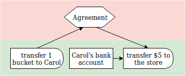
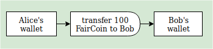
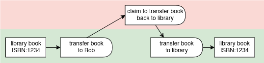
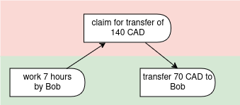
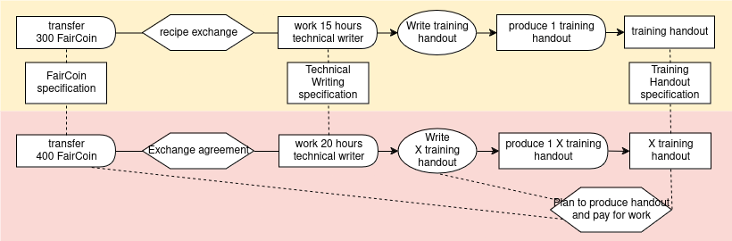

# Transfer and Exchange Examples

#### Exchange agreement

An exchange agreement with commitments.


``` yaml
# Example: Simple exchange agreement

'@context':
  - https://git.io/vf-examples-jsonld-context
  - alice: https://alice.example/
    bob: https://bob.example/

'@id': rgh:valueflows/valueflows/master/examples/exch-agreement.yaml
'@graph':

  # Exchange agreement with commitments

  - '@id': alice:57f1c1d0-432e-4bfa-9d32-002b8955a708
    '@type': Agreement
    skos:note: Alice commits to giving Bob 50 kg of apples in exchange for 10 liters of apple cider.

  - '@id': alice:2342d456-5d6f-46d5-a7ed-3ac7bfd5a86c
    '@type': Commitment
    clauseOf: alice:57f1c1d0-432e-4bfa-9d32-002b8955a708
    action: transfer
    provider: https://alice.example/
    receiver: https://bob.example/
    resourceClassifiedAs: https://www.wikidata.org/wiki/Q89 # apples
    resourceQuantity:
      om2:hasUnit: om2:kilogram
      om2:hasNumericalValue: 50

  - '@id': bob:fd399b37-0740-4a68-a184-1e655021ca21
    '@type': Commitment
    clauseOf: alice:57f1c1d0-432e-4bfa-9d32-002b8955a708
    action: transfer
    provider: https://bob.example/
    receiver: https://alice.example/
    resourceClassifiedAs: https://www.wikidata.org/wiki/Q5977438 # soft apple cider
    resourceQuantity:
      om2:hasUnit: om2:litre
      om2:hasNumericalValue: 10
```

#### Retail exchange

An exchange without prior commitments.  Note we are still using the Agreement to tie together the reciprocal events, even there were no commitments ahead of time.



``` yaml
# Example: Simple retail exchange without commitments

'@context':
  - https://git.io/vf-examples-jsonld-context
  - carol: https://carol.example/
    store: https://store.example/

'@id': rgh:valueflows/valueflows/master/examples/exch-retail.yaml
'@graph':

  - '@id': store:ac9ec98d-db80-44dc-97be-7aa149b2fe5d
    '@type': Agreement
    skos:note: Carol purchased a new bucket at the hardware store and paid 5 dollars for it.

  - '@id': store:a8356625-bf64-4c16-9099-28aa1b718c4b
    '@type': EconomicEvent
    realizationOf: store:ac9ec98d-db80-44dc-97be-7aa149b2fe5d
    action: transfer
    provider: https://store.example/
    receiver: https://carol.example/
    resourceClassifiedAs: https://www.wikidata.org/wiki/Q47107 # bucket
    resourceQuantity:
      om2:hasUnit: om2:one
      om2:hasNumericalValue: 1

  - '@id': store:2342d456-5d6f-46d5-a7ed-3ac7bfd5a86c
    '@type': EconomicEvent
    realizationOf: store:ac9ec98d-db80-44dc-97be-7aa149b2fe5d
    action: transfer
    provider: https://carol.example/
    receiver: https://store.example/
    resourceClassifiedAs: https://www.wikidata.org/wiki/Q4917 # US dollar
    resourceInventoriedAs: carol:e56fd654-7b94-4d96-8e60-de39e08329a7 # Carol's bank account
    resourceQuantity:
      om2:hasUnit: om2:one
      om2:hasNumericalValue: 5
```

#### Crypto-currency transfer

A simple transfer of a currency from one agent to another.



``` yaml
# Transfer of crypto-currency, ignoring the fee, but to record time involved in the transfer validation process

'@context':
  - https://git.io/vf-examples-jsonld-context
  - bob: https://bob.example/
    alice: https://alice.example/
    fair: https://faircoin.example/

'@id': rgh:valueflows/valueflows/master/examples/transfer-crypto.yaml
'@graph':

  # accounts before

  - '@id': fair:b75d8f6a-e2df-4e52-b36d-1a22a66f4ead
    '@type': EconomicResource
    skos:note: Alice's wallet address
    classifiedAs: wd:Q21002847 # FairCoin
    accountingQuantity:
      om2:hasUnit: om2:one
      om2:hasNumericalValue: 540

  - '@id': fair:3be5259d-10f0-431c-9fec-9c0c15a461d3
    '@type': EconomicResource
    skos:note: Bob's wallet address 
    classifiedAs: wd:Q21002847 # FairCoin
    accountingQuantity:
      om2:hasUnit: om2:one
      om2:hasNumericalValue: 480

  # transfer from Alice to Bob

  - '@id': urn:uuid:e5afaa28-1080-4912-835b-46883efb83e6
    '@type': EconomicEvent
    action: transfer
    resourceClassifiedAs: wd:Q21002847 # FairCoin
    resourceInventoriedAs: fair:b75d8f6a-e2df-4e52-b36d-1a22a66f4ead # Alice's wallet address
    toResourceInventoriedAs: fair:3be5259d-10f0-431c-9fec-9c0c15a461d3 # Bob's wallet address
    provider: https://alice.example
    receiver: https://bob.example
    resourceQuantity:
      om2:hasUnit: om2:one
      om2:hasNumericalValue: 100
    hasPointInTime: 2019-04-18T8:30:08-5:00

  # accounts after

  - '@id': fair:b75d8f6a-e2df-4e52-b36d-1a22a66f4ead
    '@type': EconomicResource
    skos:note: Alice's wallet address 
    classifiedAs: wd:Q21002847 # FairCoin
    accountingQuantity:
      om2:hasUnit: om2:one
      om2:hasNumericalValue: 440

  - '@id': fair:3be5259d-10f0-431c-9fec-9c0c15a461d3
    '@type': EconomicResource
    skos:note: Bob's wallet address 
    classifiedAs: wd:Q21002847 # FairCoin
    accountingQuantity:
      om2:hasUnit: om2:one
      om2:hasNumericalValue: 580
```

#### Moving crypto-currency

A simple move of a currency from one account to another by one agent.


``` yaml
# Move of crypto-currency for one agent, ignoring the fee

'@context':
  - https://git.io/vf-examples-jsonld-context
  - bob: https://bob.example/
    fair: https://faircoin.example/

'@id': rgh:valueflows/valueflows/master/examples/move-crypto.yaml
'@graph':

  # accounts before

  - '@id': fair:6fb358a3-2859-4d6a-a4fa-431603ee70f5
    '@type': EconomicResource
    skos:note: Bob's first wallet address
    classifiedAs: wd:Q21002847 # FairCoin
    accountingQuantity:
      om2:hasUnit: om2:one
      om2:hasNumericalValue: 540

  - '@id': fair:3be5259d-10f0-431c-9fec-9c0c15a461d3
    '@type': EconomicResource
    skos:note: Bob's second wallet address 
    classifiedAs: wd:Q21002847 # FairCoin
    accountingQuantity:
      om2:hasUnit: om2:one
      om2:hasNumericalValue: 480

  # move between Bob's accounts

  - '@id': urn:uuid:e5afaa28-1080-4912-835b-46883efb83e6
    '@type': EconomicEvent
    action: move
    resourceClassifiedAs: wd:Q21002847 # FairCoin
    resourceInventoriedAs: fair:6fb358a3-2859-4d6a-a4fa-431603ee70f5 # Bob's first wallet address
    toResourceInventoriedAs: fair:3be5259d-10f0-431c-9fec-9c0c15a461d3 # Bob's second wallet address
    provider: https://bob.example
    receiver: https://bob.example
    resourceQuantity:
      om2:hasUnit: om2:one
      om2:hasNumericalValue: 100
    hasPointInTime: 2019-04-18T8:30:08-5:00

  # accounts after

  - '@id': fair:b6fb358a3-2859-4d6a-a4fa-431603ee70f5
    '@type': EconomicResource
    skos:note: Bob's first wallet address 
    classifiedAs: wd:Q21002847 # FairCoin
    accountingQuantity:
      om2:hasUnit: om2:one
      om2:hasNumericalValue: 440

  - '@id': fair:3be5259d-10f0-431c-9fec-9c0c15a461d3
    '@type': EconomicResource
    skos:note: Bob's second wallet address 
    classifiedAs: wd:Q21002847 # FairCoin
    accountingQuantity:
      om2:hasUnit: om2:one
      om2:hasNumericalValue: 580
```

#### Checkout book

Checking out and checking back in a library book (a loan).



``` yaml
# Checking out a book

'@context':
  - https://git.io/vf-examples-jsonld-context
  - library: https://library.example/
    bob: https://bob.example/

'@id': rgh:valueflows/valueflows/master/examples/checkout-book.yaml
'@graph':

  # resource before

  - '@id': library:2402b57c-1c45-423a-acb2-f50961c97d65
    '@type': EconomicResource
    skos:note: Valueflows cookbook ISBN:1234 copy 2
    accountingQuantity:
      om2:hasUnit: om2:one
      om2:hasNumericalValue: 1
    onhandQuantity:
      om2:hasUnit: om2:one
      om2:hasNumericalValue: 1

  # check out

  - '@id': library:f47064eb-7120-4b31-b882-770165901fe6
    '@type': Agreement
    skos:note: loaning Valueflows cookbook to Bob

  - '@id': urn:uuid:54b814ee-62dc-40c1-bb96-f8582aa4f771
    '@type': EconomicEvent
    realizationOf: library:f47064eb-7120-4b31-b882-770165901fe6
    action: transfer-custody
    resourceInventoriedAs: library:2402b57c-1c45-423a-acb2-f50961c97d65
    hasPointInTime: 2019-04-18T8:00:00-5:00
    provider: https://library.example/
    receiver: https://bob.example/
    resourceQuantity: 
      om2:hasUnit: om2:one
      om2:hasNumericalValue: 1

  - '@id': urn:uuid:98c2bfeb-9c70-4801-896c-4646b975a7d9
    '@type': Commitment
    clauseOf: library:f47064eb-7120-4b31-b882-770165901fe6
    action: transfer-custody
    resourceInventoriedAs: library:2402b57c-1c45-423a-acb2-f50961c97d65
    provider: https://bob.example/
    receiver: https://library.example/
    resourceQuantity:
      om2:hasUnit: om2:one
      om2:hasNumericalValue: 1
    due: 2019-05-17T18:00:00-5:00

  # resource after check out

  - '@id': library:2402b57c-1c45-423a-acb2-f50961c97d65
    '@type': EconomicResource
    skos:note: Valueflows cookbook ISBN:1234 copy 2
    accountingQuantity:
      om2:hasUnit: om2:one
      om2:hasNumericalValue: 1
    onhandQuantity:
      om2:hasUnit: om2:one
      om2:hasNumericalValue: 0

  # return

  - '@id': urn:uuid:d4d2fd71-34f2-41c3-b1c5-19ad5ed2da59
    '@type': EconomicEvent
    realizationOf: library:f47064eb-7120-4b31-b882-770165901fe6
    action: transfer-custody
    resourceInventoriedAs: library:2402b57c-1c45-423a-acb2-f50961c97d65
    provider: https://bob.example/
    receiver: https://library.example/
    resourceQuantity:
      om2:hasUnit: om2:one
      om2:hasNumericalValue: 1
    hasPointInTime: 2019-05-14T10:20:00-5:00

  - '@id': urn:uuid:6f438393-7f87-4914-806c-e23a4fd15e89
    '@type': Fulfillment
    fulfills: urn:uuid:98c2bfeb-9c70-4801-896c-4646b975a7d9 # the commitment
    fulfilledBy: urn:uuid:d4d2fd71-34f2-41c3-b1c5-19ad5ed2da59 # the economic event
    resourceQuantity:
      om2:hasUnit: om2:one
      om2:hasNumericalValue: 1

  # resource after return

  - '@id': library:2402b57c-1c45-423a-acb2-f50961c97d65
    '@type': EconomicResource
    skos:note: Valueflows cookbook ISBN:1234 copy 2
    accountingQuantity:
      om2:hasUnit: om2:one
      om2:hasNumericalValue: 1
    onhandQuantity:
      om2:hasUnit: om2:one
      om2:hasNumericalValue: 1
```

#### Claim

Logged work triggers a claim for future income distribution for that work.



``` yaml
# Example: Claim (simple)

'@context':
  - https://git.io/vf-examples-jsonld-context
  - bob: https://bob.example/
    mfg: https://manufacturer.example/

'@id': rgh:valueflows/valueflows/master/examples/claim.yaml
'@graph':

  # Bob does some work to create a product that the mfg team wishes to sell on the marketplace

  - '@id': mfg:02b39a30-3e04-4305-9656-7f261aa63c83
    '@type': EconomicEvent
    action: work
    provider: https://bob.example/
    receiver: https://manufacturing.example/
    resourceClassifiedAs: https://www.wikidata.org/wiki/Q192047 # machining
    effortQuantity:
      om2:hasUnit: om2:hour
      om2:hasNumericalValue: 7
    hasBeginning: 2018-10-14T8:00:00-0:00
    hasEnd: 2018-10-14T15:00:00-0:00

  # this triggers a claim for payment in the future based on an income distribution agreement among the mfg group

  - '@id': mfg:d4d2fd71-34f2-41c3-b1c5-19ad5ed2da58
    '@type': Claim
    action: transfer
    provider: https://manufacturing.example/
    receiver: https://bob.example/
    resourceClassifiedAs: https://www.wikidata.org/wiki/Q1104069 # Canadian dollar
    resourceQuantity:
      om2:hasUnit: om2:one
      om2:hasNumericalValue: 140
    dcterms:created: 2018-10-14T15:30:00-0:00
    triggeredBy: mfg:02b39a30-3e04-4305-9656-7f261aa63c83
    agreedIn: mfg:e1721a61-cd47-4556-84b9-8b1b81da15be # a distribution agreement (not detailed in example)

  # half of the manufactured product is sold along with some other products, and income is distributed

  - '@id': mfg:c7897c39-7f05-4a5d-a487-80e130a2414a
    '@type': EconomicEvent
    action: transfer
    provider: https://manufacturing.example/
    receiver: https://bob.example/
    resourceClassifiedAs: https://www.wikidata.org/wiki/Q1104069 # Canadian dollar
    resourceQuantity:
      om2:hasUnit: om2:one
      om2:hasNumericalValue: 260 # here Bob received income for more than one work event (others not included in the example)
    hasPointInTime: 2018-10-25T09:30:00-0:00

  - '@id': mfg:b52a5815-fae9-43bf-be95-833b95dc0ada
    '@type': Settlement
    settles: mfg:d4d2fd71-34f2-41c3-b1c5-19ad5ed2da58 # the claim
    settlededBy: mfg:c7897c39-7f05-4a5d-a487-80e130a2414a # the economic event
    resourceQuantity:
      om2:hasUnit: om2:one
      om2:hasNumericalValue: 70 # half of the original claim for the work
```


#### Plan from recipe with production and exchange

This shows a simple recipe that includes both a process and the exchange of work that is input to the process for currency.



``` yaml
# Example: Simple recipe with both process and exchange

'@context':
  - https://git.io/vf-examples-jsonld-context
  - alice: https://alice.example/
    doc: https://documenters.example

'@id': rgh:valueflows/valueflows/master/examples/recipe-with-exchange.yaml
'@graph':

  # the recipe

  - '@id': urn:uuid:3be5259d-10f0-431c-9fec-9c0c15a461d3
    '@type': ResourceSpecification
    name: Training handout
    uri: https://documenters.example/training-handout
    skos:note: This is an electronic version of the formatted handout

  - '@id': urn:uuid:6b5bc786-b9ed-4189-b34f-5ef7d10f1f86
    '@type': ResourceSpecification
    name: Technical writing

  - '@id': urn:uuid:b90b0b77-09a2-42e2-8bd4-e9ae2c1c6172
    '@type': RecipeResource
    resourceConformsTo: urn:uuid:3be5259d-10f0-431c-9fec-9c0c15a461d3 # the spec
    name: Training handout

  - '@id': urn:uuid:33e8933b-ff73-4a01-964a-ca7a98893083
    '@type': RecipeFlow
    recipeOutputOf: urn:uuid:e1721a61-cd47-4556-84b9-8b1b81da15bf
    action: produce
    recipeFlowResource: urn:uuid:b90b0b77-09a2-42e2-8bd4-e9ae2c1c6172 # handout
    resourceQuantity:
      om2:hasUnit: one
      om2:hasNumericalValue: 1

  - '@id': urn:uuid:e1721a61-cd47-4556-84b9-8b1b81da15bf
    '@type': RecipeProcess
    name: Write and format training handout

  - '@id': urn:uuid:60f4204e-b8d2-4026-8577-102c3f82c0af
    '@type': RecipeFlow
    recipeInputOf: urn:uuid:e1721a61-cd47-4556-84b9-8b1b81da15bf
    recipeClauseOf: urn:uuid:9bd19194-a36d-4a1f-896b-8082887962cb # the recipe exchange
    action: work
    resourceConformsTo: urn:uuid:6b5bc786-b9ed-4189-b34f-5ef7d10f1f86
    resourceClassifiedAs: wd:Q1193158 # technical writing
    effortQuantity:
      om2:hasUnit: om2:hour
      om2:hasNumericalValue: 15

  - '@id': urn:uuid:9bd19194-a36d-4a1f-896b-8082887962cb
    '@type': RecipeExchange
    name: Exchange work for FairCoin

  - '@id': urn:uuid:3129ca8b-fcda-45be-bbda-294dc924d3b9
    '@type': RecipeFlow
    recipeClauseOf: urn:uuid:9bd19194-a36d-4a1f-896b-8082887962cb # the recipe exchange
    action: transfer
    resourceConformsTo: wd:Q21002847 # FairCoin
    resourceQuantity:
      om2:hasUnit: om2:one
      om2:hasNumericalValue: 300


  # the plan

  - '@id': doc:8e5fe80d-a769-4bd5-89e5-2136d33eab9f
    '@type': Plan
    name: Training Handout and Payment
    skos:note: Write and format the training handout, payment for writing work.
    due: 2019-04-08T17:00:00-5:00
    dcterms:created: 2019-04-01T10:35:00-5:00

  - '@id': doc:a8236bbb-81e0-422d-9861-56d2417db0fb
    '@type': Commitment
    independentDemandOf: doc:8e5fe80d-a769-4bd5-89e5-2136d33eab9f
    outputOf: doc:02b39a30-3e04-4305-9656-7f261aa63c84
    action: produce
    provider: https://documenters.example/
    receiver: https://documenters.example/
    resourceConformsTo: urn:uuid:3be5259d-10f0-431c-9fec-9c0c15a461d3 # training handout
    resourceQuantity:
      om2:hasUnit: om2:one
      om2:hasNumericalValue: 1

  - '@id': doc:02b39a30-3e04-4305-9656-7f261aa63c84
    '@type': Process
    name: Write and format training handout
    plannedWithin: doc:8e5fe80d-a769-4bd5-89e5-2136d33eab9f

  - '@id': doc:52f0e212-3c4f-4d27-b345-5e964c135824
    '@type': Commitment
    inputOf: doc:02b39a30-3e04-4305-9656-7f261aa63c84
    clauseOf: urn:uuid:583e83d9-a46d-44ff-bd71-88513a1d83c0
    action: work
    provider: https://alice.example/
    receiver: https://documenters.example/
    resourceConformsTo: urn:uuid:6b5bc786-b9ed-4189-b34f-5ef7d10f1f86
    resourceClassifiedAs: wd:Q1193158 # technical writing
    effortQuantity:
      om2:hasUnit: om2:hour
      om2:hasNumericalValue: 20 # the estimate for this particular work is higher than the recipe's

  - '@id': urn:uuid:583e83d9-a46d-44ff-bd71-88513a1d83c0
    '@type': Agreement
    name: Exchange technical documentation work for FairCoin

  - '@id': doc:b52a5815-fae9-43bf-be95-833b95dc0adb
    '@type': Commitment
    clauseOf: doc:02b39a30-3e04-4305-9656-7f261aa63c84
    action: transfer
    provider: https://documenters.example/
    receiver: https://alice.example/
    resourceConformsTo: wd:Q21002847 # FairCoin
    resourceQuantity:
      om2:hasUnit: om2:one
      om2:hasNumericalValue: 400
```
