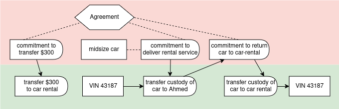

# Transfer and Exchange Examples

#### Exchange agreement

An exchange agreement with commitments.


``` yaml
# Example: Simple exchange agreement

'@context':
  - '@vocab': http://w3id.org/valueflows/ont/vf#
  - alice: https://alice.example/
    bob: https://bob.example/

'@graph':

  # Exchange agreement with commitments

  - '@id': alice:57f1c1d0-432e-4bfa-9d32-002b8955a708
    '@type': Agreement
    note: Alice commits to giving Bob 50 kg of apples in exchange for 10 liters of apple cider.

  - '@id': alice:2342d456-5d6f-46d5-a7ed-3ac7bfd5a86c
    '@type': Commitment
    clauseOf: alice:57f1c1d0-432e-4bfa-9d32-002b8955a708
    action: transfer
    provider: https://alice.example/
    receiver: https://bob.example/
    resourceConformsTo: http://www.wikidata.org/entity/Q89 # apples
    resourceQuantity:
      hasUnit: kilogram
      hasNumericalValue: 50

  - '@id': bob:fd399b37-0740-4a68-a184-1e655021ca21
    '@type': Commitment
    clauseOf: alice:57f1c1d0-432e-4bfa-9d32-002b8955a708
    action: transfer
    provider: https://bob.example/
    receiver: https://alice.example/
    resourceConformsTo: http://www.wikidata.org/entity/Q5977438 # soft apple cider
    resourceQuantity:
      hasUnit: litre
      hasNumericalValue: 10
```

#### Retail exchange

An exchange without prior commitments.  Note we are still using the Agreement to tie together the reciprocal events, even there were no commitments ahead of time.


``` yaml
# Example: Simple retail exchange without commitments

'@context':
  - '@vocab': http://w3id.org/valueflows/ont/vf#
  - carol: https://carol.example/
    store: https://store.example/

'@graph':

  - '@id': store:ac9ec98d-db80-44dc-97be-7aa149b2fe5d
    '@type': Agreement
    note: Carol purchased a new bucket at the hardware store and paid 5 dollars for it.

  - '@id': store:a8356625-bf64-4c16-9099-28aa1b718c4b
    '@type': EconomicEvent
    realizationOf: store:ac9ec98d-db80-44dc-97be-7aa149b2fe5d
    action: transfer
    provider: https://store.example/
    receiver: https://carol.example/
    resourceConformsTo: http://www.wikidata.org/entity/Q47107 # bucket
    resourceQuantity:
      hasUnit: one
      hasNumericalValue: 1

  - '@id': store:2342d456-5d6f-46d5-a7ed-3ac7bfd5a86c
    '@type': EconomicEvent
    reciprocalRealizationOf: store:ac9ec98d-db80-44dc-97be-7aa149b2fe5d
    action: transfer
    provider: https://carol.example/
    receiver: https://store.example/
    resourceConformsTo: http://www.wikidata.org/entity/Q4917 # US dollar
    resourceInventoriedAs: carol:e56fd654-7b94-4d96-8e60-de39e08329a7 # Carol's bank account
    resourceQuantity:
      hasUnit: one
      hasNumericalValue: 5
```

#### Crypto-currency transfer

A simple transfer of a currency from one agent to another.


``` yaml
# Transfer of crypto-currency, ignoring the fee, but to record time involved in the transfer validation process

'@context':
  - '@vocab': http://w3id.org/valueflows/ont/vf#
  - bob: https://bob.example/
    alice: https://alice.example/
    fair: https://faircoin.example/

'@graph':

  # accounts before

  - '@id': fair:b75d8f6a-e2df-4e52-b36d-1a22a66f4ead
    '@type': EconomicResource
    note: Alice's wallet address
    conformsTo: http://www.wikidata.org/entity/Q21002847 # FairCoin
    accountingQuantity:
      hasUnit: one
      hasNumericalValue: 540

  - '@id': fair:3be5259d-10f0-431c-9fec-9c0c15a461d3
    '@type': EconomicResource
    note: Bob's wallet address
    conformsTo: http://www.wikidata.org/entity/Q21002847 # FairCoin
    accountingQuantity:
      hasUnit: one
      hasNumericalValue: 480

  # transfer from Alice to Bob

  - '@id': urn:uuid:e5afaa28-1080-4912-835b-46883efb83e6
    '@type': EconomicEvent
    action: transfer
    resourceConformsTo: http://www.wikidata.org/entity/Q21002847 # FairCoin
    resourceInventoriedAs: fair:b75d8f6a-e2df-4e52-b36d-1a22a66f4ead # Alice's wallet address
    toResourceInventoriedAs: fair:3be5259d-10f0-431c-9fec-9c0c15a461d3 # Bob's wallet address
    provider: https://alice.example
    receiver: https://bob.example
    resourceQuantity:
      hasUnit: one
      hasNumericalValue: 100
    hasPointInTime: 2019-04-18T8:30:08-5:00

  # accounts after

  - '@id': fair:b75d8f6a-e2df-4e52-b36d-1a22a66f4ead
    '@type': EconomicResource
    note: Alice's wallet address
    conformsTo: http://www.wikidata.org/entity/Q21002847 # FairCoin
    accountingQuantity:
      hasUnit: one
      hasNumericalValue: 440

  - '@id': fair:3be5259d-10f0-431c-9fec-9c0c15a461d3
    '@type': EconomicResource
    note: Bob's wallet address
    conformsTo: http://www.wikidata.org/entity/Q21002847 # FairCoin
    accountingQuantity:
      hasUnit: one
      hasNumericalValue: 580
```

#### Moving crypto-currency

A simple move of a currency from one account to another by one agent.


``` yaml
# Move of crypto-currency for one agent, ignoring the fee

'@context':
  - '@vocab': http://w3id.org/valueflows/ont/vf#
  - bob: https://bob.example/
    fair: https://faircoin.example/

'@graph':

  # accounts before

  - '@id': fair:6fb358a3-2859-4d6a-a4fa-431603ee70f5
    '@type': EconomicResource
    note: Bob's first wallet address
    conformsTo: http://www.wikidata.org/entity/Q21002847 # FairCoin
    accountingQuantity:
      hasUnit: one
      hasNumericalValue: 540

  - '@id': fair:3be5259d-10f0-431c-9fec-9c0c15a461d3
    '@type': EconomicResource
    note: Bob's second wallet address
    conformsTo: http://www.wikidata.org/entity/Q21002847 # FairCoin
    accountingQuantity:
      hasUnit: one
      hasNumericalValue: 480

  # move between Bob's accounts

  - '@id': urn:uuid:e5afaa28-1080-4912-835b-46883efb83e6
    '@type': EconomicEvent
    action: move
    resourceconformsTo: http://www.wikidata.org/entity/Q21002847 # FairCoin
    resourceInventoriedAs: fair:6fb358a3-2859-4d6a-a4fa-431603ee70f5 # Bob's first wallet address
    toResourceInventoriedAs: fair:3be5259d-10f0-431c-9fec-9c0c15a461d3 # Bob's second wallet address
    provider: https://bob.example
    receiver: https://bob.example
    resourceQuantity:
      hasUnit: one
      hasNumericalValue: 100
    hasPointInTime: 2019-04-18T8:30:08-5:00

  # accounts after

  - '@id': fair:b6fb358a3-2859-4d6a-a4fa-431603ee70f5
    '@type': EconomicResource
    note: Bob's first wallet address
    conformsTo: http://www.wikidata.org/entity/Q21002847 # FairCoin
    accountingQuantity:
      hasUnit: one
      hasNumericalValue: 440

  - '@id': fair:3be5259d-10f0-431c-9fec-9c0c15a461d3
    '@type': EconomicResource
    note: Bob's second wallet address
    conformsTo: http://www.wikidata.org/entity/Q21002847 # FairCoin
    accountingQuantity:
      hasUnit: one
      hasNumericalValue: 580
```

#### Checkout book

Checking out and checking back in a library book (a loan).


``` yaml
# Checking out a book

'@context':
  - '@vocab': http://w3id.org/valueflows/ont/vf#
  - library: https://library.example/
    bob: https://bob.example/

'@graph':

  # resource before

  - '@id': library:2402b57c-1c45-423a-acb2-f50961c97d65
    '@type': EconomicResource
    note: Valueflows cookbook ISBN:1234 copy 2
    accountingQuantity:
      hasUnit: one
      hasNumericalValue: 1
    onhandQuantity:
      hasUnit: one
      hasNumericalValue: 1

  # check out

  - '@id': library:f47064eb-7120-4b31-b882-770165901fe6
    '@type': Agreement
    note: loaning Valueflows cookbook to Bob

  - '@id': urn:uuid:54b814ee-62dc-40c1-bb96-f8582aa4f771
    '@type': EconomicEvent
    realizationOf: library:f47064eb-7120-4b31-b882-770165901fe6
    action: transferCustody
    resourceInventoriedAs: library:2402b57c-1c45-423a-acb2-f50961c97d65
    hasPointInTime: 2019-04-18T8:00:00-5:00
    provider: https://library.example/
    receiver: https://bob.example/
    resourceQuantity: 
      hasUnit: one
      hasNumericalValue: 1

  - '@id': urn:uuid:98c2bfeb-9c70-4801-896c-4646b975a7d9
    '@type': Commitment
    clauseOf: library:f47064eb-7120-4b31-b882-770165901fe6
    action: transferCustody
    resourceInventoriedAs: library:2402b57c-1c45-423a-acb2-f50961c97d65
    provider: https://bob.example/
    receiver: https://library.example/
    resourceQuantity:
      hasUnit: one
      hasNumericalValue: 1
    due: 2019-05-17T18:00:00-5:00

  # resource after check out

  - '@id': library:2402b57c-1c45-423a-acb2-f50961c97d65
    '@type': EconomicResource
    note: Valueflows cookbook ISBN:1234 copy 2
    accountingQuantity:
      hasUnit: one
      hasNumericalValue: 1
    onhandQuantity:
      hasUnit: one
      hasNumericalValue: 0

  # return

  - '@id': urn:uuid:d4d2fd71-34f2-41c3-b1c5-19ad5ed2da59
    '@type': EconomicEvent
    realizationOf: library:f47064eb-7120-4b31-b882-770165901fe6
    action: transferCustody
    resourceInventoriedAs: library:2402b57c-1c45-423a-acb2-f50961c97d65
    provider: https://bob.example/
    receiver: https://library.example/
    resourceQuantity:
      hasUnit: one
      hasNumericalValue: 1
    hasPointInTime: 2019-05-14T10:20:00-5:00
    fulfills: urn:uuid:98c2bfeb-9c70-4801-896c-4646b975a7d9 # the commitment

  # resource after return

  - '@id': library:2402b57c-1c45-423a-acb2-f50961c97d65
    '@type': EconomicResource
    note: Valueflows cookbook ISBN:1234 copy 2
    accountingQuantity:
      hasUnit: one
      hasNumericalValue: 1
    onhandQuantity:
      hasUnit: one
      hasNumericalValue: 1
```

#### Claim for income

Logged work triggers a claim for future income distribution for that work.


``` yaml
# Example: Claim (simple)

'@context':
  - '@vocab': http://w3id.org/valueflows/ont/vf#
  - bob: https://bob.example/
    mfg: https://manufacturer.example/

'@graph':

  # Bob does some work to create a product that the mfg team wishes to sell on the marketplace

  - '@id': mfg:02b39a30-3e04-4305-9656-7f261aa63c83
    '@type': EconomicEvent
    action: work
    provider: https://bob.example/
    receiver: https://manufacturing.example/
    resourceConformsTo: http://www.wikidata.org/entity/Q192047 # machining
    effortQuantity:
      hasUnit: hour
      hasNumericalValue: 7
    hasBeginning: 2018-10-14T8:00:00-0:00
    hasEnd: 2018-10-14T15:00:00-0:00

  # this triggers a claim for payment in the future based on an income distribution agreement among the mfg group

  - '@id': mfg:d4d2fd71-34f2-41c3-b1c5-19ad5ed2da58
    '@type': Claim
    action: transfer
    provider: https://manufacturing.example/
    receiver: https://bob.example/
    resourceConformsTo: http://www.wikidata.org/entity/Q1104069 # Canadian dollar
    resourceQuantity:
      hasUnit: one
      hasNumericalValue: 140
    created: 2018-10-14T15:30:00-0:00
    triggeredBy: mfg:02b39a30-3e04-4305-9656-7f261aa63c83

  # half of the manufactured product is sold, and income is distributed

  - '@id': mfg:c7897c39-7f05-4a5d-a487-80e130a2414a
    '@type': EconomicEvent
    action: transfer
    provider: https://manufacturing.example/
    receiver: https://bob.example/
    resourceConformsTo: http://www.wikidata.org/entity/Q1104069 # Canadian dollar
    resourceQuantity:
      hasUnit: one
      hasNumericalValue: 70 # partially settles the claim
    hasPointInTime: 2018-10-25T09:30:00-0:00
    settles: mfg:d4d2fd71-34f2-41c3-b1c5-19ad5ed2da58 # the claim

```

#### Car Rental

Renting a car as a service, with transfer of custody.



``` yaml
# Example: Car rental

'@context':
  - '@vocab': http://w3id.org/valueflows/ont/vf#
  - ahmed: https://ahmed.example/
    car: https://car-rental.example/

'@graph':

  # Ahmed rents a car for a week

  # resource before

  - '@id': car:2402b57c-1c45-423a-acb2-f50961c9df89
    '@type': EconomicResource
    trackingIdentifier: VIN 43187 # a specific car
    classifiedAs: midsize
    accountingQuantity:
      hasUnit: one
      hasNumericalValue: 1
    onhandQuantity:
      hasUnit: one
      hasNumericalValue: 1

  # schedule rental

  - '@id': car:f47064eb-7120-4b31-b882-770165901fe6
    '@type': Agreement
    note: renting midsize car for a week

  - '@id': car:3129ca8b-fcda-45be-bbda-294dc924r8f8
    '@type': Commitment
    clauseOf: car:f47064eb-7120-4b31-b882-770165901fe6
    action: deliverService
    resourceConformsTo: http://www.wikidata.org/entity/Q110464531 # short term rental
    hasBeginning: 2019-04-18T8:00:00-5:00
    hasEnd: 2019-04-25T9:00:00-5:00
    provider: https://car-rental.example/
    receiver: https://ahmed.example/
    resourceQuantity:
      hasUnit: one
      hasNumericalValue: 1

  - '@id': car:3129ca8b-fcda-45be-bbda-294dc924r8f8
    '@type': Commitment
    reciprocalClauseOf: car:f47064eb-7120-4b31-b882-770165901fe6
    action: transfer
    resourceConformsTo: http://www.wikidata.org/entity/Q4917 # US dollar
    hasPointInTime: 2019-04-18T8:00:00-5:00
    provider: https://ahmed.example/
    receiver: https://car-rental.example/
    resourceQuantity:
      hasUnit: one
      hasNumericalValue: 300

  # pick up car

  - '@id': car:3129ca8b-fcda-45be-bbda-294dc924kj87
    '@type': EconomicEvent
    fulfills: car:3129ca8b-fcda-45be-bbda-294dc924r8f8
    reciprocalRealizationOf: car:f47064eb-7120-4b31-b882-770165901fe6
    action: transfer
    resourceConformsTo: http://www.wikidata.org/entity/Q4917 # US dollar
    hasPointInTime: 2019-04-18T8:30:00-5:00
    provider: https://ahmed.example/
    receiver: https://car-rental.example/
    resourceQuantity:
      hasUnit: one
      hasNumericalValue: 300

  - '@id': urn:uuid:54b814ee-62dc-40c1-bb96-f8582aa4f771
    '@type': EconomicEvent
    realizationOf: car:f47064eb-7120-4b31-b882-770165901fe6
    action: transferCustody
    resourceInventoriedAs: car:2402b57c-1c45-423a-acb2-f50961c97d65
    hasPointInTime: 2019-04-18T9:00:00-5:00
    provider: https://car-rental.example/
    receiver: https://ahmed.example/
    resourceQuantity:
      hasUnit: one
      hasNumericalValue: 1

  - '@id': urn:uuid:98c2bfeb-9c70-4801-896c-4646b975a7d9
    '@type': Commitment
    clauseOf: car:f47064eb-7120-4b31-b882-770165901fe6
    action: transferCustody
    resourceInventoriedAs: car:2402b57c-1c45-423a-acb2-f50961c97d65
    provider: https://ahmed.example/
    receiver: https://car-rental.example/
    resourceQuantity:
      hasUnit: one
      hasNumericalValue: 1
    due: 2019-04-25T9:00:00-5:00

  # resource after pick up

  - '@id': car:2402b57c-1c45-423a-acb2-f50961c9df89
    '@type': EconomicResource
    trackingIdentifier: VIN 43187 # a specific car
    classifiedAs: midsize
    accountingQuantity:
      hasUnit: one
      hasNumericalValue: 1
    onhandQuantity:
      hasUnit: one
      hasNumericalValue: 0

  # return

  - '@id': urn:uuid:d4d2fd71-34f2-41c3-b1c5-19ad5ed2da59
    '@type': EconomicEvent
    realizationOf: car:f47064eb-7120-4b31-b882-770165901fe6
    action: transferCustody
    resourceInventoriedAs: car:2402b57c-1c45-423a-acb2-f50961c9df89
    provider: https://ahmed.example/
    receiver: https://car-rental.example/
    resourceQuantity:
      hasUnit: one
      hasNumericalValue: 1
    hasPointInTime: 2019-04-25T07:20:00-5:00
    fulfills: urn:uuid:98c2bfeb-9c70-4801-896c-4646b975a7d9 # the commitment

  # resource after return

  - '@id': car:2402b57c-1c45-423a-acb2-f50961c9df89
    '@type': EconomicResource
    trackingIdentifier: VIN 43187 # a specific car
    classifiedAs: midsize
    accountingQuantity:
      hasUnit: one
      hasNumericalValue: 1
    onhandQuantity:
      hasUnit: one
      hasNumericalValue: 1

```

#### Transportation with transfer

Bob purchases 30kg of apples from Alice and Claudia transports them (FOB destination).  This illustrates an implied transfer of custody, to keep the overall flow simpler.  (The example without the implied transfer is shown after this one.)


``` yaml
# Transportation with transfer

'@context':
  - '@vocab': http://w3id.org/valueflows/ont/vf#
  - alice: https://alice.example/
    bob: https://bob.example/
    claudia: https://claudia.example/
    geo: https://location.example/

'@graph':

# Bob purchases 30kg of apples from Alice and Claudia transports them (FOB destination)

  # Alice's resource before

  - '@id': alice:21f361a6-2375-46bb-b192-c21b5ba833bf
    '@type': EconomicResource
    conformsTo: http://www.wikidata.org/entity/Q41777871 # haralson apples
    trackingIdentifier: lot-alice-apples-2018-10-11
    locatedAt: geo:70ee3034-0d15-4471-8ee3-91c60bb1a9c9
    primaryAccountable: https://alice.example
    accountingQuantity:
      hasUnit: kilogram
      hasNumericalValue: 230
    onhandQuantity:
      hasUnit: kilogram
      hasNumericalValue: 230

  # alice commits to transfer some apples to bob

  - '@id': urn:uuid:6b5bc786-b9ed-4189-b34f-5ef7d10f1f86
    '@type': Commitment
    action: transfer
    resourceConformsTo: http://www.wikidata.org/entity/Q41777871Q41777871 # haralson apples
    provider: https://alice.example/
    receiver: https://bob.example/
    resourceQuantity:
      hasUnit: kilogram
      hasNumericalValue: 30

  # alice and claudia agree on transportation of the apples

  - '@id': urn:uuid:f325a950-5737-488d-b122-8f21114d0eb0
    '@type': Agreement
    note: exchange transportation service for currency
    stipulates:

    - '@id': urn:uuid:c7897c39-7f05-4a5d-a487-80e130a2414a
      '@type': Commitment
      note: Transportation of alice's apples from alice's location to bob's location
      action: deliverService
      resourceClassifiedAs: http://www.wikidata.org/entity/Q7590 # transportation service
      provider: https://claudia.example/
      receiver: https://alice.example/
      resourceQuantity:
        hasUnit: one
        hasNumericalValue: 1

    stipulatesReciprocal:

    - '@id': urn:uuid:33e8933b-ff73-4a01-964a-ca7a98893083
      '@type': Commitment
      action: transfer
      resourceConformsTo: http://www.wikidata.org/entity/Q4917 # US Dollar
      provider: https://alice.example/
      receiver: https://claudia.example/
      resourceQuantity:
        hasUnit: one
        hasNumericalValue: 10

  # claudia transports the apples in two hops

  - '@id': claudia:633f6e56-6c7d-4a5b-b9c9-1a8adafd8960
    '@type': Process
    note: Claudia transports the apples to the distribution center
    hasInput:

    - '@id': claudia:fd399b37-0740-4a68-a184-1e655021ca21
      '@type': EconomicEvent
      action: pickup # with implied transfer custody, since different provider/receiver
      resourceInventoriedAs: alice:21f361a6-2375-46bb-b192-c21b5ba833bf
      toResourceInventoriedAs: claudia:27be5cab-d740-4194-9298-1661a69d9d95
      provider: https://alice.example/
      receiver: https://claudia.example/
      resourceQuantity:
        hasUnit: kilogram
        hasNumericalValue: 30

    hasOutput:

    - '@id': claudia:57f1c1d0-432e-4bfa-9d32-002b8955a708
      '@type': EconomicEvent
      action: dropoff # no implied transfer, one agent and one resource
      resourceInventoriedAs: claudia:27be5cab-d740-4194-9298-1661a69d9d95
      provider: https://claudia.example/
      receiver: https://claudia.example/
      resourceQuantity:
        hasUnit: kilogram
        hasNumericalValue: 30

  - '@id': claudia:c404cff5-19c7-453d-b0d8-d8e96055bd0c
    '@type': Process
    note: Claudia transports the apples from the distribution center to the receiver
    hasInput:

    - '@id': claudia:856c43b1-0a63-445f-a56f-707b257f086e
      '@type': EconomicEvent
      action: pickup
      resourceInventoriedAs: claudia:27be5cab-d740-4194-9298-1661a69d9d95
      provider: https://claudia.example/
      receiver: https://claudia.example/
      resourceQuantity:
        hasUnit: kilogram
        hasNumericalValue: 30

    hasOutput:

    - '@id': claudia:9cb4944b-d26d-4774-a530-d18f2747c0d8
      '@type': EconomicEvent
      action: dropoff # implied transfer of custody
      resourceInventoriedAs: claudia:27be5cab-d740-4194-9298-1661a69d9d95
      toResourceInventoriedAs: bob:9bd19194-a36d-4a1f-896b-8082887962cb
      provider: https://claudia.example/
      receiver: https://bob.example/
      resourceQuantity:
        hasUnit: kilogram
        hasNumericalValue: 30

    - '@id': urn:uuid:68cabaf3-deb8-4bd5-a439-798263abe35a
      '@type': EconomicEvent
      note: Transportation of alice's apples to bob's location
      action: deliverService
      resourceConformsTo: http://www.wikidata.org/entity/Q7590 # transportation service
      provider: https://claudia.example/
      receiver: https://alice.example/
      resourceQuantity:
        hasUnit: one
        hasNumericalValue: 1
      fulfills: urn:uuid:c7897c39-7f05-4a5d-a487-80e130a2414a # the commitment

  # receipt of the apples triggers finalizing the transfer of ownership

  - '@id': urn:uuid:ad56a7ed-be3c-4937-a3fb-0f156bcd2c47
    '@type': EconomicEvent
    action: transferAllRights
    resourceClassifiedAs: http://www.wikidata.org/entity/Q41777871 # haralson apples
    trackingIdentifier: lot-alice-apples-2018-10-11
    provider: https://alice.example/
    receiver: https://bob.example/
    resourceQuantity:
      hasUnit: kilogram
      hasNumericalValue: 30
    fulfills: urn:uuid:6b5bc786-b9ed-4189-b34f-5ef7d10f1f86 # the commitment

  # resources snapshot

  - '@id': alice:21f361a6-2375-46bb-b192-c21b5ba833bf
    '@type': EconomicResource
    conformsTo: http://www.wikidata.org/entity/Q41777871 # haralson apples
    trackingIdentifier: lot-alice-apples-2018-10-11
    locatedAt: geo:70ee3034-0d15-4471-8ee3-91c60bb1a9c9
    primaryAccountable: https://alice.example
    accountingQuantity:
      hasUnit: kilogram
      hasNumericalValue: 200
    onhandQuantity:
      hasUnit: kilogram
      hasNumericalValue: 200

  - '@id': bob:9bd19194-a36d-4a1f-896b-8082887962cb
    '@type': EconomicResource
    conformsTo: http://www.wikidata.org/entity/Q41777871 # haralson apples
    trackingIdentifier: lot-alice-apples-2018-10-11
    locatedAt: geo:b52a5815-fae9-43bf-be95-833b95dc0ada
    primaryAccountable: https://bob.example
    accountingQuantity:
      hasUnit: kilogram
      hasNumericalValue: 30
    onhandQuantity:
      hasUnit: kilogram
      hasNumericalValue: 30

  - '@id': claudia:27be5cab-d740-4194-9298-1661a69d9d95 # record of claudia's bill of lading on the truck
    '@type': EconomicResource
    conformsTo: http://www.wikidata.org/entity/Q41777871 # haralson apples
    onhandQuantity:
      hasUnit: kilogram
      hasNumericalValue: 0

  # alice pays claudia for the transportation service

  - '@id': urn:uuid:8baa8ff7-9c1e-4586-ae7b-79d620a3cac9
    '@type': EconomicEvent
    action: transfer
    resourceConformsTo: http://www.wikidata.org/entity/Q4917 # US Dollar
    resourceInventoriedAs: alice:daa2ec3b-2c1a-4eb1-839f-8dcec1a1f93a # alice's bank account
    toResourceInventoriedAs: claudia:bd5806d6-4a36-45b9-b3b6-3e7d361a5a14 # claudia's bank account
    provider: https://alice.example/
    receiver: https://claudia.example/
    resourceQuantity:
      hasUnit: one
      hasNumericalValue: 10
    fulfills: urn:uuid:33e8933b-ff73-4a01-964a-ca7a98893083 # the commitment
```
The following shows a snippet alternative for the transport, where claudia uses alice's id for what is in her custody.
``` yaml
  # claudia transports the apples in two hops

  - '@id': claudia:633f6e56-6c7d-4a5b-b9c9-1a8adafd8960
    '@type': Process
    note: Claudia transports the apples to the distribution center
    hasInput:

    - '@id': claudia:fd399b37-0740-4a68-a184-1e655021ca21
      '@type': EconomicEvent
      action: pickup
      resourceInventoriedAs: alice:21f361a6-2375-46bb-b192-c21b5ba833bf
      provider: https://alice.example/
      receiver: https://claudia.example/
      resourceQuantity:
        hasUnit: kilogram
        hasNumericalValue: 30

    hasOutput:

    - '@id': claudia:57f1c1d0-432e-4bfa-9d32-002b8955a708
      '@type': EconomicEvent
      action: dropoff
      resourceInventoriedAs: alice:21f361a6-2375-46bb-b192-c21b5ba833bf
      provider: https://claudia.example/
      receiver: https://claudia.example/
      resourceQuantity:
        hasUnit: kilogram
        hasNumericalValue: 30

  - '@id': claudia:c404cff5-19c7-453d-b0d8-d8e96055bd0c
    '@type': Process
    note: Claudia transports the apples from the distribution center to the receiver
    hasInput:

    - '@id': claudia:856c43b1-0a63-445f-a56f-707b257f086e
      '@type': EconomicEvent
      action: pickup
      resourceInventoriedAs: alice:21f361a6-2375-46bb-b192-c21b5ba833bf
      provider: https://claudia.example/
      receiver: https://claudia.example/
      resourceQuantity:
        hasUnit: kilogram
        hasNumericalValue: 30

    hasOutput:

    - '@id': claudia:9cb4944b-d26d-4774-a530-d18f2747c0d8
      '@type': EconomicEvent
      action: dropoff
      resourceInventoriedAs: alice:21f361a6-2375-46bb-b192-c21b5ba833bf
      toResourceInventoriedAs: bob:9bd19194-a36d-4a1f-896b-8082887962cb
      provider: https://claudia.example/
      receiver: https://bob.example/
      resourceQuantity:
        hasUnit: kilogram
        hasNumericalValue: 30

    - '@id': urn:uuid:68cabaf3-deb8-4bd5-a439-798263abe35a
      '@type': EconomicEvent
      note: Transportation of alice's apples from alice's location to bob's location
      action: deliverService
      resourceConformsTo: http://www.wikidata.org/entity/Q7590 # transportation service
      provider: https://claudia.example/
      receiver: https://alice.example/
      resourceQuantity:
        hasUnit: one
        hasNumericalValue: 1
      fulfills: urn:uuid:c7897c39-7f05-4a5d-a487-80e130a2414a # the commitment
```
It is also valid to do this with an explicit transfer of custody, as below:


``` yaml
# Transportation with transfer

'@context':
  - '@vocab': http://w3id.org/valueflows/ont/vf#
  - alice: https://alice.example/
    bob: https://bob.example/
    claudia: https://claudia.example/

'@graph':

# Bob purchases 30kg of apples from Alice and Claudia transports them (FOB destination)

  # Alice's resource before

  - '@id': alice:21f361a6-2375-46bb-b192-c21b5ba833bf
    '@type': EconomicResource
    conformsTo: http://www.wikidata.org/entity/Q41777871 # haralson apples
    trackingIdentifier: lot-alice-apples-2018-10-11
    locatedAt: geo:70ee3034-0d15-4471-8ee3-91c60bb1a9c9
    primaryAccountable: https://alice.example
    accountingQuantity:
      om2:hasUnit: om2:kilogram
      om2:hasNumericalValue: 230
    onhandQuantity:
      om2:hasUnit: om2:kilogram
      om2:hasNumericalValue: 230

  # alice commits to transfer some apples to bob

  - '@id': urn:uuid:6b5bc786-b9ed-4189-b34f-5ef7d10f1f86
    '@type': Commitment
    action: transfer
    resourceConformsTo: http://www.wikidata.org/entity/Q41777871 # haralson apples
    provider: https://alice.example/
    receiver: https://bob.example/
    resourceQuantity:
      om2:hasUnit: om2:kilogram
      om2:hasNumericalValue: 30

  # alice and claudia agree on transportation of the apples

  - '@id': urn:uuid:f325a950-5737-488d-b122-8f21114d0eb0
    '@type': Agreement
    skos:note: exchange transportation service for currency
    stipulates:

    - '@id': urn:uuid:c7897c39-7f05-4a5d-a487-80e130a2414a
      '@type': Commitment
      skos:note: Transportation of alice's apples from alice's location to bob's location
      action: deliverService
      resourceClassifiedAs: http://www.wikidata.org/entity/Q7590 # transportation service
      provider: https://claudia.example/
      receiver: https://alice.example/
      resourceQuantity:
        om2:hasUnit: om2:one
        om2:hasNumericalValue: 1

    stipulatesReciprocal:
    - '@id': urn:uuid:33e8933b-ff73-4a01-964a-ca7a98893083
      '@type': Commitment
      action: transfer
      resourceConformsTo: http://www.wikidata.org/entity/Q4917 # US Dollar
      provider: https://alice.example/
      receiver: https://claudia.example/
      resourceQuantity:
        om2:hasUnit: om2:one
        om2:hasNumericalValue: 10

  # alice transfers custody of the apples to claudia for transportation

  - '@id': urn:uuid:6b5bc786-b9ed-4189-b34f-5ef7d10f1f87
    '@type': EconomicEvent
    action: transferCustody # this is an event that was implied in the first example
    resourceClassifiedAs: http://www.wikidata.org/entity/Q41777871 # haralson apples
    trackingIdentifier: lot-alice-apples-2018-10-11
    provider: https://alice.example/
    receiver: https://claudia.example/
    resourceInventoriedAs: alice:21f361a6-2375-46bb-b192-c21b5ba833bf # alice's apples
    toResourceInventoriedAs: claudia:27be5cab-d740-4194-9298-1661a69d9d95 # claudia's bill of lading on the truck
    resourceQuantity:
      om2:hasUnit: om2:kilogram
      om2:hasNumericalValue: 30

  # resources snapshot

  - '@id': alice:21f361a6-2375-46bb-b192-c21b5ba833bf
    '@type': EconomicResource
    classifiedAs: http://www.wikidata.org/entity/Q41777871 # haralson apples
    trackingIdentifier: lot-alice-apples-2018-10-11
    locatedAt: geo:70ee3034-0d15-4471-8ee3-91c60bb1a9c9
    primaryAccountable: https://alice.example
    accountingQuantity:
      om2:hasUnit: om2:kilogram
      om2:hasNumericalValue: 230
    onhandQuantity:
      om2:hasUnit: om2:kilogram
      om2:hasNumericalValue: 200

  - '@id': claudia:27be5cab-d740-4194-9298-1661a69d9d95
    '@type': EconomicResource
    classifiedAs: http://www.wikidata.org/entity/Q41777871 # haralson apples
    trackingIdentifier: lot-alice-apples-2018-10-11
    onhandQuantity:
      om2:hasUnit: om2:kilogram
      om2:hasNumericalValue: 30

  # claudia transports the apples in two hops

  - '@id': claudia:633f6e56-6c7d-4a5b-b9c9-1a8adafd8960
    '@type': Process
    skos:note: Claudia transports the apples
    hasInput:

    - '@id': claudia:fd399b37-0740-4a68-a184-1e655021ca21
      '@type': EconomicEvent
      action: pickup
      resourceInventoriedAs: claudia:27be5cab-d740-4194-9298-1661a69d9d95
      provider: https://claudia.example/
      receiver: https://claudia.example/
      resourceQuantity:
        om2:hasUnit: om2:kilogram
        om2:hasNumericalValue: 30

    hasOutput:

    - '@id': claudia:57f1c1d0-432e-4bfa-9d32-002b8955a708
      '@type': EconomicEvent
      action: dropoff
      resourceInventoriedAs: claudia:27be5cab-d740-4194-9298-1661a69d9d95
      provider: https://claudia.example/
      receiver: https://claudia.example/
      resourceQuantity:
        om2:hasUnit: om2:kilogram
        om2:hasNumericalValue: 30

  - '@id': claudia:c404cff5-19c7-453d-b0d8-d8e96055bd0c
    '@type': Process
    skos:note: Claudia transports the apples
    hasInput:

    - '@id': claudia:856c43b1-0a63-445f-a56f-707b257f086e
      '@type': EconomicEvent
      action: pickup
      resourceInventoriedAs: claudia:27be5cab-d740-4194-9298-1661a69d9d95
      provider: https://claudia.example/
      receiver: https://claudia.example/
      resourceQuantity:
        om2:hasUnit: om2:kilogram
        om2:hasNumericalValue: 30

    hasOutput:

    - '@id': claudia:9cb4944b-d26d-4774-a530-d18f2747c0d8
      '@type': EconomicEvent
      action: dropoff
      resourceInventoriedAs: claudia:27be5cab-d740-4194-9298-1661a69d9d95
      provider: https://claudia.example/
      receiver: https://claudia.example/
      resourceQuantity:
        om2:hasUnit: om2:kilogram
        om2:hasNumericalValue: 30

    - '@id': urn:uuid:68cabaf3-deb8-4bd5-a439-798263abe35a
      '@type': EconomicEvent
      skos:note: Transportation of alice's apples to bob's location
      action: deliverService
      resourceConformsTo: http://www.wikidata.org/entity/Q7590 # transportation service
      provider: https://claudia.example/
      receiver: https://alice.example/
      resourceQuantity:
        om2:hasUnit: om2:one
        om2:hasNumericalValue: 1
      fulfills: urn:uuid:c7897c39-7f05-4a5d-a487-80e130a2414a # the commitment

  # bob receives the apples

  - '@id': urn:uuid:7a63ea10-b1c3-441a-9a08-fb8630c02614
    '@type': EconomicEvent
    action: transferCustody # this is the event that was implied in the first example
    resourceConformsTo: http://www.wikidata.org/entity/Q41777871 # haralson apples
    trackingIdentifier: lot-alice-apples-2018-10-11
    resourceInventoriedAs: claudia:27be5cab-d740-4194-9298-1661a69d9d95
    toResourceInventoriedAs: bob:9bd19194-a36d-4a1f-896b-8082887962cb
    provider: https://claudia.example/
    receiver: https://bob.example/
    resourceQuantity:
      om2:hasUnit: om2:kilogram
      om2:hasNumericalValue: 30

  # receipt of the apples triggers finalizing the transfer of ownership

  - '@id': urn:uuid:ad56a7ed-be3c-4937-a3fb-0f156bcd2c47
    '@type': EconomicEvent
    action: transferAllRights
    resourceClassifiedAs: http://www.wikidata.org/entity/Q41777871 # haralson apples
    trackingIdentifier: lot-alice-apples-2018-10-11
    provider: https://alice.example/
    receiver: https://bob.example/
    resourceQuantity:
      om2:hasUnit: om2:kilogram
      om2:hasNumericalValue: 30
    fulfills: urn:uuid:6b5bc786-b9ed-4189-b34f-5ef7d10f1f86 # the commitment

  # resources snapshot

  - '@id': alice:21f361a6-2375-46bb-b192-c21b5ba833bf
    '@type': EconomicResource
    conformsTo: http://www.wikidata.org/entity/Q41777871 # haralson apples
    trackingIdentifier: lot-alice-apples-2018-10-11
    locatedAt: geo:70ee3034-0d15-4471-8ee3-91c60bb1a9c9 # only the possessed amount
    primaryAccountable: https://alice.example
    accountingQuantity:
      om2:hasUnit: om2:kilogram
      om2:hasNumericalValue: 200
    onhandQuantity:
      om2:hasUnit: om2:kilogram
      om2:hasNumericalValue: 200

  - '@id': bob:9bd19194-a36d-4a1f-896b-8082887962cb
    '@type': EconomicResource
    conformsTo: http://www.wikidata.org/entity/Q41777871 # haralson apples
    trackingIdentifier: lot-alice-apples-2018-10-11
    locatedAt: geo:b52a5815-fae9-43bf-be95-833b95dc0ada # only the possessed amount
    primaryAccountable: https://bob.example
    accountingQuantity:
      om2:hasUnit: om2:kilogram
      om2:hasNumericalValue: 30
    onhandQuantity:
      om2:hasUnit: om2:kilogram
      om2:hasNumericalValue: 30

  - '@id': claudia:27be5cab-d740-4194-9298-1661a69d9d95 # claudia's bill of lading on the truck
    '@type': EconomicResource
    conformsTo: http://www.wikidata.org/entity/Q41777871 # haralson apples
    onhandQuantity:
      om2:hasUnit: om2:kilogram
      om2:hasNumericalValue: 0

  # alice pays claudia for the transportation service

  - '@id': urn:uuid:8baa8ff7-9c1e-4586-ae7b-79d620a3cac9
    '@type': EconomicEvent
    action: transfer
    resourceConformsTo: http://www.wikidata.org/entity/Q4917 # US Dollar
    resourceInventoriedAs: alice:daa2ec3b-2c1a-4eb1-839f-8dcec1a1f93a # alice's bank account
    toResourceInventoriedAs: claudia:bd5806d6-4a36-45b9-b3b6-3e7d361a5a14 # claudia's bank account
    provider: https://alice.example/
    receiver: https://claudia.example/
    resourceQuantity:
      om2:hasUnit: om2:one
      om2:hasNumericalValue: 10
    fulfills: urn:uuid:33e8933b-ff73-4a01-964a-ca7a98893083 # the commitment
```
