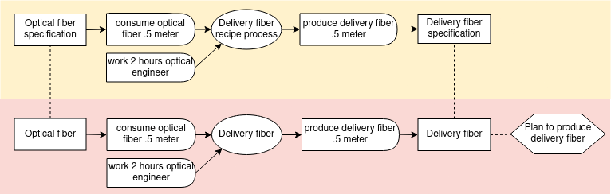
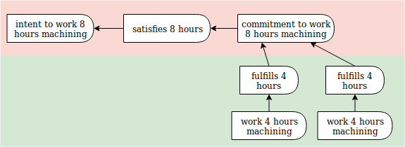

# Planning Examples

#### Simple plan

A plan for creating two different resources needed for one campaign.  The first resource requires two chained processes.


``` yaml
# Example: Simple operational plan

'@context':
  - '@vocab': http://w3id.org/valueflows/ont/vf#
  - printer: https://printer.example/

'@graph':

  - '@id': printer:8e5fe80d-a769-4bd5-89e5-2136d33eab9f
    '@type': Plan
    name: Anti climate-change campaign materials
    note: A set of printed materials for the campaign by Students for Peace and Justice
    due: 2019-04-08T17:00:00-5:00
    created: 2019-04-01T10:35:00-5:00

  - '@id': printer:02b39a30-3e04-4305-9656-7f261aa63c84
    '@type': Process
    name: Print climate brochures
    plannedWithin: printer:8e5fe80d-a769-4bd5-89e5-2136d33eab9f

  - '@id': printer:a8236bbb-81e0-422d-9861-56d2417db0fb
    '@type': Commitment
    outputOf: printer:02b39a30-3e04-4305-9656-7f261aa63c84
    independentDemandOf: printer:8e5fe80d-a769-4bd5-89e5-2136d33eab9f
    action: produce
    provider: https://printer.example/
    receiver: https://printer.example/
    resourceInventoriedAs: printer:6b97b1be-8e07-44ac-82e5-214f1b2aaf33 # specific brochures
    resourceQuantity:
      hasUnit: one
      hasNumericalValue: 1000

  - '@id': printer:b52a5815-fae9-43bf-be95-833b95dc0adb
    '@type': Commitment
    inputOf: printer:02b39a30-3e04-4305-9656-7f261aa63c84
    action: consume
    provider: https://printer.example/
    receiver: https://printer.example/
    resourceConformsTo: printer:3129ca8b-fcda-45be-bbda-294dc924d3b9 # paper
    resourceQuantity:
      hasUnit: one
      hasNumericalValue: 1020

  - '@id': printer:9bd19194-a36d-4a1f-896b-8082887962cb
    '@type': Process
    name: Print climate posters
    plannedWithin: printer:8e5fe80d-a769-4bd5-89e5-2136d33eab9f

  - '@id': printer:33e8933b-ff73-4a01-964a-ca7a98893083
    '@type': Commitment
    outputOf: printer:9bd19194-a36d-4a1f-896b-8082887962cb
    independentDemandOf: printer:8e5fe80d-a769-4bd5-89e5-2136d33eab9f
    action: produce
    provider: https://printer.example/
    receiver: https://printer.example/
    resourceInventoriedAs: printer:6078f30a-b15b-4b1c-8e77-797abae11378 # specific posters
    resourceQuantity:
      hasUnit: one
      hasNumericalValue: 35

  - '@id': printer:60f4204e-b8d2-4026-8577-102c3f82c0af
    '@type': Commitment
    inputOf: printer:9bd19194-a36d-4a1f-896b-8082887962cb
    action: consume
    provider: https://printer.example/
    receiver: https://printer.example/
    resourceConformsTo: printer:e56fd654-7b94-4d96-8e60-de39e08329a7 # paper
    resourceQuantity:
      hasUnit: one
      hasNumericalValue: 35

  - '@id': printer:b90b0b77-09a2-42e2-8bd4-e9ae2c1c6172
    '@type': Commitment
    inputOf: printer:9bd19194-a36d-4a1f-896b-8082887962cb
    action: use
    provider: https://printer.example/
    receiver: https://printer.example/
    resourceConformsTo: printer:e4783bef-9006-490c-9c03-389272c7444d # printing plate for the specific posters
    effortQuantity:
      hasUnit: hour
      hasNumericalValue: 1.5

  - '@id': printer:d4d2fd71-34f2-41c3-b1c5-19ad5ed2da59b
    '@type': Process
    name: Create poster plate
    plannedWithin: printer:8e5fe80d-a769-4bd5-89e5-2136d33eab9f

  - '@id': printer:583e83d9-a46d-44ff-bd71-88513a1d83c0
    '@type': Commitment
    outputOf: printer:d4d2fd71-34f2-41c3-b1c5-19ad5ed2da59b
    action: produce
    provider: https://printer.example/
    receiver: https://printer.example/
    resourceConformsTo: printer:e4783bef-9006-490c-9c03-389272c7444d # printing plate for the specific posters
    resourceQuantity:
      hasUnit: one
      hasNumericalValue: 1

  - '@id': printer:ad56a7ed-be3c-4937-a3fb-0f156bcd2c47
    '@type': Commitment
    inputOf: printer:9bd19194-a36d-4a1f-896b-8082887962cb
    action: consume
    provider: https://printer.example/
    receiver: https://printer.example/
    resourceInventoriedAs: printer:86ad6e22-7640-4b93-972a-db7177ab2616 # blank printing plate
    resourceQuantity:
      hasUnit: one
      hasNumericalValue: 1
```

#### Simple plan from recipe

A plan generated from a recipe, for making a component.



``` yaml
# Example: Simple plan from recipe

'@context':
  - '@vocab': http://w3id.org/valueflows/ont/vf#
  - alice: https://alice.example/
    sensor: https://sensorica.example/
    open: https://openhardware.example

'@graph':

  # the recipe

  - '@id': urn:uuid:3be5259d-10f0-431c-9fec-9c0c15a461d3
    '@type': ResourceSpecification
    name: Delivery fiber
    note: Optical fiber that connects 2 devices.

  - '@id': urn:uuid:33e8933b-ff73-4a01-964a-ca7a98893083
    '@type': RecipeFlow
    recipeOutputOf: urn:uuid:e1721a61-cd47-4556-84b9-8b1b81da15bf
    action: produce
    resourceConformsTo: urn:uuid:3be5259d-10f0-431c-9fec-9c0c15a461d3 # the delivery fiber spec
    resourceQuantity:
      hasUnit: metre
      hasNumericalValue: .5

  - '@id': urn:uuid:e1721a61-cd47-4556-84b9-8b1b81da15bf
    '@type': RecipeProcess
    name: Make delivery fiber component
    note: The delivery fiber makes the optical connection between an optical transducer and the sensor [electro-photonics device]. Requires cutting a piece of optical fiber and connectorizing it

  - '@id': urn:uuid:9bd19194-a36d-4a1f-896b-8082887962cb
    '@type': RecipeFlow
    recipeInputOf: urn:uuid:e1721a61-cd47-4556-84b9-8b1b81da15bf
    action: consume
    resourceConformsTo: http://www.wikidata.org/entity/Q162 # optical fiber
    resourceQuantity:
      hasUnit: metre
      hasNumericalValue: .5
    note: Optical guide, can be of glass of polymer. Usually it comes in a cylindrical shape. Can be MM (multimode) or SM (single mode)

  - '@id': urn:uuid:60f4204e-b8d2-4026-8577-102c3f82c0af
    '@type': RecipeFlow
    recipeInputOf: urn:uuid:e1721a61-cd47-4556-84b9-8b1b81da15bf
    action: work
    resourceConformsTo: http://www.wikidata.org/entity/Q640621 # optical engineering
    effortQuantity:
      hasUnit: hour
      hasNumericalValue: 2

  # the plan

  - '@id': sensor:8e5fe80d-a769-4bd5-89e5-2136d33eab9f
    '@type': Plan
    name: Delivery fiber
    note: Make the optical fiber that makes the connection between the device and the transducer.
    due: 2019-04-08T17:00:00-5:00
    created: 2019-04-01T10:35:00-5:00

  - '@id': sensor:a8236bbb-81e0-422d-9861-56d2417db0fb
    '@type': Commitment
    independentDemandOf: sensor:8e5fe80d-a769-4bd5-89e5-2136d33eab9f
    outputOf: sensor:02b39a30-3e04-4305-9656-7f261aa63c84
    action: produce
    provider: https://sensorica.example/
    receiver: https://sensorica.example/
    resourceConformsTo: urn:uuid:b90b0b77-09a2-42e2-8bd4-e9ae2c1c6172 # delivery fiber
    resourceQuantity:
      hasUnit: metre
      hasNumericalValue: .5

  - '@id': sensor:02b39a30-3e04-4305-9656-7f261aa63c84
    '@type': Process
    name: Make optical fiber component
    plannedWithin: sensor:8e5fe80d-a769-4bd5-89e5-2136d33eab9f
    note: The delivery fiber makes the optical connection between an optical transducer and the sensor [electro-photonics device]. Requires cutting a piece of optical fiber and connectorizing it.

  - '@id': sensor:b52a5815-fae9-43bf-be95-833b95dc0adb
    '@type': Commitment
    inputOf: sensor:02b39a30-3e04-4305-9656-7f261aa63c84
    action: consume
    provider: https://sensorica.example/
    receiver: https://sensorica.example/
    resourceConformsTo: http://www.wikidata.org/entity/Q162 # optical fiber
    resourceQuantity:
      hasUnit: metre
      hasNumericalValue: .5
    note: Optical guide, can be of glass of polymer. Usually it comes in a cylindrical shape. Can be MM (multimode) or SM (single mode).

  - '@id': sensor:52f0e212-3c4f-4d27-b345-5e964c135824
    '@type': Commitment
    inputOf: sensor:02b39a30-3e04-4305-9656-7f261aa63c84
    action: work
    provider: https://alice.example/
    receiver: https://sensorica.example/
    resourceConformsTo: http://www.wikidata.org/entity/Q640621 # optical engineering
    effortQuantity:
      hasUnit: hour
      hasNumericalValue: 2
```

#### Fulfillment and satisfaction

Commitments satisfying intents, and economic events fulfilling commitments.  (Note that economic events can also satisfy intents if there is no commitment, although it is not shown in this example.)



``` yaml
# Example: Intent - satisfied by - Commitment - fulfilled by - EconomicEvent

'@context':
  - '@vocab': http://w3id.org/valueflows/ont/vf#
  - bob: https://bob.example/
    mfg: https://manufacturer.example/

'@graph':

  # A manufacturer makes a plan that includes an intent for some work which 
  # they want someone in their network to commit to doing on Oct. 14 - 15

  - '@id': mfg:e1721a61-cd47-4556-84b9-8b1b81da15bf
    '@type': Intent
    action: work
    receiver: https://manufacturing.example/
    resourceConformsTo: http://www.wikidata.org/entity//Q192047 # machining
    effortQuantity:
      hasUnit: hour
      hasNumericalValue: 8
    hasBeginning: 2018-10-14T8:00:00-0:00
    hasEnd: 2018-10-15T18:00:00-0:00

  # Bob commits to doing the work on Oct. 14

  - '@id': mfg:02b39a30-3e04-4305-9656-7f261aa63c84
    '@type': Commitment
    action: work
    provider: https://bob.example/
    receiver: https://manufacturing.example/
    resourceConformsTo: http://www.wikidata.org/entity/Q192047 # machining
    effortQuantity:
      hasUnit: hour
      hasNumericalValue: 8
    hasBeginning: 2018-10-14T8:00:00-0:00
    hasEnd: 2018-10-14T17:00:00-0:00
    satisfies: mfg:e1721a61-cd47-4556-84b9-8b1b81da15bf # the intent

  # Bob does the work in two 4-hour shifts on Oct. 14

  - '@id': mfg:d4d2fd71-34f2-41c3-b1c5-19ad5ed2da59
    '@type': EconomicEvent
    action: work
    provider: https://bob.example/
    receiver: https://manufacturing.example/
    resourceConforms: http://www.wikidata.org/entity/Q192047 # machining
    effortQuantity:
      hasUnit: hour
      hasNumericalValue: 4
    hasBeginning: 2018-10-14T8:00:00-0:00
    hasEnd: 2018-10-14T12:00:00-0:00
    fulfills: mfg:02b39a30-3e04-4305-9656-7f261aa63c84 # the commitment

  - '@id': mfg:c7897c39-7f05-4a5d-a487-80e130a2414b
    '@type': EconomicEvent
    action: work
    provider: https://bob.example/
    receiver: https://manufacturing.example/
    resourceConformsTo: http://www.wikidata.org/entity/Q192047 # machining
    effortQuantity:
      hasUnit: hour
      hasNumericalValue: 4
    hasBeginning: 2018-10-14T13:00:00-0:00
    hasEnd: 2018-10-14T17:00:00-0:00
    fulfills: mfg:02b39a30-3e04-4305-9656-7f261aa63c84 # the commitment
```
