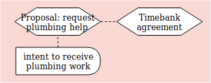
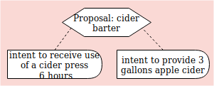

# Planning Examples

#### Simple plan

A plan for creating two different resources needed for one campaign.  The first resource requires two chained processes.


``` yaml
# Example: Simple operational plan

'@context':
  - https://git.io/vf-examples-jsonld-context
  - printer: https://printer.example/

'@id': rgh:valueflows/valueflows/master/examples/simple-plan.yaml
'@graph':

  - '@id': printer:8e5fe80d-a769-4bd5-89e5-2136d33eab9f
    '@type': Plan
    name: Anti climate change campaign materials
    skos:note: A set of printed materials for the campaign by Students for Peace and Justice
    due: 2019-04-08T17:00:00-5:00
    dcterms:created: 2019-04-01T10:35:00-5:00

  - '@id': printer:02b39a30-3e04-4305-9656-7f261aa63c84
    '@type': Process
    name: Print climate brochures
    plannedWithin: printer:8e5fe80d-a769-4bd5-89e5-2136d33eab9f

  - '@id': printer:a8236bbb-81e0-422d-9861-56d2417db0fb
    '@type': Commitment
    outputOf: printer:02b39a30-3e04-4305-9656-7f261aa63c84
    independentDemandOf: printer:8e5fe80d-a769-4bd5-89e5-2136d33eab9f
    action: produce
    provider: https://printer.example/
    receiver: https://printer.example/
    resourceInventoriedAs: printer:6b97b1be-8e07-44ac-82e5-214f1b2aaf33 # specific brochures
    resourceQuantity:
      om2:hasUnit: om2:one
      om2:hasNumericalValue: 1000

  - '@id': printer:b52a5815-fae9-43bf-be95-833b95dc0adb
    '@type': Commitment
    inputOf: printer:02b39a30-3e04-4305-9656-7f261aa63c84
    action: consume
    provider: https://printer.example/
    receiver: https://printer.example/
    resourceInventoriedAs: printer:3129ca8b-fcda-45be-bbda-294dc924d3b9 # paper
    resourceQuantity:
      om2:hasUnit: om2:one
      om2:hasNumericalValue: 1020

  - '@id': printer:9bd19194-a36d-4a1f-896b-8082887962cb
    '@type': Process
    name: Print climate posters
    plannedWithin: printer:8e5fe80d-a769-4bd5-89e5-2136d33eab9f

  - '@id': printer:33e8933b-ff73-4a01-964a-ca7a98893083
    '@type': Commitment
    outputOf: printer:9bd19194-a36d-4a1f-896b-8082887962cb
    independentDemandOf: printer:8e5fe80d-a769-4bd5-89e5-2136d33eab9f
    action: produce
    provider: https://printer.example/
    receiver: https://printer.example/
    resourceInventoriedAs: printer:6078f30a-b15b-4b1c-8e77-797abae11378 # specific posters
    resourceQuantity:
      om2:hasUnit: om2:one
      om2:hasNumericalValue: 35

  - '@id': printer:60f4204e-b8d2-4026-8577-102c3f82c0af
    '@type': Commitment
    inputOf: printer:9bd19194-a36d-4a1f-896b-8082887962cb
    action: consume
    provider: https://printer.example/
    receiver: https://printer.example/
    resourceInventoriedAs: printer:e56fd654-7b94-4d96-8e60-de39e08329a7 # paper
    resourceQuantity:
      om2:hasUnit: om2:one
      om2:hasNumericalValue: 35

  - '@id': printer:b90b0b77-09a2-42e2-8bd4-e9ae2c1c6172
    '@type': Commitment
    inputOf: printer:9bd19194-a36d-4a1f-896b-8082887962cb
    action: use
    provider: https://printer.example/
    receiver: https://printer.example/
    resourceInventoriedAs: printer:e4783bef-9006-490c-9c03-389272c7444d # printing plate for the specific posters
    effortQuantity:
      om2:hasUnit: om2:hour
      om2:hasNumericalValue: 1.5

  - '@id': printer:d4d2fd71-34f2-41c3-b1c5-19ad5ed2da59b
    '@type': Process
    name: Create poster plate
    plannedWithin: printer:8e5fe80d-a769-4bd5-89e5-2136d33eab9f

  - '@id': printer:583e83d9-a46d-44ff-bd71-88513a1d83c0
    '@type': Commitment
    outputOf: printer:d4d2fd71-34f2-41c3-b1c5-19ad5ed2da59b
    action: produce
    provider: https://printer.example/
    receiver: https://printer.example/
    resourceInventoriedAs: printer:e4783bef-9006-490c-9c03-389272c7444d # printing plate for the specific posters
    resourceQuantity:
      om2:hasUnit: om2:one
      om2:hasNumericalValue: 1

  - '@id': printer:ad56a7ed-be3c-4937-a3fb-0f156bcd2c47
    '@type': Commitment
    inputOf: printer:9bd19194-a36d-4a1f-896b-8082887962cb
    action: consume
    provider: https://printer.example/
    receiver: https://printer.example/
    resourceInventoriedAs: printer:86ad6e22-7640-4b93-972a-db7177ab2616 # blank printing plate
    resourceQuantity:
      om2:hasUnit: om2:one
      om2:hasNumericalValue: 1
```

#### Simple plan from recipe

A plan generated from a recipe, for making a component.


``` yaml
# Example: Simple plan from recipe

'@context':
  - https://git.io/vf-examples-jsonld-context
  - alice: https://alice.example/
    sensor: https://sensorica.example/
    open: https://openhardware.example

'@id': rgh:valueflows/valueflows/master/examples/plan-from-recipe.yaml
'@graph':

  # the recipe

  - '@id': urn:uuid:3be5259d-10f0-431c-9fec-9c0c15a461d3
    '@type': ResourceSpecification
    name: Delivery fiber
    uri: https://openhardware.example/delivery-fiber
    skos:note: Optical fiber that connects 2 devices.

  - '@id': urn:uuid:b90b0b77-09a2-42e2-8bd4-e9ae2c1c6172
    '@type': RecipeResource
    resourceConformsTo: urn:uuid:3be5259d-10f0-431c-9fec-9c0c15a461d3 # the spec
    name: Delivery fiber
    skos:note: Optical fiber that makes the connection between the device and the transducer. An adapter can also be used between the transducer and the delivery fiber.

  - '@id': urn:uuid:33e8933b-ff73-4a01-964a-ca7a98893083
    '@type': RecipeFlow
    recipeOutputOf: urn:uuid:e1721a61-cd47-4556-84b9-8b1b81da15bf
    action: produce
    recipeFlowResource: urn:uuid:b90b0b77-09a2-42e2-8bd4-e9ae2c1c6172 # delivery fiber
    resourceQuantity:
      om2:hasUnit: om2:metre
      om2:hasNumericalValue: .5

  - '@id': urn:uuid:e1721a61-cd47-4556-84b9-8b1b81da15bf
    '@type': RecipeProcess
    name: Make delivery fiber component
    skos:note: The delivery fiber makes the optical connection between an optical transducer and the sensor [electro-photonics device]. Requires cutting a piece of optical fiber and connectorizing it

  - '@id': urn:uuid:9bd19194-a36d-4a1f-896b-8082887962cb
    '@type': RecipeFlow
    recipeInputOf: urn:uuid:e1721a61-cd47-4556-84b9-8b1b81da15bf
    action: consume
    resourceClassifiedAs: wd:Q162 # optical fiber
    resourceQuantity:
      om2:hasUnit: om2:metre
      om2:hasNumericalValue: .5
    skos:note: Optical guide, can be of glass of polymer. Usually it comes in a cylindrical shape. Can be MM (multimode) or SM (single mode)

  - '@id': urn:uuid:60f4204e-b8d2-4026-8577-102c3f82c0af
    '@type': RecipeFlow
    recipeInputOf: urn:uuid:e1721a61-cd47-4556-84b9-8b1b81da15bf
    action: work
    resourceClassifiedAs: wd:Q640621 # optical engineering
    effortQuantity:
      om2:hasUnit: om2:hour
      om2:hasNumericalValue: 2

  # the plan

  - '@id': sensor:8e5fe80d-a769-4bd5-89e5-2136d33eab9f
    '@type': Plan
    name: Delivery fiber
    skos:note: Make the optical fiber that makes the connection between the device and the transducer. 
    due: 2019-04-08T17:00:00-5:00
    dcterms:created: 2019-04-01T10:35:00-5:00

  - '@id': sensor:a8236bbb-81e0-422d-9861-56d2417db0fb
    '@type': Commitment
    independentDemandOf: sensor:8e5fe80d-a769-4bd5-89e5-2136d33eab9f
    outputOf: sensor:02b39a30-3e04-4305-9656-7f261aa63c84
    action: produce
    provider: https://sensorica.example/
    receiver: https://sensorica.example/
    resourceConformsTo: urn:uuid:b90b0b77-09a2-42e2-8bd4-e9ae2c1c6172 # delivery fiber
    resourceQuantity:
      om2:hasUnit: om2:metre
      om2:hasNumericalValue: .5

  - '@id': sensor:02b39a30-3e04-4305-9656-7f261aa63c84
    '@type': Process
    name: Make optical fiber component
    plannedWithin: sensor:8e5fe80d-a769-4bd5-89e5-2136d33eab9f
    skos:note: The delivery fiber makes the optical connection between an optical transducer and the sensor [electro-photonics device]. Requires cutting a piece of optical fiber and connectorizing it

  - '@id': sensor:b52a5815-fae9-43bf-be95-833b95dc0adb
    '@type': Commitment
    inputOf: sensor:02b39a30-3e04-4305-9656-7f261aa63c84
    action: consume
    provider: https://sensorica.example/
    receiver: https://sensorica.example/
    resourceClassifiedAs: wd:Q162 # optical fiber
    resourceQuantity:
      om2:hasUnit: om2:metre
      om2:hasNumericalValue: .5
    skos:note: Optical guide, can be of glass of polymer. Usually it comes in a cylindrical shape. Can be MM (multimode) or SM (single mode)

  - '@id': sensor:52f0e212-3c4f-4d27-b345-5e964c135824
    '@type': Commitment
    inputOf: sensor:02b39a30-3e04-4305-9656-7f261aa63c84
    action: work
    provider: https://alice.example/
    receiver: https://sensorica.example/
    resourceClassifiedAs: wd:Q640621 # optical engineering
    effortQuantity:
      om2:hasUnit: om2:hour
      om2:hasNumericalValue: 2
```

#### Fulfillment and satisfaction

Commitments satisfying intents, and economic events fulfilling commitments.


``` yaml
# Example: Intent - satisfied by - Commitment - fulfilled by - EconomicEvent

'@context':
  - https://git.io/vf-examples-jsonld-context
  - bob: https://bob.example/
    mfg: https://manufacturer.example/

'@id': rgh:valueflows/valueflows/master/examples/fulfill-satisfy.yaml
'@graph':

  # A manufacturer makes a plan that includes an intent for some work which 
  # they want someone in their network to commit to doing on Oct. 14 - 15

  - '@id': mfg:e1721a61-cd47-4556-84b9-8b1b81da15bf
    '@type': Intent
    action: work
    receiver: https://manufacturing.example/
    resourceClassifiedAs: https://www.wikidata.org/wiki/Q192047 # machining
    effortQuantity:
      om2:hasUnit: om2:hour
      om2:hasNumericalValue: 8
    hasBeginning: 2018-10-14T8:00:00-0:00
    hasEnd: 2018-10-15T18:00:00-0:00

  # Bob commits to doing the work on Oct. 14

  - '@id': mfg:02b39a30-3e04-4305-9656-7f261aa63c84
    '@type': Commitment
    action: work
    provider: https://bob.example/
    receiver: https://manufacturing.example/
    resourceClassifiedAs: https://www.wikidata.org/wiki/Q192047 # machining
    effortQuantity:
      om2:hasUnit: om2:hour
      om2:hasNumericalValue: 8
    hasBeginning: 2018-10-14T8:00:00-0:00
    hasEnd: 2018-10-14T17:00:00-0:00

  - '@id': mfg:b52a5815-fae9-43bf-be95-833b95dc0adb
    '@type': Satisfaction
    satisfies: mfg:e1721a61-cd47-4556-84b9-8b1b81da15bf # the intent
    satisfiedBy: mfg:02b39a30-3e04-4305-9656-7f261aa63c84 # the commitment
    effortQuantity:
      om2:hasUnit: om2:hour
      om2:hasNumericalValue: 8

  # Bob does the work in two 4-hour shifts on Oct. 14

  - '@id': mfg:d4d2fd71-34f2-41c3-b1c5-19ad5ed2da59
    '@type': EconomicEvent
    action: work
    provider: https://bob.example/
    receiver: https://manufacturing.example/
    resourceClassifiedAs: https://www.wikidata.org/wiki/Q192047 # machining
    effortQuantity:
      om2:hasUnit: om2:hour
      om2:hasNumericalValue: 4
    hasBeginning: 2018-10-14T8:00:00-0:00
    hasEnd: 2018-10-14T12:00:00-0:00

  - '@id': mfg:6f438393-7f87-4914-806c-e23a4fd15e89
    '@type': Fulfillment
    fulfills: mfg:02b39a30-3e04-4305-9656-7f261aa63c84 # the commitment
    fulfilledBy: mfg:d4d2fd71-34f2-41c3-b1c5-19ad5ed2da59 # the economic event
    effortQuantity:
      om2:hasUnit: om2:hour
      om2:hasNumericalValue: 4

  - '@id': mfg:c7897c39-7f05-4a5d-a487-80e130a2414b
    '@type': EconomicEvent
    action: work
    provider: https://bob.example/
    receiver: https://manufacturing.example/
    resourceClassifiedAs: https://www.wikidata.org/wiki/Q192047 # machining
    effortQuantity:
      om2:hasUnit: om2:hour
      om2:hasNumericalValue: 4
    hasBeginning: 2018-10-14T13:00:00-0:00
    hasEnd: 2018-10-14T17:00:00-0:00

  - '@id': mfg:0f563083-8da4-46fe-adc3-68b05ba06320
    '@type': Fulfillment
    fulfills: mfg:02b39a30-3e04-4305-9656-7f261aa63c84 # the commitment
    fulfilledBy: mfg:c7897c39-7f05-4a5d-a487-80e130a2414b # the second economic event
    effortQuantity:
      om2:hasUnit: om2:hour
      om2:hasNumericalValue: 4
```

#### Proposals to sell and give away

A simple proposal with reciprocity expected, then another one to give the item away.


``` yaml
# Example: Simple proposals based on one intent

'@context':
  - https://git.io/vf-examples-jsonld-context
  - alice: https://alice.example/
    map: https://mapping.service/

'@id': rgh:valueflows/valueflows/master/examples/proposals-intent.yaml
'@graph':

  # One offer with expected reciprocity

  - '@id': alice:8791913c-0152-4c32-bb3f-f25d61df736c
    '@type': Proposal
    name: Used bike
    hasBeginning: 2019-03-01T00:00:00-5:00
    hasEnd: 2019-03-31T00:00:00-5:00
    eligibleLocation: map:566a2c01-96f8-4b3c-adcf-f197eced3092 # Madison, WI

  - '@id': alice:02b39a30-3e04-4305-9656-7f261aa63c84
    '@type': Intent
    name: Old adult Schwinn one speed bike
    skos:note: Pedals fine, not good for hills, has basket, brakes are a bit dodgy
    action: transfer
    provider: https://alice.example/
    resourceClassifiedAs: https://www.wikidata.org/wiki/Q11442 # bicycle

  - '@id': alice:a8236bbb-81e0-422d-9861-56d2417db0fb
    '@type': ProposedIntent
    publishedIn: alice:8791913c-0152-4c32-bb3f-f25d61df736c # the proposal
    publishes: alice:02b39a30-3e04-4305-9656-7f261aa63c84 # the intent
    reciprocal: false

  - '@id': alice:e72f7d1d-4f0a-4518-a44c-96658cafda95
    '@type': Intent
    name: Payment
    action: transfer
    receiver: https://alice.example/
    resourceClassifiedAs: https://www.wikidata.org/wiki/Q4917 # US Dollar
    resourceQuantity:
      om2:hasUnit: om2:one
      om2:hasNumericalValue: 15

  - '@id': alice:f325a950-5737-488d-b122-8f21114d0eb0
    '@type': ProposedIntent
    publishedIn: alice:8791913c-0152-4c32-bb3f-f25d61df736c # the proposal
    publishes: alice:e72f7d1d-4f0a-4518-a44c-96658cafda95 # the intent
    reciprocal: true

  # Alice did not get any responses to her proposal above, so decided to offer the bike for free

  - '@id': alice:8e5fe80d-a769-4bd5-89e5-2136d33eab9f
    '@type': Proposal
    name: Free used bike 
    hasBeginning: 2019-04-01T00:00:00-5:00
    hasEnd: 2019-05-01T00:00:00-5:00
    eligibleLocation: map:566a2c01-96f8-4b3c-adcf-f197eced3092 # Madison, WI

  - '@id': alice:a8236bbb-81e0-422d-9861-56d2417db0fb
    '@type': ProposedIntent
    publishedIn: alice:8e5fe80d-a769-4bd5-89e5-2136d33eab9f # the proposal
    publishes: alice:02b39a30-3e04-4305-9656-7f261aa63c84 # the intent (this is the same intent alice originally published)
```

#### Proposal in timebank

A simple proposal for a timebank.  The reciprocity is assumed based on the timebank policies.



``` yaml
# Example: Simple proposal in a timebank

'@context':
  - https://git.io/vf-examples-jsonld-context
  - bob: https://bob.example/
    timebank: https://timebank.example/

'@id': rgh:valueflows/valueflows/master/examples/proposal-timebank.yaml
'@graph':

  # Timebank request, reciprocity defined in the timebank agreement (hour credits)

  - '@id': bob:23799c14-c368-4653-a584-83bf9ae8b82a
    '@type': Proposal
    name: Seeking plumbing help
    hasBeginning: 2019-04-01T00:00:00-5:00
    hasEnd: 2019-04-05T00:00:00-5:00
    inScopeOf: https://timebank.example/
    agreedIn: https://timebank.example/member-agreement/

  - '@id': bob:e18c808c-929a-450d-9d0d-3b3f531bc126
    '@type': Intent
    name: Plumbing help please
    skos:note: Need someone with plumbing skills to fix leaky faucet and plugged drain asap
    action: work
    receiver: https://bob.example/
    resourceClassifiedAs: https://www.wikidata.org/wiki/Q252924 # plumber

  - '@id': bob:5d2fe7da-b91b-4dab-91d9-68db80c1feb7
    '@type': ProposedIntent
    publishedIn: bob:23799c14-c368-4653-a584-83bf9ae8b82a # the proposal
    publishes: bob:e18c808c-929a-450d-9d0d-3b3f531bc126 # the intent
```

#### Proposal for barter

A simple proposal for barter.



``` yaml
# Example: Simple proposal for barter
'@context':
  - https://git.io/vf-examples-jsonld-context
  - carol: https://carol.example/
    map: https://mapping.service/

'@id': rgh:valueflows/valueflows/master/examples/proposal-barter.yaml
'@graph':

  - '@id': carol:6405b8ad-0ac2-4d58-abdb-0808903c78ad
    '@type': Proposal
    name: Cider press for cider
    hasBeginning: 2018-10-01T00:00:00-5:00
    hasEnd: 2018-10-15T00:00:00-5:00
    eligibleLocation: map:566a2c01-96f8-4b3c-adcf-f197eced3092 # Madison, WI

  - '@id': carol:e02e3f6b-420a-4ba8-89b0-909d7363ce07
    '@type': Intent
    name: Cider press
    skos:note: I can pick up or come to your place, will clean up.
    action: use
    receiver: https://carol.example/
    resourceClassifiedAs: https://www.wikidata.org/wiki/Q1111 # cider press (fictional)
    effortQuantity:
      om2:hasUnit: om2:hour
      om2:hasNumericalValue: 6

  - '@id': carol:9f112621-3f13-4f48-a3e2-fd2ca99493cd
    '@type': ProposedIntent
    publishedIn: carol:6405b8ad-0ac2-4d58-abdb-0808903c78ad # the proposal
    publishes: carol:e02e3f6b-420a-4ba8-89b0-909d7363ce07 # the intent
    reciprocal: false

  - '@id': carol:b52a5815-fae9-43bf-be95-833b95dc0adb
    '@type': Intent
    name: Cider
    skos:note: Fresh cider from the pressing
    action: transfer
    provider: https://carol.example/
    resourceClassifiedAs: https://www.wikidata.org/wiki/Q5977438 # apple cider
    resourceQuantity:
      om2:hasUnit: om2:gallon-US
      om2:hasNumericalValue: 3

  - '@id': carol:9bd19194-a36d-4a1f-896b-8082887962cb
    '@type': ProposedIntent
    publishedIn: carol:6405b8ad-0ac2-4d58-abdb-0808903c78ad # the proposal
    publishes: carol:b52a5815-fae9-43bf-be95-833b95dc0adb7 # the intent
    reciprocal: true
```

#### Proposal for work commitment

A simple proposal requesting help for work on a planned production process.  The reciprocal intent (payment) is governed by a previous agreement, and based on the actual hours that will be worked.


``` yaml
# Example: Simple proposal for commitment to an intent on a planned process

'@context':
  - https://git.io/vf-examples-jsonld-context
  - fablab: https://fablab.example/
    map: https://mapping.service/

'@id': rgh:valueflows/valueflows/master/examples/proposal-plan.yaml
'@graph':


  # Plan a process, broadcast request for worker with certain skills to collaborate

  - '@id': fablab:ad56a7ed-be3c-4937-a3fb-0f156bcd2c47
    '@type': Process
    name: Develop soil moisture sensor
    inScopeOf: https://fablab.example/

  - '@id': fablab:60f4204e-b8d2-4026-8577-102c3f82c0af
    '@type': Intent
    inputOf: fablab:ad56a7ed-be3c-4937-a3fb-0f156bcd2c47
    name: Help with R&D for the sensor
    skos:note: Will need to be at the lab all day both days.
    action: work
    receiver: https://fablab.example/
    resourceClassifiedAs: https://www.wikidata.org/wiki/Q2474620 # electrochemical engineering
    flowQuantity:
      om2:hasUnit: om2:hour
      om2:hasNumericalValue: 16
    hasBeginning: 2019-04-12T08:00:00-5:00
    hasEnd: 2019-04-13T17:00:00-5:00

  - '@id': fablab:33e8933b-ff73-4a01-964a-ca7a98893083
    '@type': Proposal
    name: Electrochemical engineering skills
    hasBeginning: 2019-04-01T08:00:00-5:00
    hasEnd: 2019-04-11T17:00:00-5:00
    eligibleLocation: map:566a2c01-96f8-4b3c-adcf-f197eced3092 # Madison, WI

  - '@id': fablab:b90b0b77-09a2-42e2-8bd4-e9ae2c1c6172
    '@type': ProposedIntent
    publishedIn: fablab:33e8933b-ff73-4a01-964a-ca7a98893083 # the proposal
    publishes: fablab:60f4204e-b8d2-4026-8577-102c3f82c0af # the intent
    reciprocal: false

  - '@id': fablab:583e83d9-a46d-44ff-bd71-88513a1d83c0
    '@type': Intent
    name: Payment
    skos:note: Payment when the unit is manufactured and sold
    action: transfer
    provider: https://fablab.example/
    resourceClassifiedAs: https://www.wikidata.org/wiki/Q4917 # US Dollar
    agreedIn: https://fablab.example/soil-sensor-project/value-equation/

  - '@id': fablab:d4d2fd71-34f2-41c3-b1c5-19ad5ed2da59b
    '@type': ProposedIntent
    publishedIn: fablab:33e8933b-ff73-4a01-964a-ca7a98893083 # the proposal
    publishes: fablab:583e83d9-a46d-44ff-bd71-88513a1d83c0 # the intent
    reciprocal: true
```

#### Proposals for price list

A simple set of proposals that make up a price list.


``` yaml
# Example: Simple price list

'@context':
  - https://git.io/vf-examples-jsonld-context
  - farm: https://farm.example/
    map: https://mapping.service/

'@id': rgh:valueflows/valueflows/master/examples/proposal-list.yaml
'@graph':

  # Price list

  - '@id': farm:da7bfa38-a1b2-4f6f-a896-b9bf1ec8807a
    '@type': Proposal
    hasBeginning: 2019-03-01T00:00:00-5:00
    hasEnd: 2019-03-31T00:00:00-5:00
    eligibleLocation: map:566a2c01-96f8-4b3c-adcf-f197eced3092 # Madison, WI
    unitBased: true # often currently called 'unit pricing'

  - '@id': farm:c7897c39-7f05-4a5d-a487-80e130a24345
    '@type': Intent
    name: Carrots case 25#
    action: transfer
    provider: https://farm.example/
    resourceClassifiedAs: wd:Q81 # carrot
    resourceSpecifiedAs: farm:2402b57c-1c45-423a-acb2-f50961c97d65 # 25 pound case organic carrots seconds
    resourceQuantity:
      om2:hasUnit: om2:one
      om2:hasNumericalValue: 1

  - '@id': farm:a8236bbb-81e0-422d-9861-56d2417db0fb
    '@type': ProposedIntent
    publishedIn: farm:da7bfa38-a1b2-4f6f-a896-b9bf1ec8807a # the proposal
    publishes: farm:c7897c39-7f05-4a5d-a487-80e130a24345 # the intent
    reciprocal: false

  - '@id': farm:0f563083-7f05-4a5d-a487-80e130a24345
    '@type': Intent
    name: Payment
    action: transfer
    receiver: https://farm.example/
    resourceClassifiedAs: https://www.wikidata.org/wiki/Q4917 # US Dollar
    resourceQuantity:
      om2:hasUnit: om2:one
      om2:hasNumericalValue: 18

  - '@id': farm:f325a950-5737-488d-b122-8f21114d0eb0
    '@type': ProposedIntent
    publishedIn: farm:da7bfa38-a1b2-4f6f-a896-b9bf1ec8807a # the proposal
    publishes: farm:0f563083-7f05-4a5d-a487-80e130a24345 # the intent
    reciprocal: true

  - '@id': farm:f47064eb-7120-4b31-b882-770165901fe6
    '@type': Proposal
    hasBeginning: 2019-03-01T00:00:00-5:00
    hasEnd: 2019-03-31T00:00:00-5:00
    eligibleLocation: map:566a2c01-96f8-4b3c-adcf-f197eced3092 # Madison, WI
    unitBased: true

  - '@id': farm:54b814ee-62dc-40c1-bb96-f8582aa4f771
    '@type': Intent
    name: Beets case 25#
    action: transfer
    provider: https://farm.example/
    resourceClassifiedAs: wd:Q165437 # beet root
    resourceSpecifiedAs: farm:8baa8ff7-9c1e-4586-ae7b-79d620a3cac9 # 25 pound case organic beets
    resourceQuantity:
      om2:hasUnit: om2:one
      om2:hasNumericalValue: 1

  - '@id': farm:98c2bfeb-9c70-4801-896c-4646b975a7d9
    '@type': ProposedIntent
    publishedIn: farm:f47064eb-7120-4b31-b882-770165901fe6 # the proposal
    publishes: farm:54b814ee-62dc-40c1-bb96-f8582aa4f771 # the intent
    reciprocal: false

  - '@id': farm:21f361a6-2375-46bb-b192-c21b5ba833bf
    '@type': Intent
    name: Payment
    action: transfer
    receiver: https://farm.example/
    resourceClassifiedAs: https://www.wikidata.org/wiki/Q4917 # US Dollar
    resourceQuantity:
      om2:hasUnit: om2:one
      om2:hasNumericalValue: 32

  - '@id': farm:b75d8f6a-e2df-4e52-b36d-1a22a66f4ead
    '@type': ProposedIntent
    publishedIn: farm:f47064eb-7120-4b31-b882-770165901fe6 # the proposal
    publishes: farm:21f361a6-2375-46bb-b192-c21b5ba833bf5 # the intent
    reciprocal: true
```
