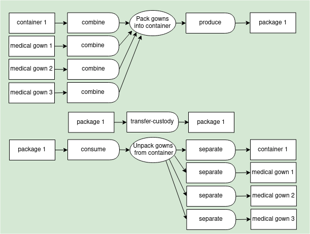
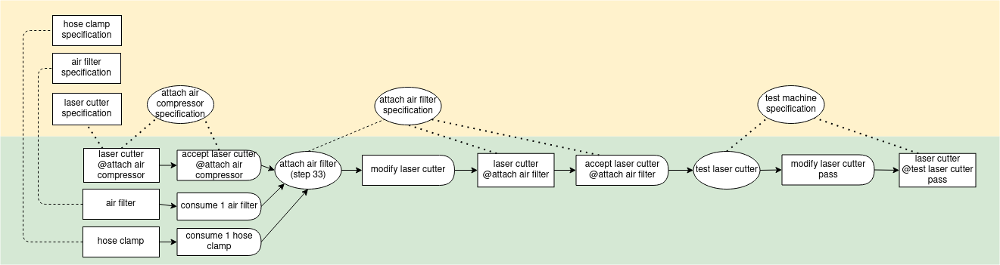

# Production Examples

#### Manufacturing

Simple one-process manufacturing with typical inputs and outputs.


``` yaml
# Example: Simple manufacturing process

'@context':
  - https://git.io/vf-examples-jsonld-context
  - alice: https://alice.example/
    mfg: https://manufacturing.example/

'@id': rgh:valueflows/valueflows/master/examples/process-manufacturing.yaml
'@graph':

  # Economic resources before

  - '@id': mfg:e1721a61-cd47-4556-84b9-8b1b81da15bf
    '@type': EconomicResource
    resourceConformsTo: https://www.opendesk.cc/lean/desk # desk
    accountingQuantity:
      om2:hasUnit: om2:one
      om2:hasNumericalValue: 8

  - '@id': mfg:3129ca8b-fcda-45be-bbda-294dc924d3b9
    '@type': EconomicResource
    classifiedAs: https://www.wikidata.org/wiki/Q219803 # plywood
    accountingQuantity:
      om2:hasUnit: om2:one
      om2:hasNumericalValue: 130
    skos:note: 4 x 8 sheet of 1/2 inch plywood

  - '@id': mfg:6b97b1be-8e07-44ac-82e5-214f1b2aaf33
    '@type': EconomicResource
    classifiedAs: https://www.wikidata.org/wiki/Q2101564 # desk design specification
    accountingQuantity:
      om2:hasUnit: om2:one
      om2:hasNumericalValue: 1

  - '@id': mfg:52f0e212-3c4f-4d27-b345-5e964c135824
    '@type': EconomicResource
    classifiedAs: https://www.wikidata.org/wiki/Q13231055 # CNC machine
    accountingQuantity:
      om2:hasUnit: om2:one
      om2:hasNumericalValue: 1

  # Production

  - '@id': mfg:02b39a30-3e04-4305-9656-7f261aa63c84
    '@type': Process
    name: Make the lean desk

  - '@id': mfg:b52a5815-fae9-43bf-be95-833b95dc0adb
    '@type': EconomicEvent
    inputOf: mfg:02b39a30-3e04-4305-9656-7f261aa63c84
    action: consume
    provider: https://manufacturing.example/
    receiver: https://manufacturing.example/
    resourceInventoriedAs: mfg:3129ca8b-fcda-45be-bbda-294dc924d3b9 # plywood sheets
    resourceQuantity:
      om2:hasUnit: om2:one
      om2:hasNumericalValue: 3

  - '@id': mfg:b90b0b77-09a2-42e2-8bd4-e9ae2c1c6172
    '@type': EconomicEvent
    inputOf: mfg:02b39a30-3e04-4305-9656-7f261aa63c84
    action: use
    provider: https://manufacturing.example/
    receiver: https://manufacturing.example/
    resourceInventoriedAs: mfg:52f0e212-3c4f-4d27-b345-5e964c135824 # CNC machine
    effortQuantity:
      om2:hasUnit: om2:hour
      om2:hasNumericalValue: 3.5

  - '@id': mfg:a8236bbb-81e0-422d-9861-56d2417db0fb
    '@type': EconomicEvent
    inputOf: mfg:02b39a30-3e04-4305-9656-7f261aa63c84
    action: cite
    provider: https://makezine.com/
    receiver: https://manufacturing.example/
    resourceInventoriedAs: mfg:6b97b1be-8e07-44ac-82e5-214f1b2aaf33 # desk design specification
    resourceQuantity:
      om2:hasUnit: om2:one
      om2:hasNumericalValue: 1

  - '@id': mfg:6f438393-7f87-4914-806c-e23a4fd15e89
    '@type': EconomicEvent
    inputOf: mfg:02b39a30-3e04-4305-9656-7f261aa63c84
    action: work
    provider: https://alice.example/
    receiver: https://manufacturing.example/
    resourceClassifiedAs: https://www.wikidata.org/wiki/Q192047 # machining
    effortQuantity:
      om2:hasUnit: om2:hour
      om2:hasNumericalValue: 7

  - '@id': mfg:d4d2fd71-34f2-41c3-b1c5-19ad5ed2da59
    '@type': EconomicEvent
    outputOf: mfg:02b39a30-3e04-4305-9656-7f261aa63c84
    action: produce
    provider: https://manufacturing.example/
    receiver: https://manufacturing.example/
    resourceInventoriedAs: mfg:e1721a61-cd47-4556-84b9-8b1b81da15bf # desk
    resourceQuantity:
      om2:hasUnit: om2:one
      om2:hasNumericalValue: 1

  # Economic resources after

  - '@id': mfg:e1721a61-cd47-4556-84b9-8b1b81da15bf
    '@type': EconomicResource
    resourceConformsTo: https://www.opendesk.cc/lean/desk # desk
    accountingQuantity:
      om2:hasUnit: om2:one
      om2:hasNumericalValue: 9

  - '@id': mfg:3129ca8b-fcda-45be-bbda-294dc924d3b9
    '@type': EconomicResource
    classifiedAs: https://www.wikidata.org/wiki/Q219803 # plywood
    accountingQuantity:
      om2:hasUnit: om2:one
      om2:hasNumericalValue: 127
    note: 4 x 8 sheet of 1/2 inch plywood

  - '@id': mfg:6b97b1be-8e07-44ac-82e5-214f1b2aaf33
    '@type': EconomicResource
    classifiedAs: https://www.wikidata.org/wiki/Q2101564 # desk design specification
    accountingQuantity:
      om2:hasUnit: om2:one
      om2:hasNumericalValue: 1

  - '@id': mfg:52f0e212-3c4f-4d27-b345-5e964c135824
    '@type': EconomicResource
    classifiedAs: https://www.wikidata.org/wiki/Q13231055 # CNC machine
    accountingQuantity:
      om2:hasUnit: om2:one
      om2:hasNumericalValue: 1
```

#### Service

Simple delivery of a service with typical inputs and outputs.


``` yaml
# Example: Simple service process

'@context':
  - https://git.io/vf-examples-jsonld-context
  - alice: https://alice.example/
    bob: https://bob.example/
    carol: https://carol.example/
    training: https://training.example/

'@id': rgh:valueflows/valueflows/master/examples/process-service.yaml
'@graph':

  # Economic resources and specifications

  - '@id': training:3129ca8b-fcda-45be-bbda-294dc924d3b9
    '@type': ResourceSpecification
    name: 3D printing 1 day hands-on workshop
    classifiedAs: [ https://www.wikidata.org/wiki/Q27556165, https://www.wikidata.org/wiki/Q229367 ] # workshop, 3d printing

  - '@id': training:52f0e212-3c4f-4d27-b345-5e964c135824
    '@type': ResourceSpecification
    name: 3D printing workshop handout
    skos:note: 3D printing class handout for the one day hands-on class, including exercises and review

  - '@id': training:f438393-7f87-4914-806c-e23a4fd15e89
    '@type': ResourceSpecification
    name: 3D printing training
    skos:note: In-house certified training on 3D printing

  - '@id': training:e1721a61-cd47-4556-84b9-8b1b81da15bf
    '@type': EconomicResource
    classifiedAs: https://www.wikidata.org/wiki/Q53953506 # 3D printer
    accountingQuantity:
      qudt:unit: unit:Number
      om2:hasUnit: om2:one
      om2:hasNumericalValue: 1

  - '@id': training:6b97b1be-8e07-44ac-82e5-214f1b2aaf33
    '@type': EconomicResource
    conformsTo: training:52f0e212-3c4f-4d27-b345-5e964c135824 # 3D printing class handout
    accountingQuantity:
      om2:hasUnit: om2:one
      om2:hasNumericalValue: 100

  # Service delivery

  - '@id': training:02b39a30-3e04-4305-9656-7f261aa63c84
    '@type': Process
    name: Give the 3D printing workshop

  - '@id': training:b90b0b77-09a2-42e2-8bd4-e9ae2c1c617
    '@type': EconomicEvent
    inputOf: training:02b39a30-3e04-4305-9656-7f261aa63c84
    action: consume
    provider: https://training.example/
    receiver: https://training.example/
    involves: training:6b97b1be-8e07-44ac-82e5-214f1b2aaf33 # workshop handout
    resourceQuantity:
      om2:hasUnit: om2:one
      om2:hasNumericalValue: 3

  - '@id': training:b52a5815-fae9-43bf-be95-833b95dc0adb
    '@type': EconomicEvent
    inputOf: training:02b39a30-3e04-4305-9656-7f261aa63c84
    action: use
    provider: https://training.example/
    receiver: https://training.example/
    involves: training:e1721a61-cd47-4556-84b9-8b1b81da15bf # 3D printer
    effortQuantity:
      om2:hasUnit: om2:hour
      om2:hasNumericalValue: 8

  - '@id': training:a8236bbb-81e0-422d-9861-56d2417db0fb
    '@type': EconomicEvent
    inputOf: training:02b39a30-3e04-4305-9656-7f261aa63c84
    action: work
    provider: https://training.example/
    receiver: https://training.example/
    resourceConformsTo: training:f438393-7f87-4914-806c-e23a4fd15e89 # 3D printer training
    effortQuantity:
      om2:hasUnit: om2:hour
      om2:hasNumericalValue: 8

  - '@id': training:d4d2fd71-34f2-41c3-b1c5-19ad5ed2da59
    '@type': EconomicEvent
    outputOf: training:02b39a30-3e04-4305-9656-7f261aa63c84
    action: service
    provider: https://training.example/
    receiver: https://alice.example/
    resourceConformsTo: training:3129ca8b-fcda-45be-bbda-294dc924d3b9 # one day 3D printing workshop
    resourceQuantity:
      om2:hasUnit: om2:one
      om2:hasNumericalValue: 1

  - '@id': training:583e83d9-a46d-44ff-bd71-88513a1d83c0
    '@type': EconomicEvent
    outputOf: training:02b39a30-3e04-4305-9656-7f261aa63c84
    action: service
    provider: https://training.example/
    receiver: https://bob.example/
    resourceConformsTo: training:3129ca8b-fcda-45be-bbda-294dc924d3b9 # one day 3D printing workshop
    resourceQuantity:
      om2:hasUnit: om2:one
      om2:hasNumericalValue: 1

  - '@id': training:e4783bef-9006-490c-9c03-389272c7444d
    '@type': EconomicEvent
    outputOf: training:02b39a30-3e04-4305-9656-7f261aa63c84
    action: service
    provider: https://training.example/
    receiver: https://carol.example/
    resourceConformsTo: training:3129ca8b-fcda-45be-bbda-294dc924d3b9 # one day 3D printing workshop
    resourceQuantity:
      om2:hasUnit: om2:one
      om2:hasNumericalValue: 1
```

#### Workflow production

Simple repair process with typical inputs and outputs.  The same economic resource goes into and out of the process(es).


``` yaml
# Example: Simple workflow process

'@context':
  - https://git.io/vf-examples-jsonld-context
  - alice: https://alice.example/
    repair: https://auto-repair.example/

'@id': rgh:valueflows/valueflows/master/examples/process-workflow.yaml
'@graph':

  # Economic resource before

  - '@id': alice:e1721a61-cd47-4556-84b9-8b1b81da15bf
    '@type': EconomicResource
    resourceConformsTo: http://opensourceecology.org/wiki/Wikispeed_SGT01 # car
    trackingIdentifier: JHMCD38698S061469
    accountingQuantity:
      om2:hasUnit: om2:one
      om2:hasNumericalValue: 1

  # Repair process

  - '@id': repair:02b39a30-3e04-4305-9656-7f261aa63c84
    '@type': Process
    name: Oil change JHMCD38698S061469
    skos:note: Check over car, change oil (standard quantity).

  - '@id': repair:a8236bbb-81e0-422d-9861-56d2417db0fb
    '@type': EconomicEvent
    inputOf: repair:02b39a30-3e04-4305-9656-7f261aa63c84
    action: accept
    provider: https://alice.example/
    receiver: https://auto-repair.example/
    resourceInventoriedAs: alice:e1721a61-cd47-4556-84b9-8b1b81da15bf
    resourceQuantity:
      om2:hasUnit: om2:one
      om2:hasNumericalValue: 1

  - '@id': repair:52f0e212-3c4f-4d27-b345-5e964c135824
    '@type': EconomicEvent
    inputOf: repair:02b39a30-3e04-4305-9656-7f261aa63c84
    action: modify
    provider: https://auto-repair.example/
    receiver: https://alice.example/
    resourceInventoriedAs: alice:e1721a61-cd47-4556-84b9-8b1b81da15bf
    resourceQuantity:
      om2:hasUnit: om2:one
      om2:hasNumericalValue: 1

  # Economic resource after

  - '@id': alice:e1721a61-cd47-4556-84b9-8b1b81da15bf
    '@type': EconomicResource
    resourceConformsTo: http://opensourceecology.org/wiki/Wikispeed_SGT01 # car
    trackingIdentifier: JHMCD38698S061469
    accountingQuantity:
      om2:hasUnit: om2:one
      om2:hasNumericalValue: 1
```

#### Pack unpack

Simple pack and unpack of resources into and out of a container resource, using `combine` and `separate`.



``` yaml
# Example: Simple pack and unpack processes

'@context':
  - https://git.io/vf-examples-jsonld-context
  - med: https://medical.example/
    wash: https://laundry.example/

'@id': rgh:valueflows/valueflows/master/examples/process-pack-unpack.yaml
'@graph':

  # Economic resources before

  - '@id': med:e1721a61-cd47-4556-84b9-8b1b81da15bf
    '@type': EconomicResource
    conformsTo: https://www.wikidata.org/wiki/Q987767 # container
    trackingIdentifier: cont234
    accountingQuantity:
      om2:hasUnit: om2:one
      om2:hasNumericalValue: 1
    containedIn:

  - '@id': med:3129ca8b-fcda-45be-bbda-294dc924d3b9
    '@type': EconomicResource
    conformsTo: https://www.wikidata.org/wiki/Q89990310 # medical gown
    trackingIdentifier: gown789
    accountingQuantity:
      om2:hasUnit: om2:one
      om2:hasNumericalValue: 1
    containedIn: 

  - '@id': med:3129ca8b-fcda-45be-bbda-294dc924d3b0
    '@type': EconomicResource
    conformsTo: https://www.wikidata.org/wiki/Q89990310 # medical gown
    trackingIdentifier: gown734
    accountingQuantity:
      om2:hasUnit: om2:one
      om2:hasNumericalValue: 1
    containedIn: 

  - '@id': med:3129ca8b-fcda-45be-bbda-294dc924d3b1
    '@type': EconomicResource
    conformsTo: https://www.wikidata.org/wiki/Q89990310 # medical gown
    trackingIdentifier: gown698
    accountingQuantity:
      om2:hasUnit: om2:one
      om2:hasNumericalValue: 1
    containedIn: 

  # Packing process

  - '@id': med:02b39a30-3e04-4305-9656-7f261aa63c84
    '@type': Process
    name: Pack medical gowns
    note: Each gown is scanned for tracking identifier as packed

  - '@id': med:b52a5815-fae9-43bf-be95-833b95dc0adb
    '@type': EconomicEvent
    inputOf: med:02b39a30-3e04-4305-9656-7f261aa63c84
    action: combine
    provider: https://medical.example/
    receiver: https://medical.example/
    resourceInventoriedAs: med:e1721a61-cd47-4556-84b9-8b1b81da15bf # a container
    resourceQuantity:
      om2:hasUnit: om2:one
      om2:hasNumericalValue: 1
    note: Container is empty at this point.

  - '@id': med:b90b0b77-09a2-42e2-8bd4-e9ae2c1c6172
    '@type': EconomicEvent
    inputOf: med:02b39a30-3e04-4305-9656-7f261aa63c84
    action: combine
    provider: https://medical.example/
    receiver: https://medical.example/
    resourceInventoriedAs: med:3129ca8b-fcda-45be-bbda-294dc924d3b9 # a medical gown
    resourceQuantity:
      om2:hasUnit: om2:one
      om2:hasNumericalValue: 1

  - '@id': med:a8236bbb-81e0-422d-9861-56d2417db0fb
    '@type': EconomicEvent
    inputOf: med:02b39a30-3e04-4305-9656-7f261aa63c84
    action: combine
    provider: https://medical.example/
    receiver: https://medical.example/
    resourceInventoriedAs: med:3129ca8b-fcda-45be-bbda-294dc924d3b0 # a medical gown
    resourceQuantity:
      om2:hasUnit: om2:one
      om2:hasNumericalValue: 1

  - '@id': med:6f438393-7f87-4914-806c-e23a4fd15e89
    '@type': EconomicEvent
    inputOf: med:02b39a30-3e04-4305-9656-7f261aa63c84
    action: combine
    provider: https://medical.example/
    receiver: https://medical.example/
    resourceInventoriedAs: med:3129ca8b-fcda-45be-bbda-294dc924d3b1 # a medical gown
    resourceQuantity:
      om2:hasUnit: om2:one
      om2:hasNumericalValue: 1

  - '@id': med:b52a5815-fae9-43bf-be95-833b95dc0adb
    '@type': EconomicEvent
    outputOf: med:02b39a30-3e04-4305-9656-7f261aa63c84
    action: produce
    provider: https://medical.example/
    receiver: https://medical.example/
    resourceConformsTo: https://www.wikidata.org/wiki/Q2127468 # packaging unit
    resourceQuantity:
      om2:hasUnit: om2:one
      om2:hasNumericalValue: 1
    note: This is a new resource, a package containing all inputs.

  # Economic resources after packing

  - '@id': med:e1721a61-cd47-4556-84b9-8b1b81da15bf
    '@type': EconomicResource
    conformsTo: https://www.wikidata.org/wiki/Q987767 # container
    trackingIdentifier: cont234
    accountingQuantity:
      om2:hasUnit: om2:one
      om2:hasNumericalValue: 1
    containedIn: med:e1721a61-cd47-4556-84b9-8b1b81da564h

  - '@id': med:3129ca8b-fcda-45be-bbda-294dc924d3b9
    '@type': EconomicResource
    conformsTo: https://www.wikidata.org/wiki/Q89990310 # medical gown
    trackingIdentifier: gown789
    accountingQuantity:
      om2:hasUnit: om2:one
      om2:hasNumericalValue: 1
    containedIn: med:e1721a61-cd47-4556-84b9-8b1b81da564h

  - '@id': med:3129ca8b-fcda-45be-bbda-294dc924d3b0
    '@type': EconomicResource
    conformsTo: https://www.wikidata.org/wiki/Q89990310 # medical gown
    trackingIdentifier: gown734
    accountingQuantity:
      om2:hasUnit: om2:one
      om2:hasNumericalValue: 1
    containedIn: med:e1721a61-cd47-4556-84b9-8b1b81da564h

  - '@id': med:3129ca8b-fcda-45be-bbda-294dc924d3b1
    '@type': EconomicResource
    conformsTo: https://www.wikidata.org/wiki/Q89990310 # medical gown
    trackingIdentifier: gown698
    accountingQuantity:
      om2:hasUnit: om2:one
      om2:hasNumericalValue: 1
    containedIn: med:e1721a61-cd47-4556-84b9-8b1b81da564h

  - '@id': med:e1721a61-cd47-4556-84b9-8b1b81da564h
    '@type': EconomicResource
    conformsTo: https://www.wikidata.org/wiki/Q2127468 # packaging unit
    trackingIdentifier: pack6789
    accountingQuantity:
      om2:hasUnit: om2:one
      om2:hasNumericalValue: 1

  # The package is transferred to the laundry

  - '@id': med:b52a5815-fae9-43bf-be95-833berqojdasf7
    '@type': EconomicEvent
    action: transfer-custody
    provider: https://medical.example/
    receiver: https://laundry.example/
    resourceInventoriedAs: med:e1721a61-cd47-4556-84b9-8b1b81da564h # the package
    resourceQuantity:
      om2:hasUnit: om2:one
      om2:hasNumericalValue: 1
    note: Contains gowns and container.

  # The package is unpacked at the laundry
  
  - '@id': wash:33e8933b-ff73-4a01-964a-ca7a98893083
    '@type': Process
    name: Unpack medical gowns
    note: Each gown is scanned for tracking identifier as unpacked

  - '@id': wash:33e8933b-ff73-4a01-964a-ca7a98893
    '@type': EconomicEvent
    inputOf: wash:33e8933b-ff73-4a01-964a-ca7a98893083
    action: consume
    provider: https://laundry.example/
    receiver: https://laundry.example/
    resourceInventoriedAs: med:e1721a61-cd47-4556-84b9-8b1b81da564h # the package
    resourceQuantity:
      om2:hasUnit: om2:one
      om2:hasNumericalValue: 1

  - '@id': wash:60f4204e-b8d2-4026-8577-102c3f82c0af
    '@type': EconomicEvent
    outputOf: wash:33e8933b-ff73-4a01-964a-ca7a98893083
    action: separate
    provider: https://laundry.example/
    receiver: https://laundry.example/
    resourceInventoriedAs: med:e1721a61-cd47-4556-84b9-8b1b81da15bf # a container
    resourceQuantity:
      om2:hasUnit: om2:one
      om2:hasNumericalValue: 1

  - '@id': wash:60f4204e-b8d2-4026-8577-102c3fkm98g1
    '@type': EconomicEvent
    outputOf: wash:33e8933b-ff73-4a01-964a-ca7a98893083
    action: separate
    provider: https://laundry.example/
    receiver: https://laundry.example/
    resourceInventoriedAs: med:3129ca8b-fcda-45be-bbda-294dc924d3b9 # a medical gown
    resourceQuantity:
      om2:hasUnit: om2:one
      om2:hasNumericalValue: 1

  - '@id': wash:60f4204e-b8d2-4026-8577-102c3fsd89cv
    '@type': EconomicEvent
    outputOf: wash:33e8933b-ff73-4a01-964a-ca7a98893083
    action: separate
    provider: https://laundry.example/
    receiver: https://laundry.example/
    resourceInventoriedAs: med:3129ca8b-fcda-45be-bbda-294dc924d3b0 # a medical gown
    resourceQuantity:
      om2:hasUnit: om2:one
      om2:hasNumericalValue: 1

  - '@id': wash:60f4204e-b8d2-4026-8577-102c3fd9kjre
    '@type': EconomicEvent
    outputOf: wash:33e8933b-ff73-4a01-964a-ca7a98893083
    action: separate
    provider: https://laundry.example/
    receiver: https://laundry.example/
    resourceInventoriedAs: med:3129ca8b-fcda-45be-bbda-294dc924d3b1 # a medical gown
    resourceQuantity:
      om2:hasUnit: om2:one
      om2:hasNumericalValue: 1

  # Economic resources after unpacking

  - '@id': med:e1721a61-cd47-4556-84b9-8b1b81da15bf
    '@type': EconomicResource
    conformsTo: https://www.wikidata.org/wiki/Q987767 # container
    trackingIdentifier: cont234
    accountingQuantity:
      om2:hasUnit: om2:one
      om2:hasNumericalValue: 1

  - '@id': med:3129ca8b-fcda-45be-bbda-294dc924d3b9
    '@type': EconomicResource
    conformsTo: https://www.wikidata.org/wiki/Q89990310 # medical gown
    trackingIdentifier: gown789
    accountingQuantity:
      om2:hasUnit: om2:one
      om2:hasNumericalValue: 1
    containedIn: 

  - '@id': med:3129ca8b-fcda-45be-bbda-294dc924d3b0
    '@type': EconomicResource
    conformsTo: https://www.wikidata.org/wiki/Q89990310 # medical gown
    trackingIdentifier: gown734
    accountingQuantity:
      om2:hasUnit: om2:one
      om2:hasNumericalValue: 1
    containedIn:

  - '@id': med:3129ca8b-fcda-45be-bbda-294dc924d3b1
    '@type': EconomicResource
    conformsTo: https://www.wikidata.org/wiki/Q89990310 # medical gown
    trackingIdentifier: gown698
    accountingQuantity:
      om2:hasUnit: om2:one
      om2:hasNumericalValue: 1
    containedIn: 
```

#### Stage and state

Simple assembly and testing showing use of stage and state.



``` yaml
# Example: Process using stage and state
# credit Fabulaser-Mini, https://github.com/fab-machines/Fabulaser-Mini/blob/main/manual/Fabulaser%20manual%20L2M2.pdf

'@context':
  - https://git.io/vf-examples-jsonld-context
  - mfg: https://manufacturing.example/

'@id': rgh:valueflows/valueflows/master/examples/process-stage-state.yaml
'@graph':

  # Process Specifications

  - '@id': mfg:3be5259d-10f0-431c-9fec-9c0c15a461d3
    '@type': ProcessSpecification
    name: Attach air filter

  - '@id': mfg:3be5259d-10f0-431c-9fec-9c0c15a461e4
    '@type': ProcessSpecification
    name: Attach air compressor

  - '@id': mfg:3be5259d-10f0-431c-9fec-9c0c15a461f9
    '@type': ProcessSpecification
    name: Test machine

  # Resource Specification

  - '@id': mfg:3be525ee-10f0-431c-9fec-9c0c15a4dv97
    '@type': ResourceSpecification
    name: Fabulaser laser cutter

  # Economic resource before attach air filter process

  - '@id': mfg:e1721a61-cd47-4556-84b9-8b1b81da15bf
    '@type': EconomicResource
    resourceConformsTo: mfg:3be525ee-10f0-431c-9fec-9c0c15a4dv97 # Fabulaser
    accountingQuantity:
      om2:hasUnit: om2:one
      om2:hasNumericalValue: 1
    stage: mfg:3be5259d-10f0-431c-9fec-9c0c15a461e4 # attach air compressor

  # Assembly process

  - '@id': mfg:02b39a30-3e04-4305-9656-7f261aa63c84
    '@type': Process
    name: Attach the air filter (step 33)
    basedOn: mfg:3be5259d-10f0-431c-9fec-9c0c15a461d3 # process specification: attach air filter

  - '@id': mfg:a8236bbb-81e0-422d-9861-56d2417db0fb
    '@type': EconomicEvent
    inputOf: mfg:02b39a30-3e04-4305-9656-7f261aa63c84
    action: accept
    provider: https://manufacturing.example/
    receiver: https://manufacturing.example/
    resourceInventoriedAs: mfg:e1721a61-cd47-4556-84b9-8b1b81da15bf # a laser cutter
    resourceQuantity:
      om2:hasUnit: om2:one
      om2:hasNumericalValue: 1
    stage: mfg:3be5259d-10f0-431c-9fec-9c0c15a461e4 # attach air compressor

  - '@id': mfg:a8236bbb-81e0-422d-9861-56d2417db0ss
    '@type': EconomicEvent
    inputOf: mfg:02b39a30-3e04-4305-9656-7f261aa63c84
    action: consume
    provider: https://manufacturing.example/
    receiver: https://manufacturing.example/
    resourceInventoriedAs: mfg:e1721a61-cd47-4556-84b9-8b1b81dlk4d0 # an air filter
    resourceQuantity:
      om2:hasUnit: om2:one
      om2:hasNumericalValue: 1

  - '@id': mfg:a8236bbb-81e0-422d-9861-56d2417db0st
    '@type': EconomicEvent
    inputOf: mfg:02b39a30-3e04-4305-9656-7f261aa63c84
    action: consume
    provider: https://manufacturing.example/
    receiver: https://manufacturing.example/
    resourceInventoriedAs: mfg:e1721a61-cd47-4556-84b9-8b1b81dlcvgk # a hose clamp
    resourceQuantity:
      om2:hasUnit: om2:one
      om2:hasNumericalValue: 1

  - '@id': mfg:52f0e212-3c4f-4d27-b345-5e964c135824
    '@type': EconomicEvent
    outputOf: mfg:02b39a30-3e04-4305-9656-7f261aa63c84
    action: modify
    provider: https://manufacturing.example/
    receiver: https://manufacturing.example/
    resourceInventoriedAs: mfg:e1721a61-cd47-4556-84b9-8b1b81da15bf # a laser cutter
    resourceQuantity:
      om2:hasUnit: om2:one
      om2:hasNumericalValue: 1

  # Economic resource after attach air filter process

  - '@id': mfg:e1721a61-cd47-4556-84b9-8b1b81da15bf
    '@type': EconomicResource
    resourceConformsTo: mfg:3be525ee-10f0-431c-9fec-9c0c15a4dv97 # Fabulaser
    accountingQuantity:
      om2:hasUnit: om2:one
      om2:hasNumericalValue: 1
    stage: mfg:3be5259d-10f0-431c-9fec-9c0c15a461d3 # attach air filter

  # Testing process

  - '@id': mfg:02b39a30-3e04-4305-9656-7f261aa63c98
    '@type': Process
    name: Test the laser cutter
    basedOn: mfg:3be5259d-10f0-431c-9fec-9c0c15a461d3 # final test after all assembly

  - '@id': mfg:a8236bbb-81e0-422d-9861-56d2417db0fb
    '@type': EconomicEvent
    inputOf: mfg:02b39a30-3e04-4305-9656-7f261aa63c98
    action: accept
    provider: https://manufacturing.example/
    receiver: https://manufacturing.example/
    resourceInventoriedAs: mfg:e1721a61-cd47-4556-84b9-8b1b81da15bf # a laser cutter
    resourceQuantity:
      om2:hasUnit: om2:one
      om2:hasNumericalValue: 1
    stage: mfg:02b39a30-3e04-4305-9656-7f261aa63c84 #attach air filter

  - '@id': mfg:52f0e212-3c4f-4d27-b345-5e964c135824
    '@type': EconomicEvent
    outputOf: mfg:02b39a30-3e04-4305-9656-7f261aa63c98
    action: modify
    state: pass
    provider: https://manufacturing.example/
    receiver: https://manufacturing.example/
    resourceInventoriedAs: mfg:e1721a61-cd47-4556-84b9-8b1b81da15bf # a laser cutter
    resourceQuantity:
      om2:hasUnit: om2:one
      om2:hasNumericalValue: 1

  # Economic resource after testing

  - '@id': mfg:e1721a61-cd47-4556-84b9-8b1b81da15bf
    '@type': EconomicResource
    resourceConformsTo: mfg:3be525ee-10f0-431c-9fec-9c0c15a4dv97 # Fabulaser
    accountingQuantity:
      om2:hasUnit: om2:one
      om2:hasNumericalValue: 1
    stage: mfg:02b39a30-3e04-4305-9656-7f261aa63c98 # test machine
    state: pass

```
