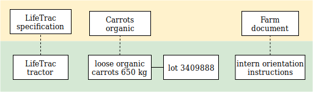

# Economic Resource Examples

This example includes economic resources, with their resource specifications.  One resource has a lot identifier.



``` yaml
# Example: Resources

'@context':
  - '@vocab': http://w3id.org/valueflows/ont/vf#
  - farm: https://farm.example/
    ose: https://www.opensourceecology.org/

'@graph':

  - '@id': ose:822b6baf-d66f-45a0-98f2-57450e2aec23
    '@type': ResourceSpecification
    name: Tractor - LifeTrac 6
    uri: https://www.opensourceecology.org/portfolio/tractor/
    image: https://www.opensourceecology.org/wp-content/uploads/2014/02/Tractor_gray.png
    defaultUnitOfResource: one
    defaultUnitOfEffort: hour
    substitutable: true
    note: A versatile, 4-wheel drive, hydraulically-driven tractor with 18 to 200 horsepower capacity for agriculture, construction and other utility duties.

  - '@id': farm:fbff9852-36ca-4364-a943-bc0b49e1cab5
    '@type': EconomicResource
    name: Tractor - LifeTrac 6
    trackingIdentifier: 889jcd00s # the serial number assigned by the manufacturer
    conformsTo: ose:822b6baf-d66f-45a0-98f2-57450e2aec23
    accountingQuantity:
      hasUnit: one
      hasNumericalValue: 1

  - '@id': farm:8baa8ff7-9c1e-4586-ae7b-79d620a3cac9
    '@type': ResourceSpecification
    name: Carrots organic
    defaultUnitOfResource: kilogram
    substitutable: true
    note: Organic loose carrots without tops.

  - '@id': farm:07819789-dd51-44c3-b35c-9210165bc832
    '@type': EconomicResource
    name: Loose organic carrots
    trackingIdentifier: 3409888 # the lot number assigned by the farm
    conformsTo: farm:8baa8ff7-9c1e-4586-ae7b-79d620a3cac9
    accountingQuantity:
      hasUnit: kilogram
      hasNumericalValue: 650
    note: Medium size, clean, harvested after the first frost, will store well.

  - '@id': farm:68cabaf3-deb8-4bd5-a439-798263abe35a
    '@type': ResourceSpecification
    name: Farm documentation
    defaultUnitOfResource: one
    substitutable: false
    note: Any of the documentation produced and/or used by the farm.

  - '@id': farm:a7e94dde-2997-451e-a7e1-8d364d5e6dee
    '@type': EconomicResource
    name: Intern orientation instructions
    conformsTo: farm:68cabaf3-deb8-4bd5-a439-798263abe35a
    uri: https://farm.example/docs/intern-orientation.odt
    accountingQuantity:
      hasUnit: one
      hasNumericalValue: 1
```
