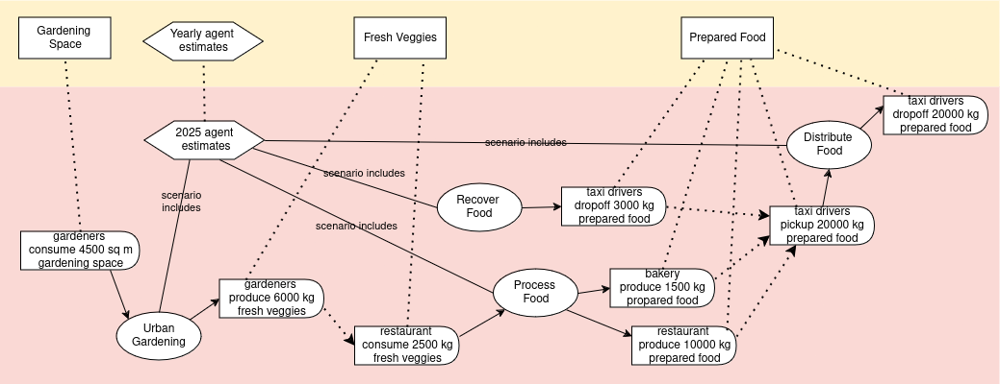

# Scenario Examples

#### UNDER CONSTRUCTION!!

#### Map Community Consumption/Production

This use case maps potential yearly consumption and production for community members, in order to discover gaps and opportunities to connect more in the network, and start organizations to fill gaps.



``` yaml
# Example: Map community consumption/production

'@context':
  - '@vocab': http://w3id.org/valueflows/ont/vf#
  - community: https://community.example/
    community: https://community.example/
    skos: http://www.w3.org/2004/02/skos/core#
    om2: http://www.ontology-of-units-of-measure.org/resource/om-2/
    dcterms: http://purl.org/dc/terms/

'@graph':

  - '@id': community:8e5fe80d-a769-4bd5-89e5-2136d33eab9f
    '@type': Plan
    name: Anti climate-change campaign materials
    skos:note: A set of printed materials for the campaign by Students for Peace and Justice
    due: 2019-04-08T17:00:00-5:00
    dcterms:created: 2019-04-01T10:35:00-5:00

  - '@id': community:02b39a30-3e04-4305-9656-7f261aa63c84
    '@type': Process
    name: Print climate brochures
    plannedWithin: community:8e5fe80d-a769-4bd5-89e5-2136d33eab9f

  - '@id': community:a8236bbb-81e0-422d-9861-56d2417db0fb
    '@type': Commitment
    outputOf: community:02b39a30-3e04-4305-9656-7f261aa63c84
    independentDemandOf: community:8e5fe80d-a769-4bd5-89e5-2136d33eab9f
    action: produce
    provider: https://community.example/
    receiver: https://community.example/
    resourceInventoriedAs: community:6b97b1be-8e07-44ac-82e5-214f1b2aaf33 # specific brochures
    resourceQuantity:
      om2:hasUnit: om2:one
      om2:hasNumericalValue: 1000

  - '@id': community:b52a5815-fae9-43bf-be95-833b95dc0adb
    '@type': Commitment
    inputOf: community:02b39a30-3e04-4305-9656-7f261aa63c84
    action: consume
    provider: https://community.example/
    receiver: https://community.example/
    resourceConformsTo: community:3129ca8b-fcda-45be-bbda-294dc924d3b9 # paper
    resourceQuantity:
      om2:hasUnit: om2:one
      om2:hasNumericalValue: 1020

  - '@id': community:9bd19194-a36d-4a1f-896b-8082887962cb
    '@type': Process
    name: Print climate posters
    plannedWithin: community:8e5fe80d-a769-4bd5-89e5-2136d33eab9f

  - '@id': community:33e8933b-ff73-4a01-964a-ca7a98893083
    '@type': Commitment
    outputOf: community:9bd19194-a36d-4a1f-896b-8082887962cb
    independentDemandOf: community:8e5fe80d-a769-4bd5-89e5-2136d33eab9f
    action: produce
    provider: https://community.example/
    receiver: https://community.example/
    resourceInventoriedAs: community:6078f30a-b15b-4b1c-8e77-797abae11378 # specific posters
    resourceQuantity:
      om2:hasUnit: om2:one
      om2:hasNumericalValue: 35

  - '@id': community:60f4204e-b8d2-4026-8577-102c3f82c0af
    '@type': Commitment
    inputOf: community:9bd19194-a36d-4a1f-896b-8082887962cb
    action: consume
    provider: https://community.example/
    receiver: https://community.example/
    resourceConformsTo: community:e56fd654-7b94-4d96-8e60-de39e08329a7 # paper
    resourceQuantity:
      om2:hasUnit: om2:one
      om2:hasNumericalValue: 35

  - '@id': community:b90b0b77-09a2-42e2-8bd4-e9ae2c1c6172
    '@type': Commitment
    inputOf: community:9bd19194-a36d-4a1f-896b-8082887962cb
    action: use
    provider: https://community.example/
    receiver: https://community.example/
    resourceConformsTo: community:e4783bef-9006-490c-9c03-389272c7444d # printing plate for the specific posters
    effortQuantity:
      om2:hasUnit: om2:hour
      om2:hasNumericalValue: 1.5

  - '@id': community:d4d2fd71-34f2-41c3-b1c5-19ad5ed2da59b
    '@type': Process
    name: Create poster plate
    plannedWithin: community:8e5fe80d-a769-4bd5-89e5-2136d33eab9f

  - '@id': community:583e83d9-a46d-44ff-bd71-88513a1d83c0
    '@type': Commitment
    outputOf: community:d4d2fd71-34f2-41c3-b1c5-19ad5ed2da59b
    action: produce
    provider: https://community.example/
    receiver: https://community.example/
    resourceConformsTo: community:e4783bef-9006-490c-9c03-389272c7444d # printing plate for the specific posters
    resourceQuantity:
      om2:hasUnit: om2:one
      om2:hasNumericalValue: 1

  - '@id': community:ad56a7ed-be3c-4937-a3fb-0f156bcd2c47
    '@type': Commitment
    inputOf: community:9bd19194-a36d-4a1f-896b-8082887962cb
    action: consume
    provider: https://community.example/
    receiver: https://community.example/
    resourceInventoriedAs: community:86ad6e22-7640-4b93-972a-db7177ab2616 # blank printing plate
    resourceQuantity:
      om2:hasUnit: om2:one
      om2:hasNumericalValue: 1
```

