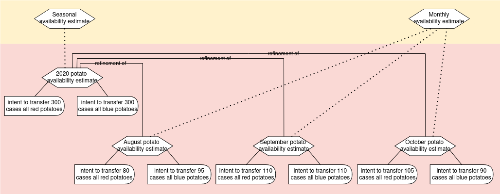

# Scenario Examples

Scenarios are used for all pre-operational planning, such as estimates for other agents, group offers/requests, forecasting and budgeting, aggregated analysis.

#### Community planning

This snippet maps potential yearly inputs and outputs for community members, in order to discover opportunities to connect more in the network, and start organizations to fill gaps.  In the following diagram, the dotted arrows indicate where opportunities for output-to-input matches can occur.

#### Map Community Consumption/Production

This use case maps potential yearly consumption and production for community members, in order to discover gaps and opportunities to connect more in the network, and start organizations to fill gaps.


``` yaml
# Example: Map community consumption/production

'@context':
  - '@vocab': http://w3id.org/valueflows/ont/vf#
  - community: https://community.example/
    garden: https://community-gardens.example/
    restaurant: https://restaurant.example/
    bakery: https://bakery.example/
    taxi: https://taxi-coop.example/

'@graph':

  # Knowledge layer setup

  - '@id': community:822b6baf-d66f-45a0-98f2-57450e2aec23
    '@type': ResourceSpecification
    name: Fresh veggies
    defaultUnitOfResource: kilogram
    substitutable: true

  - '@id': community:fbff9852-36ca-4364-a943-bc0b49e1cab5
    '@type': ResourceSpecification
    name: Gardening space
    defaultUnitOfResource: squareMetre
    substitutable: true

  - '@id': community:8baa8ff7-9c1e-4586-ae7b-79d620a3cac9
    '@type': ResourceSpecification
    name: Prepared food
    defaultUnitOfResource: kilogram
    substitutable: true

  - '@id': community:a7e94dde-2997-451e-a7e1-8d364d5e6dee
    '@type': ResourceSpecification
    name: Transportation
    defaultUnitOfResource: kilometre
    substitutable: true

  - '@id': community:33e8933b-ff73-4a01-964a-ca7a98893083
    '@type': ScenarioDefinition
    name: Yearly agent estimates
    hasDuration: year
    note: Yearly estimates of high-level consumption and production.

  # The scenario is set up with generic processes by the community to set the stage

  - '@id': community:9bd19194-a36d-4a1f-896b-8082887962cb
    '@type': Scenario
    name: 2025 agent estimates
    definedAs: community:33e8933b-ff73-4a01-964a-ca7a98893083 # the ScenarioDefinition
    hasBeginning: 2025-01-01T00:00:00-6:00
    hasEnd: 2025-12-31T23:59:59-6:00
    note: 2025 estimates of high-level consumption and production by economic solidarity groups in Madison, WI.
    scenarioIncludes:

    - '@id': community:d4d2fd71-34f2-41c3-b1c5-19ad5ed2da59b
      '@type': Process
      name: Urban gardening
      nestedIn: community:9bd19194-a36d-4a1f-896b-8082887962cb # the Scenario

    - '@id': community:02b39a30-3e04-4305-9656-7f261aa63c84
      '@type': Process
      name: Process food
      nestedIn: community:9bd19194-a36d-4a1f-896b-8082887962cb # the Scenario

    - '@id': community:a8236bbb-81e0-422d-9861-56d2417db0fb
      '@type': Process
      name: Recover food
      nestedIn: community:9bd19194-a36d-4a1f-896b-8082887962cb # the Scenario

    - '@id': community:b52a5815-fae9-43bf-be95-833b95dc0adb
      '@type': Process
      name: Distribute food
      nestedIn: community:9bd19194-a36d-4a1f-896b-8082887962cb # the Scenario

  # Estimated inputs and outputs are added by the agents

  - '@id': community:60f4204e-b8d2-4026-8577-102c3f82c0af
    '@type': Intent
    inputOf: community:d4d2fd71-34f2-41c3-b1c5-19ad5ed2da59b # Urban gardening
    action: consume
    receiver: https://community-gardens.example/
    resourceConformsTo: community:fbff9852-36ca-4364-a943-bc0b49e1cab5 # gardening space
    resourceQuantity:
      hasUnit: squareMetre
      hasNumericalValue: 4500

  - '@id': community:8e5fe80d-a769-4bd5-89e5-2136d33eab9f
    '@type': Intent
    outputOf: community:d4d2fd71-34f2-41c3-b1c5-19ad5ed2da59b # Urban gardening
    action: produce
    provider: https://community-gardens.example/
    resourceConformsTo: community:822b6baf-d66f-45a0-98f2-57450e2aec23 # fresh veggies
    resourceQuantity:
      hasUnit: kilogram
      hasNumericalValue: 6000

  - '@id': community:b90b0b77-09a2-42e2-8bd4-e9ae2c1c6172
    '@type': Intent
    inputOf: community:d4d2fd71-34f2-41c3-b1c5-19ad5ed2da59b # Process food
    action: consume
    receiver: https://restaurant.example/
    resourceConformsTo: community:822b6baf-d66f-45a0-98f2-57450e2aec23 # fresh veggies
    resourceQuantity:
      hasUnit: kilogram
      hasNumericalValue: 2500

  - '@id': community:583e83d9-a46d-44ff-bd71-88513a1d83c0
    '@type': Intent
    outputOf: community:d4d2fd71-34f2-41c3-b1c5-19ad5ed2da59b # Process food
    action: produce
    provider: https://restaurant.example/
    resourceConformsTo: community:8baa8ff7-9c1e-4586-ae7b-79d620a3cac9 # prepared food
    note: leftover food
    resourceQuantity:
      hasUnit: kilogram
      hasNumericalValue: 10000

  - '@id': community:ad56a7ed-be3c-4937-a3fb-0f156bcd2c47
    '@type': Intent
    outputOf: community:a8236bbb-81e0-422d-9861-56d2417db0fb # Recover food
    action: dropoff
    provider: https://taxi-coop.example/
    resourceConformsTo: community:8baa8ff7-9c1e-4586-ae7b-79d620a3cac9 # prepared food
    note: taxi drivers pickup leftovers from local businesses
    resourceQuantity:
      hasUnit: kilogram
      hasNumericalValue: 3000

  - '@id': community:8791913c-0152-4c32-bb3f-f25d61df736c
    '@type': Intent
    outputOf: community:d4d2fd71-34f2-41c3-b1c5-19ad5ed2da59b # Process food
    action: produce
    provider: https://bakery.example/
    resourceConformsTo: community:8baa8ff7-9c1e-4586-ae7b-79d620a3cac9 # prepared food
    note: non-retail food
    resourceQuantity:
      hasUnit: kilogram
      hasNumericalValue: 1500

  - '@id': community:02b39a30-3e04-4305-9656-7f261aa63c84
    '@type': Intent
    inputOf: community:b52a5815-fae9-43bf-be95-833b95dc0adb # distribute food
    action: pickup
    receiver: https://taxi-coop.example/
    resourceConformsTo: community:8baa8ff7-9c1e-4586-ae7b-79d620a3cac9 # prepared food
    resourceQuantity:
      hasUnit: kilogram
      hasNumericalValue: 20000

  - '@id': community:e72f7d1d-4f0a-4518-a44c-96658cafda95
    '@type': Intent
    outputOf: community:b52a5815-fae9-43bf-be95-833b95dc0adb # distribute food
    action: dropoff
    provider: https://taxi-coop.example/
    resourceConformsTo: community:8baa8ff7-9c1e-4586-ae7b-79d620a3cac9 # prepared food
    resourceQuantity:
      hasUnit: kilogram
      hasNumericalValue: 20000
```
#### Regional analysis

This is a snippet of a regional analysis of actual flows of resources at a high level in one domain (groundfish). Even though this is not operational, it uses economic events which are aggregates of operational events, to reflect that this is actual data. A person or software can tell these events are not operational because they are part of a scenario, not an operational plan.


``` yaml
# Example: Map actual aggregated resource flows for groundfish for a region

'@context':
  - '@vocab': http://w3id.org/valueflows/ont/vf#
  - region: https://region.example/

'@graph':

  # Knowledge layer setup

  - '@id': region:822b6baf-d66f-45a0-98f2-57450e2aec23
    '@type': ResourceSpecification
    name: Grade A Groundfish
    defaultUnitOfResource: tonne
    substitutable: true

  - '@id': region:fbff9852-36ca-4364-a943-bc0b49e1cab5
    '@type': ResourceSpecification
    name: Grade B Groundfish
    defaultUnitOfResource: tonne
    substitutable: true

  - '@id': region:8baa8ff7-9c1e-4586-ae7b-79d620a3cac9
    '@type': ResourceSpecification
    name: Bycatch
    defaultUnitOfResource: tonne
    substitutable: true

  - '@id': region:07819789-dd51-44c3-b35c-9210165bc832
    '@type': ResourceSpecification
    name: Processed Groundfish
    defaultUnitOfResource: tonne
    substitutable: true

  - '@id': region:3d4iu33b-ff73-4a01-964a-ca7a9849kr98
    '@type': Agent
    name: XYZ Region
    hasDuration: year

  - '@id': region:33e8933b-ff73-4a01-964a-ca7a98893083
    '@type': ScenarioDefinition
    name: Yearly Groundfish Processing
    hasDuration: year

  # The aggregated data is entered as economic events, since it is actual data, albeit not operational.

  - '@id': region:9bd19194-a36d-4a1f-896b-8082887962cb
    '@type': Scenario
    name: 2020 Yearly Groundfish Processing
    definedAs: region:33e8933b-ff73-4a01-964a-ca7a98893083 # the ScenarioDefinition
    hasBeginning: 2025-01-01T00:00:00-6:00
    hasEnd: 2025-12-31T23:59:59-6:00
    note: 2010 estimates of high-level consumption and production by economic solidarity groups in Madison, WI.
    inScopeOf: region:3d4iu33b-ff73-4a01-964a-ca7a9849kr98 # XYZ region
    scenarioIncludes:

    - '@id': region:d4d2fd71-34f2-41c3-b1c5-19ad5ed2da59b
      '@type': Process
      name: Otter Trawl Fishing
      nestedIn: region:9bd19194-a36d-4a1f-896b-8082887962cb # the Scenario
      hasOutput:

      - '@id': region:60f4204e-b8d2-4026-8577-102c3f82c0af
        '@type': EconomicEvent
        action: produce
        resourceConformsTo: region:fbff9852-36ca-4364-a943-bc0b49e1cab5 # grade B groundfish
        resourceQuantity:
          hasUnit: tonne
          hasNumericalValue: 27915

      - '@id': region:b52a5815-fae9-43bf-be95-833b95dc0adb
        '@type': EconomicEvent
        action: produce
        resourceConformsTo: region:8baa8ff7-9c1e-4586-ae7b-79d620a3cac9 # bycatch
        resourceQuantity:
          hasUnit: tonne
          hasNumericalValue: 3700

    - '@id': region:02b39a30-3e04-4305-9656-7f261aa63c84
      '@type': Process
      name: Longline Fishing
      nestedIn: region:9bd19194-a36d-4a1f-896b-8082887962cb # the Scenario
      hasOutput:

      - '@id': region:8e5fe80d-a769-4bd5-89e5-2136d33eab9f
        '@type': EconomicEvent
        action: produce
        resourceConformsTo: region:fbff9852-36ca-4364-a943-bc0b49e1cab5 # grade B groundfish
        resourceQuantity:
          hasUnit: tonne
          hasNumericalValue: 7193

    - '@id': region:a8236bbb-81e0-422d-9861-56d2417db0fb
      '@type': Process
      name: Processing Groundfish
      nestedIn: region:9bd19194-a36d-4a1f-896b-8082887962cb # the Scenario
      hasOutput:

      - '@id': region:21f361a6-2375-46bb-b192-c21b5ba833bf
        '@type': EconomicEvent
        action: produce
        resourceConformsTo: region:07819789-dd51-44c3-b35c-9210165bc832 # processed groundfish
        resourceQuantity:
          hasUnit: tonne
          hasNumericalValue: 31120
```
#### Refinement of estimates

Here a farm is publishing a seasonal estimate of resources they intend to produce for a farmstand retailer.  Then each month, they publish a refined estimate for the next month, to enable further planning by the farmstand retailer.



``` yaml
# Example: Season and monthly estimates for vegetable availability from a farm to a farmstand retailer

'@context':
  - '@vocab': http://w3id.org/valueflows/ont/vf#
  - farm: https://farm.example/
    retail: https://farmstand-retailer.example/

'@graph':

  # Knowledge layer setup

  - '@id': farm:822b6baf-d66f-45a0-98f2-57450e2aec23
    '@type': ResourceSpecification
    name: All Red Potatoes, 25 lb case
    defaultUnitOfResource: one
    substitutable: true

  - '@id': farm:fbff9852-36ca-4364-a943-bc0b49e1cab5
    '@type': ResourceSpecification
    name: All Blue Potatoes, 25 lb case
    defaultUnitOfResource: one
    substitutable: true

  - '@id': farm:33e8933b-ff73-4a01-964a-ca7a98893083
    '@type': ScenarioDefinition
    name: Seasonal availability estimate
    hasDuration: year

  - '@id': farm:b52a5815-fae9-43bf-be95-833b95dc0adb
    '@type': ScenarioDefinition
    name: Monthly availability estimate
    hasDuration: month

  # Early in the season, the farm gives a rough estimate for the season availability to the farmstand retailer.

  - '@id': farm:9bd19194-a36d-4a1f-896b-8082887962cb
    '@type': Scenario
    name: 2020 potato availability estimate
    definedAs: farm:33e8933b-ff73-4a01-964a-ca7a98893083 # the ScenarioDefinition
    hasBeginning: 2020-08-01T00:00:00-5:00
    hasEnd: 2021-10-30T23:59:59-5:00
    note: This covers the season for potatoes in this area.
    created: 2020-06-01-T00:00:00-5:00
    inScopeOf: https://farm.example/
    publishedTo: https://farmstand-retailer.example/
    scenarioIncludes:

      - '@id': farm:60f4204e-b8d2-4026-8577-102c3f82c0af
        '@type': Intent
        action: transfer
        provider: https://farm.example/
        resourceConformsTo: farm:822b6baf-d66f-45a0-98f2-57450e2aec23 # all red potatoes 25 lb case
        resourceQuantity:
          hasUnit: one
          hasNumericalValue: 300

      - '@id': farm:8baa8ff7-9c1e-4586-ae7b-79d620a3cac9
        '@type': Intent
        action: transfer
        provider: https://farm.example/
        resourceConformsTo: farm:fbff9852-36ca-4364-a943-bc0b49e1cab5 # all blue potatoes 25 lb case
        resourceQuantity:
          hasUnit: one
          hasNumericalValue: 300

  # Then before each month, the farmer gives a more accurate estimate for the month.

  - '@id': farm:02b39a30-3e04-4305-9656-7f261aa63c84
    '@type': Scenario
    name: August 2020 potato availability estimate
    definedAs: farm:b52a5815-fae9-43bf-be95-833b95dc0adb # the ScenarioDefinition
    refinementOf: farm:9bd19194-a36d-4a1f-896b-8082887962cb # the season estimate
    hasBeginning: 2020-08-01-01T00:00:00-5:00
    hasEnd: 2021-08-31T23:59:59-5:00
    created: 2020-07-20-T00:00:00-5:00
    inScopeOf: https://farm.example/
    publishedTo: https://farmstand-retailer.example/
    scenarioIncludes:

      - '@id': farm:a8236bbb-81e0-422d-9861-56d2417db0fb
        '@type': Intent
        action: transfer
        provider: https://farm.example/
        resourceConformsTo: farm:822b6baf-d66f-45a0-98f2-57450e2aec23 # all red potatoes 25 lb case
        resourceQuantity:
          hasUnit: one
          hasNumericalValue: 80

      - '@id': farm:8e5fe80d-a769-4bd5-89e5-2136d33eab9f
        '@type': Intent
        action: transfer
        provider: https://farm.example/
        resourceConformsTo: farm:fbff9852-36ca-4364-a943-bc0b49e1cab5 # all blue potatoes 25 lb case
        resourceQuantity:
          hasUnit: one
          hasNumericalValue: 95

  - '@id': farm:07819789-dd51-44c3-b35c-9210165bc832
    '@type': Scenario
    name: September 2020 potato availability estimate
    definedAs: farm:b52a5815-fae9-43bf-be95-833b95dc0adb # the ScenarioDefinition
    refinementOf: farm:9bd19194-a36d-4a1f-896b-8082887962cb # the season estimate
    hasBeginning: 2020-09-01-01T00:00:00-5:00
    hasEnd: 2021-09-30T23:59:59-5:00
    created: 2020-08-20-T00:00:00-5:00
    inScopeOf: https://farm.example/
    publishedTo: https://farmstand-retailer.example/
    scenarioIncludes:

      - '@id': farm:b90b0b77-09a2-42e2-8bd4-e9ae2c1c6172
        '@type': Intent
        action: transfer
        provider: https://farm.example/
        resourceConformsTo: farm:822b6baf-d66f-45a0-98f2-57450e2aec23 # all red potatoes 25 lb case
        resourceQuantity:
          hasUnit: one
          hasNumericalValue: 110

      - '@id': farm:a8236bbb-81e0-422d-9861-56d2417db0fb
        '@type': Intent
        action: transfer
        provider: https://farm.example/
        resourceConformsTo: farm:fbff9852-36ca-4364-a943-bc0b49e1cab5 # all blue potatoes 25 lb case
        resourceQuantity:
          hasUnit: one
          hasNumericalValue: 110

  - '@id': farm:6f438393-7f87-4914-806c-e23a4fd15e89
    '@type': Scenario
    name: October 2020 potato availability estimate
    definedAs: farm:b52a5815-fae9-43bf-be95-833b95dc0adb # the ScenarioDefinition
    refinementOf: farm:9bd19194-a36d-4a1f-896b-8082887962cb # the season estimate
    hasBeginning: 2020-10-01-01T00:00:00-5:00
    hasEnd: 2021-10-31T23:59:59-5:00
    created: 2020-09-20-T00:00:00-5:00
    inScopeOf: https://farm.example/
    publishedTo: https://farmstand-retailer.example/
    scenarioIncludes:

      - '@id': farm:d4d2fd71-34f2-41c3-b1c5-19ad5ed2da59
        '@type': Intent
        action: transfer
        provider: https://farm.example/
        resourceConformsTo: farm:822b6baf-d66f-45a0-98f2-57450e2aec23 # all red potatoes 25 lb case
        resourceQuantity:
          hasUnit: one
          hasNumericalValue: 105

      - '@id': farm:e1721a61-cd47-4556-84b9-8b1b81da15bf
        '@type': Intent
        action: transfer
        provider: https://farm.example/
        resourceConformsTo: farm:fbff9852-36ca-4364-a943-bc0b49e1cab5 # all blue potatoes 25 lb case
        resourceQuantity:
          hasUnit: one
          hasNumericalValue: 90

```
