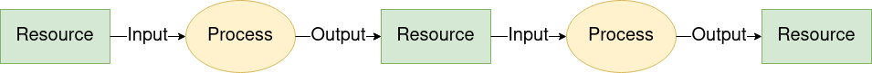
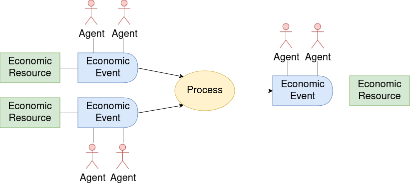
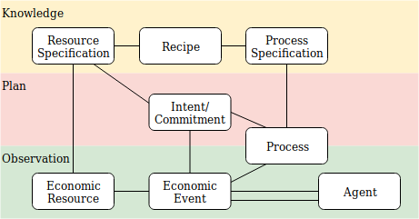

# Core

## Flows of value

Value means useful economic resources. Flows means how people create, combine, move, and exchange them.

Networks of value flows are created when processes and transfers are linked together through flows of resources.

Flow-oriented systems can coordinate whole networks as easily as one company.

## The patterns used in Valueflows

There are two basic patterns used in Valueflows:

* Resources, Events, and Agents (REA)

* Input-Process-Output Resource Flows (IPO)

## REA (Resources, Events, Agents)

The core is based on the REA (Resource, Event, Agent) ontology.  You can find all the details by following the [links here](../appendix/rea.md).

**Agents** are individual persons or organizations or ecological agents, who perform Economic Events affecting Economic Resources.

An **Economic Event** can take actions like produce, modify, consume, or use Economic Resources, or transfer them from one Agent to another, or transport them from one location to another.

**Economic Resources** would typically be useful goods and services, but could also be money, credits, energy, knowledge, designs, skills, CO2, methane, air, water, or almost anything else that some Agents can agree should be accounted for in their economic networks.

## IPO (Input-Process-Output)

The IPO pattern is used to enhance the ability of REA to represent complex flows of value.  The flows are IPOs...

...Input-Process-Output resource chains, where one **Economic Resource** is the output of one **Process** and then becomes an input to another, thus connecting the processes into a flow. The **Agents** involved in each Process in the chain need to coordinate with the previous and next Processes about the quantity, quality, and timing of resource flows between them.

## Putting them together

In general, how they fit together: Agents perform Economic Events that provide Inputs to Processes and take Outputs from Processes and move Resources from one Process to another.  This forms a directed graph of value flows.

For example: a food network

...might include farmers, food processors, restaurants and bakeries, grocery stores, families to eat the food. And vehicles to move everything from place to place. Coordination might be needed between each of those stages: seeds and other inputs for planting crops, workers etc for harvesting crops. when are the crops ready for processing, when is the grain ready for milling and then for baking and then for people to eat, when is the fruit ready for pies, etc.

## Flows without processes

Some flows do not involve processing, i.e. there is no transformation or transportation of Economic Resources.  These flows simply transfer Economic Resources between Agents. One common example is an exchange of one Economic Resource for another Economic Resource between two Agents, as below, with two reciprocal flows based on an Agreement.

It can also be simpler, such as a gift, or more complex, involving many Agents.

For example: in that food network above

...food processors might purchase the harvested food from farmers, sell processed food to restaurants and stores... or families might provide land and labor for a farm and receive harvested food each week in return.  That becomes part of the coordination.

## Directed graphs of flows

Both process-based flows and flows without processes can create "directed graphs" in infinite combinations.  Basically, a Process can have many inputs and many outputs.  An Economic Resource can be created or increased by many flows, and can be decreased by many flows, over time. And flows without processes can fit inline with these, for example when a resource is created, then transferred whole or in part to another agent.

## Traversing value flows

Value flows can be traversed forwards ("tracking") or backwards ("tracing").  Often people use the term "provenance" when looking backwards towards the source of some resource, sometimes when a problem emerges (as in a disease outbreak from food), sometimes to know the quality of the resource (as in wanting local humanely produced food with lower ecological impact).

The data structures of Valueflows provide the ability to trace or track any value flow, no matter how long or complex.  In the above diagram, following the arrows forward from an Economic Resource is to track what happened to the resource once produced, following them backwards from an Economic Resource is to trace what went into the resource plus all has happened because of the production and transfer of the resource.

## Types of flows

These are the main types of flows and how they relate as stages of value flows.  They have basically the same core data structure, with differences related to their stage.  Any of these types can be input or output to a process, or reciprocally related, as above.

## Levels of the ontology

Valueflows uses the layers of ontology documented by REA.  Each of the layers follows the core patterns above.

* The Knowledge level represents classification, policies, procedures, rules and patterns. This is where each network or community can configure the core concepts to fit their needs.
* The Plan level represents offers and requests, schedules and promises.
* The Observation level represents what really happened.

Here is a simplified view of how they connect.

Here is a specific simplified example:

