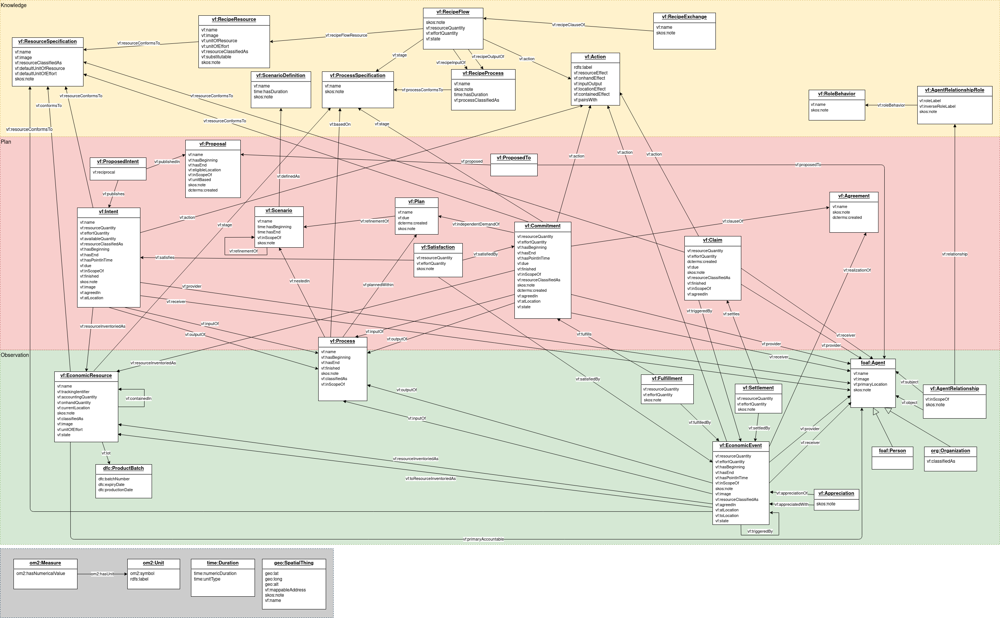
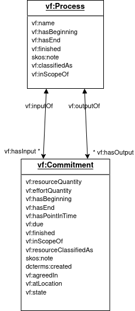
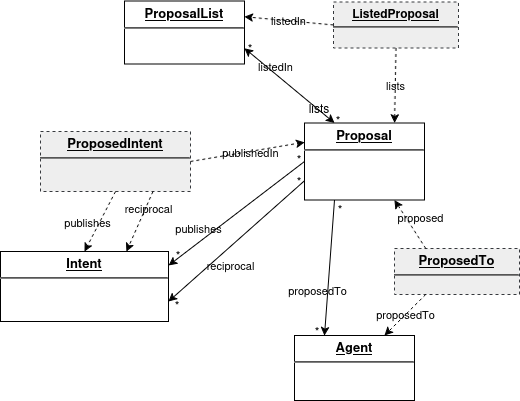
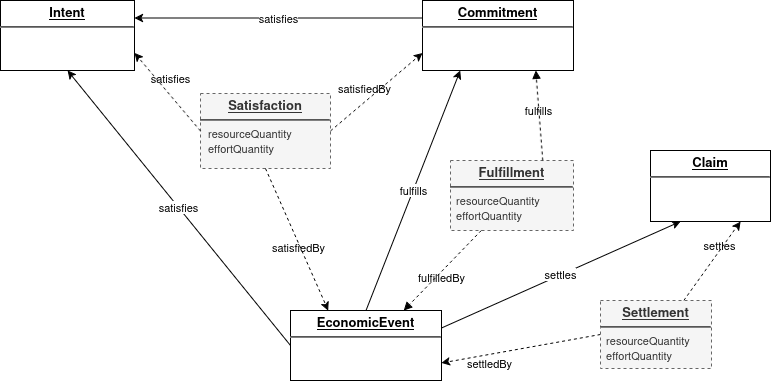
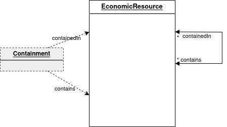
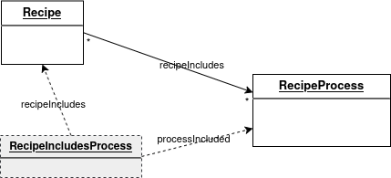

# Class and property diagram

*This section is non-normative.*

## Diagram

This diagram includes all class and property elements defined in the system of record turtle file, for visual understanding of relationships.

An informal textual explanation of everything on this diagram is on the [Diagram Explanations page](model-text.md), along with subject area class and property diagrams.

*To make the diagram bigger, you can right click and select 'View Image' or 'Open Image in New Tab' or a similar command in your browser.*

## Diagram conventions

### Notation

The notation is similar to [UML class diagrams](https://www.omg.org/spec/UML/){target="_blank"}.  Each arrow represents an additional property in the class at the beginning of the arrow.  If there is an * at the arrowhead end, then many instances are supported (like a collection in object oriented modeling).  If there is no *, then it should be assumed that only one instance is supported (like a foreign key in a relational model).  Optionality is not implied in this notation.

### Relationships not shown

In some cases, there were just too many lines!  The subordinate classes in the gray section at the bottom are not connected with arrows, so the viewer should assume that:

* every property ending in "Quantity" or "Duration" is a `vf:Measure` (does not live on its own);
* properties ending in "Location" that are physical locations are a `vf:SpatialThing` (can live on its own).

These are shown properly in the smaller diagrams in the [Diagram Explanations page](model-text.md).

### Inverse terms

To support cleaner representation in JSON / JSON-LD / RDF, as well as object oriented collections, in addition to the initial relational representation, we include some inverse terms, using `owl:inverseOf` in the source turtle file.  If there is a name on each end of the line, there is both a regular and an inverse property defined in the specification itself.

Note that having an inverse defined and specifying cardinality of many are not connected.  You will see * if logically there could be more than one of the objects on that end of the relationship, whether there is explicitly an inverse defined or not.

For example, here a Commitment `isInput` or `isOutput` of a Process; and a Process `hasInput`(zero or more) Commitments and/or `hasOutput`(zero or more) Commitments.  Both directions are specified as part of the formal vocabulary, so can be used in the direction preferred by the application for creation and update.  However, for queries, both directions must be supported.

The first several examples on [the Examples-Production page](../examples/ex-production.md) show both options as yaml.

### Many-to-many relationships

Instead of the typical relational resolution of a many-to-many relationship of including an "associative" class or table between them, we are specifying a direct one-to-many relationship, which more cleanly supports JSON / JSON-LD / RDF / OO structures.  To get to the other less-used "many" without the "associative" entity, a query is needed.  The suggested query names are included in [Query Naming](inverses.md).

Below are the places in Valueflows where there is a logical many-to-many.

#### publishes, proposedTo, listedIn

Although not included in the formal RDF-based spec, the suggested intermediate "associative" class for three cases where there are no intermediate properties is shown below with dotted lines, for projects that want to implement a relational database under the covers, for example.

Note on this diagram, there is an example of a many-to-many where an inverse is defined (Proposal-ProposalList); and also examples of a many-to-many with no inverse defined in the vocabulary, although one is implied (Proposal-Intent).  Where one is implied because of the cardinalities, then they can be found in a query, but create/update with that path is not supported.

#### fulfills, satisfies, settles

These cases have possible properties in the "associative" class. For example, between Commitment and EconomicEvent, a Commitment for 40 hours of work might be fulfilled by 5 EconomicEvents of 8 hours.  Or an EconomicEvent might pay for a statement or invoice that includes multiple Commitments for deliveries.  The model we have settled on supports the former, but not the latter.  The latter is one of a few cases that we believe will be a small minority of edge cases where the quantities in the "associative" entity might be appreciated.  For that case, an application could possibly divide the payment into multiple EconomicEvents and connect them with the trackingIdentifier.  Or it could extend the vocabulary to include the quantity fulfilled/satisfied/settled, and over time the VF community can re-consider the best trade-off for handling this situation.

In this case, we believe that it is more important to simplify the model and the concepts for the majority of use cases, than to have complete support of all use cases.

#### contains

#### recipeIncludes

### Denormalization

Note there are a few place where VF is more normalized than might be wanted for a database design behind the scenes. However, for data provided for interoperability, such as in an api, it is expected that apps will adhere to the specified version.

For example, we have used a separate structure for quantities, including the numeric amount and unit of measure.  These never stand on their own, i.e. one wouldn't expect to change "4 liters" in an event and have it change wherever else "4 liters" appears.  So these can be safely denormalized behind the scenes.

This also could apply to simple uses of location data, although in that case, locations can stand on their own, so it depends on the application.  But for example, some apps might move `SpatialThing`'s `long` and `lat` into the record having the location under the covers.
