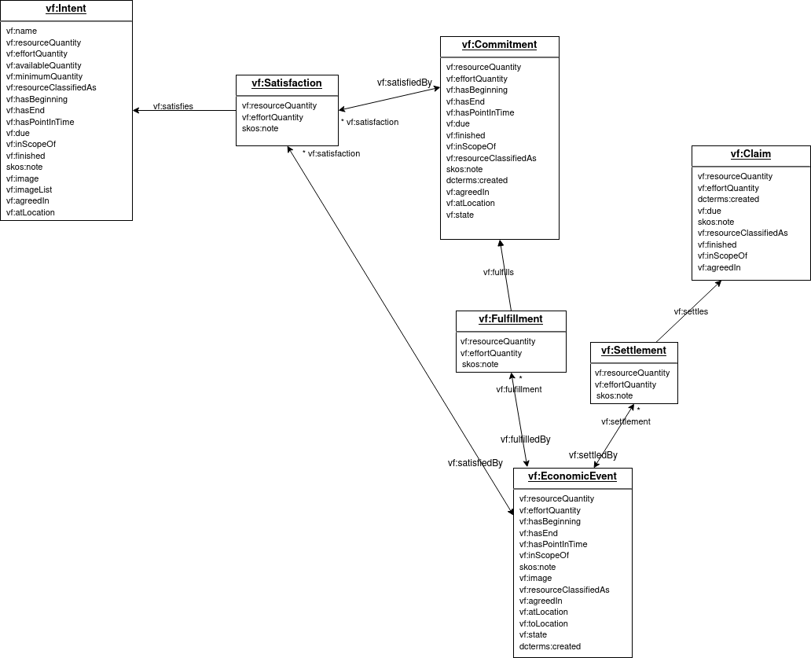

## UML diagram

This diagram includes all elements necessary for a complete REA-based core economic vocabulary, so includes elements that we re-use from other vocabularies.  All namespaces are documented by the prefix to each element.

A textual explanation of everything on this diagram is on the [next page](model-text.md).

*To make the diagram bigger, you can right click and select 'View Image' or 'Open Image in New Tab' or a similar command in your browser.*

## Diagram conventions

Each arrow represents an additional property in the class at the beginning of the arrow.  If there is an * at the arrowhead end, then many instances are supported (like a collection in object oriented modeling).  If there is no *, then it should be assumed that one instance is supported (like a foreign key in a relational model).

### Relationships not shown

In some cases, there were just too many lines!  The subordinate classes in the gray section at the bottom are not connected with arrows, so the viewer should assume that:

* every property ending in "Quantity" is a `om2:Measure`;
* every property ending in "Duration" is a `time:Duration`;
* every property ending in "Location" is a `geo:SpatialThing`;
* `vf:inScopeOf` references a `vf:Agent`.

### Inverse terms

To support cleaner representation in JSON / JSON-LD / RDF, as well as object oriented collections, in addition to the initial relational representation, we include some inverse terms, using `owl:inverseOf` in the source turtle file.  If there is a name on each end of the line, and an end on both sides of the arrow, there is an inverse defined.  For example, here a Commitment `isInput` or `isOutput` of a Process; and a Process `hasInput`(one or more) and/or `hasOutput`(one or more).  Both directions are specified as part of the formal vocabulary, so can be used in the direction preferred by the application.

### Many-to-many relationships

Instead of the typical relational resolution of a many-to-many relationship of including an "associative" class or table between them, when possible we are specifying a direct one-to-many relationship, which more cleanly supports JSON / JSON-LD / RDF / OO structures.  To get to the other less-used "many" without the "associative" entity, for the case on the left for example, to find all the Proposals an Intent is `publishedIn`, a query would be needed.  In this case, `publishedIn` is a recommended standard query name, but not formally part of the specification.

Although not included in the formal RDF-based spec, the suggested intermediate "associative" class for the two cases where there are no intermediate properties is shown below with dotted lines, for projects that want to implement a relational database under the covers.

### Many-to-many relationships with properties

When a many-to-many relationship involves an "associative" entity that has necessary properties (is "reified"), we have kept the intermediate class, and added an inverse term as above to the relationship involved to make saving a flow with its intermediate data easier in JSON / JSON-LD / RDF / OO.  The original relationship direction was kept for applications that prefer to use the relational method.  To traverse in the other direction where there is no inverse, for example from Intent to Satisfaction, a query is required. The diagram below shows the situations with many-to-many relationships where the properties are needed.

**Note**: For use cases where the properties in the intermediate class are not needed (i.e. where there will never be a case that needs the many-to-many relationship, such as always only one event fulfills a commitment and vice versa), the application can simplify the situation, and just derive the intermediate values as needed to emit VF standard api data.
